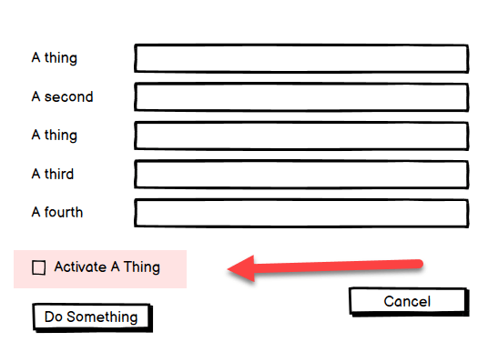
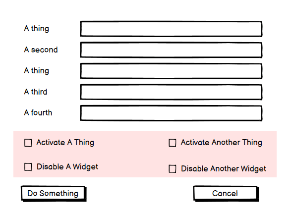

> More Features Is Good

Sounds simple enough. Adding more features to your software usually means it can do more things. Which means it can serve humanity more. Which means it can make users happier.

But does it?

Take this simple program:

It is fairly successful, and then you get customer requests to add something to it.

The proposal is as follows:

This looks very straightforward. I mean, it is just a check box.

Or is it?

This is what it directly entails to make that change:

1. Adding the checkbox to the interface
2. Adding a tool-tip to the checkbox
3. If the application is localized, translating the caption to all the supported languages
4. Making sure that the new UI element is keyboard friendly (using `TAB` or `Enter` behaves consistently)
5. Updating the database to add the field to store this setting
6. Updating your business logic to be aware of this field
7. Updating your data logic to be aware of this field
8. Updating your manuals and online help to explain what this feature does
9. Updating all screenshots of this form to reflect the new change
10. Creating new unit and integration tests to verify this new setting is saved and loaded correctly.
11. Creating new tests (doubling) all the existing unit and integration tests to reflect whether the setting is ON or OFF
12. Updating your API, which probably means adding a new endpoint, or at least a versioned endpoint to cater for the fact that new payloads will have that extra field, but existing clients can still use the original endpoint
13. Updating your API documentation and notifying clients of the change.
14. If you have a SDK, updating it to reflect this change, updating the documentation and publishing the artifacts to clients (Java [Gradle](https://gradle.org/)/[Maven](https://maven.apache.org/), .NET [NuGet](https://www.nuget.org/), PHP [Composer](https://getcomposer.org/), Ruby [Gems](https://rubygems.org/), Rust [Cargo](https://crates.io/), Node [NPM](https://www.npmjs.com/) etc)
15. Updating your training, marketing materials and website
16. Once you add this feature, you generally cannot remove it. You must support it
17. Adding features means you have more code to support. More code means increased potential for maintenance complexity, bugs, and security flaws

Not so simple, is it?

The not so direct cost is that there is an increased cognitive load to the user.

Take a look again

Don't think so?

How about now?

Now you have four choices to make while filling this form, over and above the initial data that is being captured. You have to think about what each of the four things is, and the implications of having them on or off. And then think about the effect of each of them being on/off has on the others.

Does it make the app more powerful? Probably.

But what is the cost? **Ease of use.** The software is now more complex, and **harder to use**.

The question then is not whether or not you should add the feature. The question is:

> Is the cost of adding this feature (development time, money, staff resources, documentation, increased complexity) worth the benefit it will bring to customers or to the business?

As software grows in complexity you need to be prepared to say **NO** more, after weighing these issues, for the good of the product.

Happy hacking!