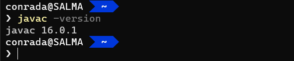
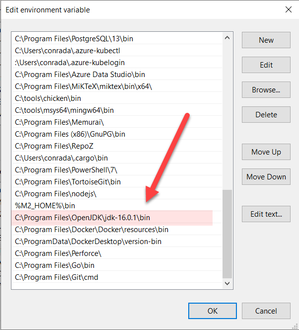
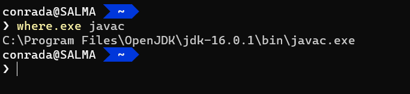

Assume you have a command like so:



This is the [Java](https://www.java.com/) compiler, part of the [Java JDK](https://openjdk.java.net/). It works from wherever I am without me having to specify the complete path because it is in my [PATH](https://www.maketecheasier.com/what-is-the-windows-path/) environment.



But what if you wanted to know where exactly it was? It is possible to have more than one JDK installed, and there are times you want to know where exactly the executable is located.

To do this, run the this command:

```powershell
    where.exe javac
```

(note the `.exe`) if you are using [PowerShell](https://docs.microsoft.com/en-us/powershell/) (or [PowerShell Core](https://twitter.com/yulemsee/status/1404345270910001152?s=08)). This is because where without the exe will be interpreted as an alias for [where-object](https://docs.microsoft.com/en-us/powershell/module/microsoft.powershell.core/where-object?view=powershell-7.1)

If you are using the [Windows Command](https://docs.microsoft.com/en-us/windows-server/administration/windows-commands/windows-commands) interpreter (cmd.exe), run just 

```dos
where javac
```

[Where.exe](https://ss64.com/nt/where.html) is a program packaged with Windows for this very purpose.

You should get a response like this:



Here you can see exactly where the binary is located.

Happy hacking!
