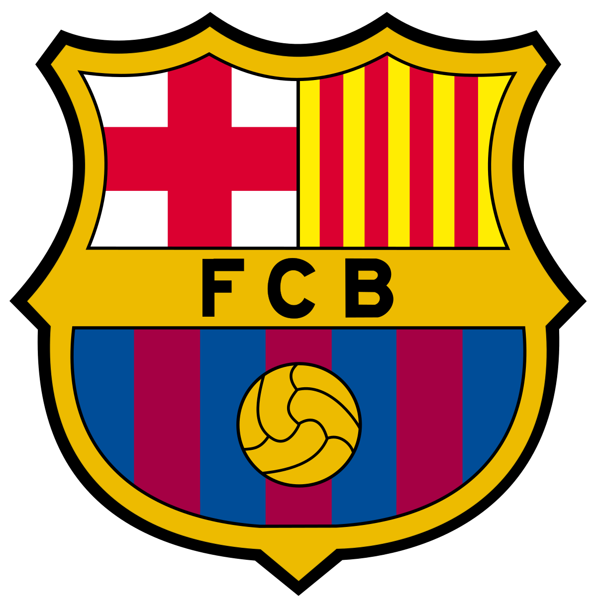
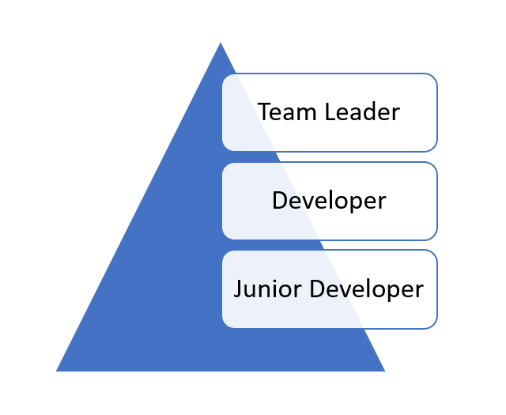

[Lionel Messi](https://en.wikipedia.org/wiki/Lionel_Messi) is, by many accounts, the best football player in the world.

He is also the captain of the first men's team of the [Barcelona Football Club](https://www.fcbarcelona.com/en/).

Imagine you are also a player in this team, and then the club announces that Messi intends to move to a different team the next season.

This would mean over and above the vacancy for a forward, there would also be a vacancy for captain.

Assume there are very able forwards chomping at the bits, and you are one of these.

Assume, that you want to be the captain of Barcelona.

One stratagem would be to be the best forward the club, and the league has ever seen. To play the best football of your life.

Is being the best forward, or the best midfielder, or the best defender, or the best goalie good? Absolutely.

Would it increase your standings in the club, in the league, and in the world?

Absolutely.

Should that be grounds to make you the captain?

Absolutely not.

Because being the best striker / midfielder / defender / goalkeeper has absolutely no bearing when it comes to being a captain.

The question then arises - what is it that is expected of a team captain?

Here are a few responsibilities of what I feel would be expected of a captain:

1. Inspire / rally the team - either through example, or words or any other technique.
2. On the pitch leadership - if the team is trailing and a player is sent off, changing strategy to focus on attack. Or vice versa if the team is leading.
3. Represent the player's interests to the management.
4. Look out for the individual welfare of players - for example if one team member is down because of a sibling in hospital, arranging for the team bus to ferry the entire team to the hospital to rally both player and sibling.
5. Look out for the individual performance of each player and suggest ways to improve in case of lapses.

Being a good striker is absolutely irrelevant for any of these.

It would be a bonus, if in addition to carrying out the above, the captain was also the best in their position. But again - not relevant to the role of captain.

Imagine also there is another team member who, after Messi's departure, it is discovered this team member is the oldest person on the team.

Should this person the the captain by virtue of their age?

Absolutely not.

Imagine there is a third team member who it turns out has been on the starting lineup for longer than anyone else. Should this person be the captain?

Absolutely not.

Why? Because, again, these factors have nothing to do with the expectations of captain.

So why do we apply this strategy to our careers?

> Remember - you, an individual, are a business. In stiff competition with other businesses (individuals). For a finite market (employers)

Let us take this hierarchy (simplified) in a software company.

Here are the (simplified) roles for each

# Team Leader
1. Develop technical strategy & oversee development of problem analysis
2. Assign tasks, manage and manage senior developers

# Senior Developer
1. Convert problem analysis into technical designs
2. Design and develop top level modules
3. Break down modules into sub-tasks for assignment to junior developers
4. Assign tasks, manage and manage junior developers

# Junior Developer
1. Write code to fulfill tasks assigned by a developer
2. Write code to fix bugs assigned by a developer

In such an organization, assume you were hired as a junior developer.

What most of us would do is become really really good at writing code, and then expect to be promoted on the strength of that, or of how long we have been at that position. Or both.

> **This is a flawed strategy**

A better strategy would be this:
1. Become really good at writing code
2. Find out what are the expectations and responsibilities of a senior developer
3. Start researching the skill-sets required, and starting to learn - either through structured training, or reading, YouTube videos, online courses, etc
4. Talk to those who are currently performing that role and learn from either direct observation or seek outright mentorship. Or both.
5. Participate, by asking questions and providing feedback during meetings and other engagements with the larger teams.
6. Outright ask from management the prerequisites and requirements to be promoted from Junior Developer to Senior Developer, indicating an interest in the same.

Assuming you are successful at all these during the next round of promotions you will stand out because:
1. You have expressed interest in the new role
2. You have done a good job in your current role
3. During engagement with the larger team you have demonstrated some rudimentary knowledge from the next level; obviously not commensurate with the role, but certainly enough to strongly signal you are willing to learn and be up-skilled.

And that is what is key - you need to stand out in some way. Remember:
1. As you rise in the ranks, positions become fewer
2. You are in competition not only with your colleagues, but also senior developers applying from outside the company.

Which brings about a larger question:

> Do you in fact want to be promoted?

Contrary to to popular belief, not everyone wants to, or should be promoted.

> Some people love what they do, and do not want to be promoted as that includes tasks that take time away from what they want to do

You run into this problem a lot in creative roles - artists, designers, writers, programmers, etc. Promotion to be in charge of programmers necessarily means less time programming yourself. Are you prepared to pay this price to grow your career?

Also, for the organization, if the person in fact does want the additional responsibilities, they necessarily will lose a good programmer as part of the price of gaining a new manager.

If you are not willing or able to do one of the key tasks in the role you aspire to, prepare to be passed over for that promotion.

Over the 15 years I have been running teams, I repeatedly run into this problem when a team member expects to be promoted but is unwilling to undertake crucial aspects of the role they are gunning for.

Which brings about the biggest consideration:

> What is your plan?

Do you know what you want to be doing in
* 50 Years?
* 25 Years?
* 10 Years?
* 5 Years?
* 2 Years?
* 1 Year?
* 6 Months?

It is important to take some times to think about this, and review it periodically. As you grow and your interests change and your circumstances change, your plan and vision might change too.

Having clarity around this allows you to take steps to day to fit into what your end game is.

It also allows you to have some clarity of self.

For instance, you might realize that you in fact do not like to, or want to deal with people.

Imagine you work in a bank.

If you come to this revelation, then it does not make sense to apply for a relationship management role, where the bulk of your time will involve working with customers directly on a one on one basis. It might make more sense to apply for a role in the treasury.

> Promotion is not a buffet. You cannot pick and choose the responsibilities you want.

Having said that, one aspect is so persistently a problem that it has required alternative thinking.

Not everyone has the willingness or ability to manage people.

But keeping them at their level as well is denying them progression, seniority, not to mention commensurate raises in pay and benefits.

You run into this problem frequently in technical roles.

A common solution to this, that we are also developing internally is "non managerial career progression". This is essentially a parallel growth plan that does not include people management responsibilities.

I have occasionally ran into this problem when a managerial role opens up, and a prospective candidate is ether unwilling or unable to take up the managerial duties of the role. This, unfortunately rules them out of contention for the post.

In conclusion

Career growth is a continuous and evolving process requiring you to do continuously do a couple of things:
1. Evaluate your plans and interests for the future, from 6 months all the way to 50 years
2. Evaluate, based on your circumstances, time, etc who you really are and how that will affect your career choices
3. Find out what are the prerequisites of the role you are applying for - all of them; and learn them, either on your own initiative or actively seek mentorship
4. Participate in the larger team, to make the knowledge you are acquiring evident.
5. Make it clear to all stakeholders your interest in going for the role
6. Once you get the role, rinse and repeat.

I would be remiss to leave without making this point:

> A good job move is not necessarily a good career move.

Again, it is critical to have some level of clarity about your end objectives over the next 6 months up to 50 years.

Suppose your objective is to start your own company and you are considering two offers - one is from a multinational conglomerate and the other is from a startup.

The conglomerate will certainly offer you a better salary and benefits, a straightforward role and regular hours.

The startup, however will expose you to all facets of the business, and at one time or the other you will find yourself supporting sales, and then operations, and then engineering, and then finance. You will be pushed totally outside your comfort zone and will learn a lot.

Given your life plan, which of these offers is best aligned with taking you towards your goals and dreams in the long term? It make make better sense in the short term to forgo the conglomerate and learn all that you can at the startup.

Either way - this is a continuous evaluation you need to continuously and consistently make.

Happy hacking!