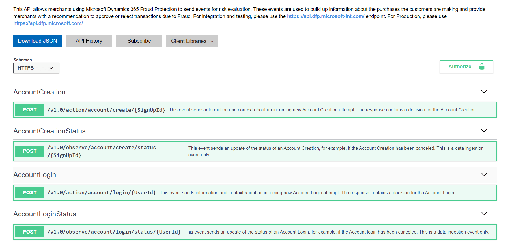
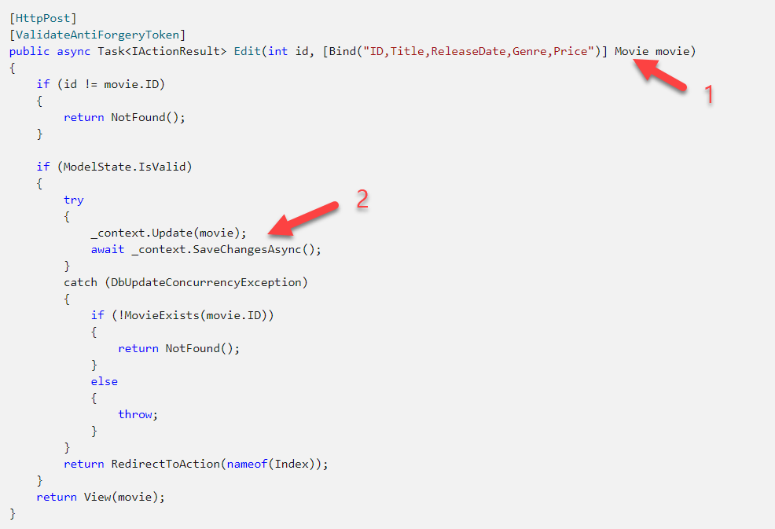

Recent developments (we are in the middle of a massive upgrade of our technology stacks) as well as strategic decisions have forced us to interface with systems and ecosystems not only at code level as we are accustomed to, but additionally at documentation level.

And one of the things that stands out the most is the following:

> **Good** documentation appears to be a secondary objective.

Most institutions, including my own, I must regretfully confess, spend the bulk of our attention on the UI, UX and code, and then, when we have time, the documentation.
  
The documentation I am referring to in this post is specifically technical documentation.

There are a couple of reasons for this:

* Documentation is not glamorous
* Most people are not actually good at writing good documentation
* The deployed software is generally considered the primary deliverable
* The skill-set to write good code and the skill-set to write good documentation are very different.
* For documentation it is easy to conflate quality over quantity
* Good documentation cost resources (time, people and money) and seeing as everyone is cost constrained, if you need to cut costs, you start to cut the easiest targets, and documentation is first on the chopping board.

The premise behind good documentation should make it easy for someone who is totally new to the thing you are documenting to do the following:
* Understand at a broad level what your thing is, and how it works
* Understand what problems you are trying to solve
* Understand how it relates to existing technologies and how it complements / improves upon
* Drill into a deeper level the plumbing and conventions of your thing, and how to use it, preferably with samples
* A list of FAQs that addresses common issues / problems.

Let me discuss a few of the examples of documentation that could do a bit more to meet its objectives.

# Invalid / Wrong Assumptions

Let us look at one of Microsoft's key APIs - the object relational management framework [Entity Framework](https://docs.microsoft.com/en-us/ef/).

Assume you have never used it at all. 

This is the home page of the technology:

An obvious place to start is [Getting Started](https://docs.microsoft.com/en-us/ef/core/get-started/overview/first-app).

You are immediately [dumped here](https://docs.microsoft.com/en-us/ef/core/get-started/overview/first-app?tabs=netcore-cli), where you are expected to run commands and write code.

But what is Entity Framework Core? And how does it relate to Entity Framework?

What is a context class? What is an entity class? What is a model?

I don't think it is reasonable for the authors of this documentation to assume users know these things in advance.

It doesn't get any better as you progress.

Next you are expected to run a bunch of cryptic commands, with nothing but cursory explanations. What is a design package? What is a migration? What is a scaffold? Why does `database update` **create** the database?

Let me not belabour the point. This documentation is written with the assumption that the developers reading already understand the technology, it's history, design considerations, terminologies etc.

> **This is not a valid assumption.**

Due to the fact that Microsoft's own documentation makes so many assumptions, a whole cottage industry of alternative documentation has developed, like [Learn Entity Framework](https://www.learnentityframeworkcore.com/)

Maybe there's something in the [Learn](https://docs.microsoft.com/en-us/learn/modules/persist-data-ef-core/) section

Alas!

There is a laundry list of things you are already expected to know, and you get straight to writing code.

Now in terms of quantity of documentation for Entity Framework - [there is lots and lots of it](https://docs.microsoft.com/en-us/ef/core/get-started/overview/first-app?tabs=netcore-cli).

But bombarding users, especially new users, with lots of specialized documentation without fundamentals and context, while making so many assumptions - does that help or hinder the adoption of the technology?

# Unhelpful Documentation

Another problem is documentation that is there, but is not helpful.

SDK / API documentation is the most notorious for this.

> Listing API end points and parameters is not complete documentation!

Having [SwaggerGen](https://swagger.io/tools/swagger-codegen/) or other such tools to generate [OpenAPI](https://swagger.io/specification/) documentation does not mean that the documentation is complete.

Take a look a the [Microsoft Dynamics365](https://apidocs.microsoft.com/services/dynamics365fraudprotection) fraud protection documentation

It is better than nothing, of course, but to be of real value a bit more effort is needed so that somebody looking to integrate with this service can have all the information they need to:

* Understand the service, and how it works
* Understand any prerequisites and requirements
* Understand how to properly integrate with the service
* Understand various pitfalls and edge cases to beware of

You will still need to spend some time expounding on as many of these as possible
1. Design considerations
2. Sample code for basic scenarios
3. Potential pitfalls and things to watch out for

# Unrealistic / Trivial Samples

Another problem you may encounter is samples that are either unrealistic or too trivial to be of value.

Take a look at this [ASP.NET Core sample](https://docs.microsoft.com/en-us/aspnet/core/tutorials/first-mvc-app/controller-methods-views?view=aspnetcore-5.0) that explains how to interact with a database.

The code here is responsible for persisting a movie domain object to the database.

This code is 100% correct and works perfectly.

> The problem is nobody builds proper applications like this!

1. In a well designed application you do not pass around the actual domain object from the user interface to the database
2. In a well designed application, you probably would not do your database access and error handling directly in the controller - you would use some sort of business / domain logic layer.

It can be argued that rewriting this sample to do this would complicate it, which is true.

But a vast majority of samples do not explain this.

It would have been better to have a second, more detailed sample that tackled the same problem from a properly architected and implemented sample so that experienced developers from other platforms and frameworks who understand these principles can see how the are applied here.

The second and the first samples would then link to each other with a description so that depending on your expertise level, you know which to read.

In conclusion:

Documentation should be a first class deliverable in any product or solution. And, as with all things in life, **quality**, and not **quantity** - is what matters.

Happy hacking!