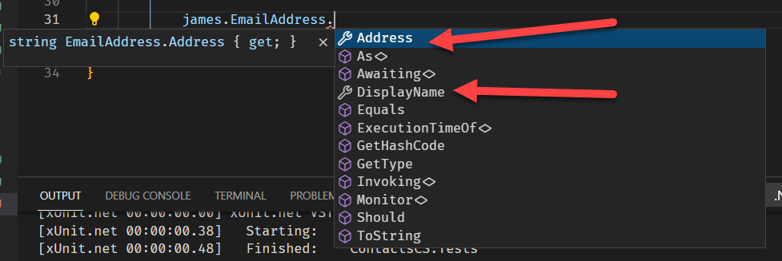

  
One of my favourite maxims is "measure twice so you cut once".

When it comes to developing, improving and maintaining software, you can get a surprising boost from spending some time on refining your domain design.

Let us use an example.

You are working on a contact application, contact in the sense of an address book. For simplicity I have skipped all but the essentials to demonstrate the point.

Here is the contact class:

```csharp
public class Contact
{
    public string FirstName { get; set; }
    public string Surname { get; set; }
    public DateTime DateOfBirth { get; set; }
    public string EmailAddress { get; set; }
    public string PhoneNumber { get; set; }
}
```

Pretty straightforward.

Here is a test that constructs a contact and tests the construction.

```csharp
[Fact]
public void ContactIsConstructedCorrectly()
{
    var firstName = "James";
    var surname = "Bond";
    var dateOfBirth = new DateTime(1930, 1, 1);
    var emailAddress = "ShakenNotStirred@gmail.com";
    var phoneNumber = "555-444-33-2";
    
    var james = new Contact()
    {
        FirstName = firstName,
        Surname = surname,
        DateOfBirth = dateOfBirth,
        EmailAddress = emailAddress,
        PhoneNumber = phoneNumber
    };
    
    james.FirstName.Should().Be(firstName);
    james.Surname.Should().Be(surname);
    james.DateOfBirth.Should().Be(dateOfBirth);
    james.EmailAddress.Should().Be(emailAddress);
    james.PhoneNumber.Should().Be(phoneNumber);
}
```

This runs perfectly. However, this code also allows you to do this:

```csharp
var jason = new Contact();
```

If you don't specify any values, the runtime will construct a contact with default values for each type. In this case, there are two types we are using: `string` and `DateTime`.

The default for string is a null string, ""

The default for DateTime is midnight on first January, year 0.

`1 Jan 0001 00:00:00`

In fact, we can verify this with tests:

```csharp
jason.FirstName.Should().Be(default(string));
jason.Surname.Should().Be(default(string));
jason.DateOfBirth.Should().Be(default(DateTime));
jason.EmailAddress.Should().Be(default(string));
jason.PhoneNumber.Should().Be(default(string));
```

This means that we need to find a way to force the creation of a valid contact.

A way to do this is to use a constructor to set (and validate) fields.

Here we are doing a couple of things:

- We are making sure the `FirstName`, `Surname`, `DateOfBirth`, `EmailAddress` and `PhoneNumber` are provided.
- For the string values, we are insisting on a value being provided - so we reject empty strings, nulls, and whitespace
- For date of birth we are rejecting dates later than today or earlier than 1 Jan 1900 (The exact date as a lower bound depends on your logic)

If the validations pass, we can then go ahead to assign the values.

The class now looks like this:

```csharp
public class ContactV1
{
    public string FirstName { get; }
    public string Surname { get; }
    public DateTime DateOfBirth { get; }
    public string EmailAddress { get; }
    public string PhoneNumber { get; }
    public ContactV1(string firstName, string surname, DateTime dateOfBirth, string emailAddress, string phoneNumber)
    {
        if (string.IsNullOrWhiteSpace(firstName))
            throw new ArgumentNullException(nameof(firstName));
        if (string.IsNullOrWhiteSpace(surname))
            throw new ArgumentNullException(nameof(surname));
        if (string.IsNullOrWhiteSpace(emailAddress))
            throw new ArgumentNullException(nameof(emailAddress));
        if (string.IsNullOrWhiteSpace(phoneNumber))
            throw new ArgumentNullException(nameof(phoneNumber));
        
        if (dateOfBirth < new DateTime(1900, 1, 1) || dateOfBirth >= DateTime.Today)
            throw new ArgumentOutOfRangeException(nameof(dateOfBirth));
        
        FirstName = firstName;
        Surname = surname;
        DateOfBirth = dateOfBirth;
        EmailAddress = emailAddress;
        PhoneNumber = phoneNumber;
    }
}
```
We can verify with a test now that you can no longer create an invalid `Contact`.


Given this is a contact application, we can assume (for this example) that we will always know the name, email and phone number. The Date of birth, however, is not always known - people generally have all the other information on their business cards, but not their date of birth.

In other words, date of birth is optional.

This means we have to make two more changes:

First, we need to be explicit in our domain that the `DateOfBirth` might not be known. Rather than use a magic date (1 Jan 0000 00:00), we can signal explicitly in our domain that the value is optional. For this we can use a nullable date.

This means we change from:

```csharp
public DateTime DateOfBirth { get; }
```

to

```csharp
public DateTime? DateOfBirth { get; }
```

Note the `?`, indicates to the runtime that the `DateOfBirth` is nullable.

This means we can check if the `DateOfBirth` is null - if it is, then no `DateOfBirth` was provided.

The second change would be to add another constructor to cater for a situation where we don't know the `DateOfBirth`.

Rather than create a constructor and copy the contents of the existing one, we can make use of the fact that we can call a constructor from another.

Our new constructors will now look like this:

```csharp
public ContactV1(string firstName, string surname, DateTime dateOfBirth, string emailAddress, string phoneNumber)
    : this(firstName, surname, emailAddress, phoneNumber)
{
    if (dateOfBirth < new DateTime(1900, 1, 1) || dateOfBirth >= DateTime.Today)
        throw new ArgumentOutOfRangeException(nameof(dateOfBirth));
        
    DateOfBirth = dateOfBirth;
}

public ContactV1(string firstName, string surname, string emailAddress, string phoneNumber)
{
    if (string.IsNullOrWhiteSpace(firstName))
        throw new ArgumentNullException(nameof(firstName));
    if (string.IsNullOrWhiteSpace(surname))
        throw new ArgumentNullException(nameof(surname));
    if (string.IsNullOrWhiteSpace(emailAddress))
        throw new ArgumentNullException(nameof(emailAddress));
    if (string.IsNullOrWhiteSpace(phoneNumber))
        throw new ArgumentNullException(nameof(phoneNumber));

    FirstName = firstName;
    Surname = surname;
    EmailAddress = emailAddress;
    PhoneNumber = phoneNumber;
}
```

With this improvements now we have the following advantages:
1. It is impossible to create an invalid object
2. In our domain we know exactly whether a date of birth has been provided or not, and can write code accordingly to handle either case

For example, perhaps in various parts of the application, we want to display the age of the contact.

This is normally a simple computation, and a simple enough algorithm is the current year minus the year of birth.

Or alternatively we can get the days between the current date and the year of birth and divide those by 364.

Rather than have these computations everywhere, we can do it in the model as a lambda property.

```csharp
public byte Age => (byte)(DateTime.Today.Year - DateOfBirth.Value.Year);
```
 
 Given `DateOfBirth` may be null, we have to factor that in as well.
 
 We therefore make `Age` nullable as well, and handle that in our code, making use of the fact that we can check whether there is a value using the HasValue property of all `Nullable<T>` types.
 
 Our new computed property is now this:
 
```csharp
public byte? Age
{
    get
    {
        if (DateOfBirth.HasValue)
            return (byte)(DateTime.Today.Year - DateOfBirth.Value.Year);
        return null;
    }
}
```

Now in our domain whenever we want to use the `Age` of a contact, it is baked right into the `Contact`.

```csharp
Console.WriteLine (james.Age);
```

Having it this way means we can change our implementation to whatever we want.

We can decide add a new string property to handle the case when the `DateOfBirth` is unknown. Perhaps for use on the user interface, without having to keep handling the possibility of a null `Age`.

In which case the property would look like this:

```csharp
public string DisplayAge => Age == null ? "Unknown" : $"{Age}";
```

We are leveraging the fact that we are already computing the `Age` in another property; so we check if that is `null` and output the appropriate string.

We can verify the code with tests for each scenario:

First we test with 3 dates and the corresponding ages (specified in the `InlineData` attribute)

```csharp
[Theory]
[InlineData(1950, 1, 71)]
[InlineData(1950, 12, 71)]
[InlineData(1960, 1, 61)]
public void AgeIsComputedCorrectly(int birthYear, int birthMonth, byte age)
{
    var james = new ContactV1("james", "bond", new DateTime(birthYear, birthMonth, 1), "james@gmail.com", "32423424");
    james.Age.Should().Be(age);
}
```

Next we test with a `Contact` without a date of birth
```csharp
[Fact]
public void ContactWithoutAgeHasAgeHandledComputedCorrectly()
{
    var james = new ContactV1(firstName: "james", surname: "bond", emailAddress: "james@gmail.com", phoneNumber: "32423424");
    james.Age.Should().BeNull();
}
```

Another problem is email.

This is perfectly valid code:

```csharp
var james = new ContactV1(firstName: "james", surname: "bond", emailAddress: "2423424242423", phoneNumber: "32423424");
```

Everywhere you need to use this email, you will need to validate that it is in fact a valid email address.

A simple way to handle this is to do the validation in the constructor.

```csharp
string pattern = @"^(?!\.)(""([^""\r\\]|\\[""\r\\])*""|"
+ @"([-a-z0-9!#$%&'*+/=?^_`{|}~]|(?<!\.)\.)*)(?<!\.)"
+ @"@[a-z0-9][\w\.-]*[a-z0-9]\.[a-z][a-z\.]*[a-z]$";

var regex = new Regex(pattern, RegexOptions.IgnoreCase);
if (!regex.IsMatch(emailAddress))
    throw new ArgumentException($"{emailAddress} is an invalid email");
```

[Validating email addresses is very difficult](http://haacked.com/archive/2007/08/21/i-knew-how-to-validate-an-email-address-until-i.aspx/), so the solution here is one of the simpler techniques.

We can verify valid and invalid emails with two tests:

```csharp
[Fact]
public void ValidEmailIsAccepted()
{
    var james = new ContactV1(firstName: "james", surname: "bond", emailAddress: "james@gmail.com", phoneNumber: "32423424");
    james.Age.Should().BeNull();
}

[Fact]
public void InValidEmailIsRejected()
{
    var ex = Record.Exception(() =>
    {
        var james = new ContactV1(firstName: "james", surname: "bond", emailAddress: "2423424242423", phoneNumber: "32423424");
    });
    ex.Should().BeOfType<ArgumentException>();
}
```

But - we have not really solved the problem.

Technically, the email address is indeed a string.

But, if you think about it, an email address has **meaning**. It is not just a string. There is the address itself, and the display name.

what if we created a new type to encapsulate this?

```csharp
public class EmailAddress
{
    public string DisplayName { get; }
    public string Address { get; }
    public EmailAddress(string displayName, string address)
        : this(address)
    {
        if (string.IsNullOrWhiteSpace(displayName))
            throw new ArgumentNullException(nameof(displayName));

        DisplayName = displayName;
    }
    public EmailAddress(string address)
    {
        if (string.IsNullOrWhiteSpace(address))
            throw new ArgumentNullException(nameof(address));

        string pattern = @"^(?!\.)(""([^""\r\\]|\\[""\r\\])*""|"
    + @"([-a-z0-9!#$%&'*+/=?^_`{|}~]|(?<!\.)\.)*)(?<!\.)"
    + @"@[a-z0-9][\w\.-]*[a-z0-9]\.[a-z][a-z\.]*[a-z]$";

        var regex = new Regex(pattern, RegexOptions.IgnoreCase);
        if (!regex.IsMatch(address))
            throw new ArgumentException($"{address} is an invalid email");

        Address = address;
        DisplayName = address;
    }
}
```
The rationale here is:
- An email address is composed of an **address** (*james@gmail.com*) and a **display name** (*James Bond*)
- If a display name is not provided, use the email address as the display name
- The validations from our earlier code should be preserved here.

Thus, instead of passing a string around (that happens to be an email address) - we are passing around an actual type.

We thus refactor our `Contact` type to be like this:

```csharp
public class ContactV2
{
    public string FirstName { get; }
    public string Surname { get; }
    public DateTime? DateOfBirth { get; }
    public EmailAddress EmailAddress { get; }
    public string PhoneNumber { get; }
    public byte? Age
    {
        get
        {
            if (DateOfBirth.HasValue)
                return (byte)(DateTime.Today.Year - DateOfBirth.Value.Year);
            return null;
        }
    }
    public string DisplayAge => Age == null ? "Unknown" : $"{Age}";
    public ContactV2(string firstName, string surname, DateTime dateOfBirth, string emailAddress, string phoneNumber)
        : this(firstName, surname, emailAddress, phoneNumber)
    {
        if (dateOfBirth < new DateTime(1900, 1, 1) || dateOfBirth >= DateTime.Today)
            throw new ArgumentOutOfRangeException(nameof(dateOfBirth));
    
        DateOfBirth = dateOfBirth;
    }
    public ContactV2(string firstName, string surname, string emailAddress, string phoneNumber)
    {
        if (string.IsNullOrWhiteSpace(firstName))
            throw new ArgumentNullException(nameof(firstName));
        if (string.IsNullOrWhiteSpace(surname))
            throw new ArgumentNullException(nameof(surname));
        if (string.IsNullOrWhiteSpace(phoneNumber))
            throw new ArgumentNullException(nameof(phoneNumber));
    
        FirstName = firstName;
        Surname = surname;
        EmailAddress = new EmailAddress(emailAddress);
        PhoneNumber = phoneNumber;
    }
}
```

Note that the constructor is still taking a string as the parameter for the `emailAddress`, but then going on ahead to construct an `EmailAddress` object.

Note also that we are no longer validating email here - it has been delegated to the `EmailAddress` type.



Now this is unquestionably more code up front. What are the benefits?

1. The `EmailAddress` type can be used in other parts of the domain, or even used in another application altogether. And as improvements are made and functionality is added (and bugs fixed!) the benefits trickle down.
2. Any logic that receives an `EmailAddress` object knows what it is, and how to use it. It does not need to perform any additional validations.
3. The state of the object will always be correct

So if in other parts of the application you have code like this:

```csharp
public void SendEmail(string emailAddress)
{

}
```

You can refactor it to be this:

```csharp
public void SendEmail(EmailAddress emailAddress)
{

}
```

You will face a similar problem with phone numbers.

This is the same phone number:

* 254721000000
* 0721000000
* 0721-000-000
* 0721-000000
* 254-721-000-000
* 254-721000000


How many times have you attempted to dial a number, or enter a phone number into a form and been told your phone number is invalid?

This problem can be solved using a number of new types (I am skipping the constructors and validations, as well as making the types mutable to make the code shorter. In reality it should follow the model of `EmailAddress`)

```csharp
public class Country
{
    public string Name { get; set; }
    public string CountryCode { get; set; }
}
public class MobileOperator
{
    public string Name { get; set; }
    public string Prefix { get; set; }
}
public class PhoneNumber
{
    public Country Country { get; set; }
    public MobileOperator MobileOperator { get; set; }
    public string Number { get; set; }
    public string DisplayFullNumber => $"{Country.CountryCode}{MobileOperator.Prefix.Substring(1, 3)}{Number}";
    public string DisplayShortNumber => $"{MobileOperator.Prefix}{Number}";
}
```
There are two computed properties in the type, `DisplayFullNumber` and `DisplayShortNumber` that illustrate how to work around formatting issues. You can even add others!

To demonstrate how it works, here are some tests:

```csharp
[Fact]
public void PhoneNumberIsConstructedCorrectly()
{
    var kenya = new Country() { Name = "Kenya", CountryCode = "254" };
    var safaricom = new MobileOperator() { Name = "Safaricom", Prefix = "0721" };
    var phoneNumber = new PhoneNumber() { Country = kenya, MobileOperator = safaricom, Number = "000000" };
    phoneNumber.DisplayFullNumber.Should().Be("254721000000");
    phoneNumber.DisplayShortNumber.Should().Be("0721000000");
}
```
With this change the `PhoneNumber` type now can be delegated the responsibility of the interpretation and display of a phone number.

And, just like `EmailAddress` this type can be used across the domain, or packaged into a Nuget package for use in other projects.

And, again, just like `EmailAddress`, any code using this type knows what it is, and how to use it.

A common problem with this approach is how do you structure unstructured data? Users often will not be expected to structure their input in such a way!

You can solve this by writing some code to parse unstructured data into structured.

Like this:

```csharp
public static PhoneNumber Parse(string input)
{
    Country country = null;
    MobileOperator mobileOperator = null;

    //
    // This is a MASSIVELY simplified algorithm!
    //

    var parsedCountry = input.Substring(0, 3);
    if (parsedCountry == "254")
        country = new Country() { Name = "Kenya", CountryCode = "254" };

    var parsedMobileOperator = input.Substring(3, 3);
    if (parsedMobileOperator == "721")
        mobileOperator = new MobileOperator() { Name = "Safaricom", Prefix = "0721" };

    return new PhoneNumber()
    {
        Country = country,
        MobileOperator = mobileOperator,
        Number = input.Substring(6, input.Length - 6)
    };
}
```

We can check it works with a test:

```csharp
[Fact]
public void PhoneNumberIsParsedCorrectly()
{
    var kenya = new Country() { Name = "Kenya", CountryCode = "254" };
    var safaricom = new MobileOperator() { Name = "Safaricom", Prefix = "0721" };

    var inputPhoneNumber = "254721000000";
    var phoneNumber = PhoneNumber.Parse(inputPhoneNumber);
    phoneNumber.Country.CountryCode.Should().Be(kenya.CountryCode);
    phoneNumber.Country.Name.Should().Be(kenya.Name);
    phoneNumber.MobileOperator.Name.Should().Be(safaricom.Name);
    phoneNumber.MobileOperator.Prefix.Should().Be(safaricom.Prefix);
    phoneNumber.Number.Should().Be("000000");
    phoneNumber.DisplayFullNumber.Should().Be("254721000000");
    phoneNumber.DisplayShortNumber.Should().Be("0721000000");
}
```

Our final class now looks like this:

```csharp
public class ContactV3
{
    public string FirstName { get; }
    public string Surname { get; }
    public DateTime? DateOfBirth { get; }
    public EmailAddress EmailAddress { get; }
    public PhoneNumber PhoneNumber { get; }
    public byte? Age
    {
        get
        {
            if (DateOfBirth.HasValue)
                return (byte)(DateTime.Today.Year - DateOfBirth.Value.Year);
            return null;
        }
    }
    public string DisplayAge => Age == null ? "Unknown" : $"{Age}";
    public ContactV3(string firstName, string surname, DateTime dateOfBirth, string emailAddress, string phoneNumber)
        : this(firstName, surname, emailAddress, phoneNumber)
    {
        if (dateOfBirth < new DateTime(1900, 1, 1) || dateOfBirth >= DateTime.Today)
            throw new ArgumentOutOfRangeException(nameof(dateOfBirth));

        DateOfBirth = dateOfBirth;
    }
    public ContactV3(string firstName, string surname, string emailAddress, string phoneNumber)
    {
        if (string.IsNullOrWhiteSpace(firstName))
            throw new ArgumentNullException(nameof(firstName));
        if (string.IsNullOrWhiteSpace(surname))
            throw new ArgumentNullException(nameof(surname));
        // THis validation should be performed in the PhoneNumber object
        if (string.IsNullOrWhiteSpace(phoneNumber))
            throw new ArgumentNullException(nameof(phoneNumber));

        FirstName = firstName;
        Surname = surname;
        EmailAddress = new EmailAddress(emailAddress);
        PhoneNumber = PhoneNumber.Parse(phoneNumber);
    }
}
```

Another unexpected benefit of this domain model is that the types are immutable - once they are constructed, they cannot be mutated. (Note in the property definitions, there are no setters).

This has a number of benefits:

1. No bugs from when state is changed by accident
2. Thread-safe for free - given there are no setters - you don't need to write code to factor in contention and state mutation
3. Predictable - no matter how many places the object is passed around - you can rely on the state to be known.

Spending more time on domain design leads to the following benefits:
1. Code that is more modular
2. Code that is easier to debug and test
3. Code that is to maintain, and add features
4. Code that is easier to read and internalize
5. Focused objects with single responsibility
6. Reduction (or outright) removal of state, making objects predictable

The code is in my [Github](https://github.com/conradakunga/BlogCode/tree/master/2021-07-29%20-%20Domain%20Design).

Happy hacking!
