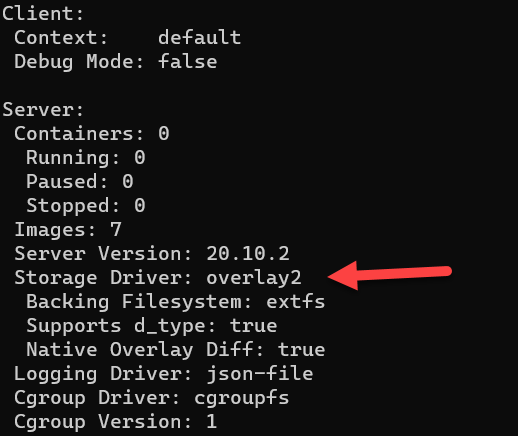

While upgrading [docker](https://www.docker.com/) you may get the following error:

```plaintext
Preparing to unpack .../0-docker.io_20.10.7-0ubuntu1~20.04.1_amd64.deb ...
The aufs storage-driver is no longer supported.
Please ensure that none of your containers are
using the aufs storage driver, remove the directory
/var/lib/docker/aufs and try again.
dpkg: error processing archive /tmp/apt-dpkg-install-qrebPX/0-docker.io_20.10.7-0ubuntu1~20.04.1_amd64.deb (--unpack):
 new docker.io package pre-installation script subprocess returned error exit status 1
```

The issue here is that docker has deprecated the [AUFS](https://docs.docker.com/storage/storagedriver/aufs-driver/) storage driver, previously the default.

You can read about the details [here](https://docs.docker.com/storage/storagedriver/overlayfs-driver/).

To fix this do the following:

1. **Stop running containers**

    From where you have your `docker-compose.yml` file, run the following command: 
    
    ```bash
    sudo docker-compose down
    ```
    
2. **Stop docker**
    
    Run the following command to stop the docker service:
    
    ```bash
    sudo systemctl stop docker
    ```

3. **Back up the current `aufs` location**

    ```bash
    sudo cp -au /var/lib/docker /var/lib/docker.bak
    ```
    
4. **Clear the current `aufs` location**

    ```bash
    sudo rm -rf /var/lib/docker/aufs/
    ```

    
    If you get the following error:
    
    ```plaintext
    rm: cannot remove 'aufs/mnt/7d07dfe17fda8a61bc2b90ec6bd02ba43166394dd2c91ed171864e5389ab8103': Is a directory
    rm: cannot remove 'aufs/mnt/98e8c98dabd63b3ebc36911416c808966b24fcb0367d66c294f0b4a4da273bed': Is a directory
    ```

    
    This means that your containers are probably still running, or docker has an active handle to one of more of your containers.
    
5. **Create / Update `/etc/docker/daemon.json`**

    It should have the following contents:
    
   ```json
    {
        "storage-driver": "overlay2"
    }
    ```
6. **Restart docker**

    Run the following command
    
    ```bash
    sudo systemctl start docker
    ```

To verify that it worked, run the following command:

```bash
docker info
```

If you see the following, it was a success.



You can now restart your containers.

```bash
sudo docker-compose up -d
```

**Note that this will re-download and recreate the images and volumes.**

You can now upgrade your docker.

If everything runs OK after upgrading and restarting your containers, you can delete the backups.

Happy hacking!