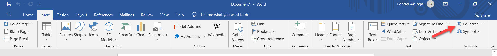
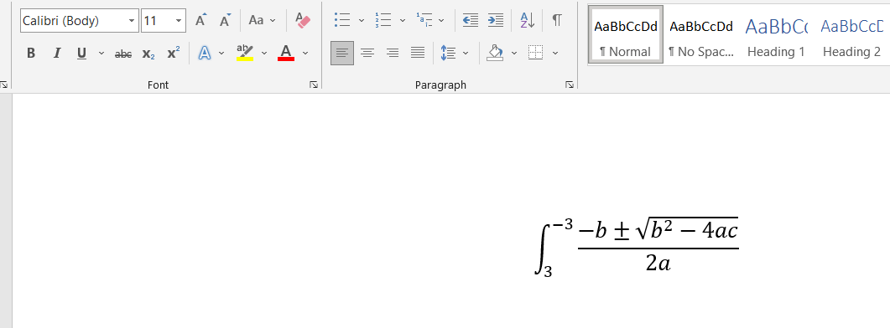
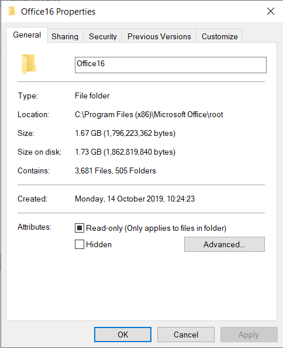
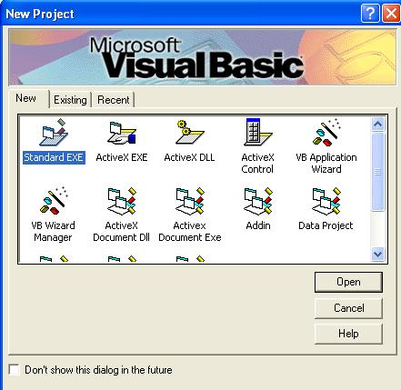
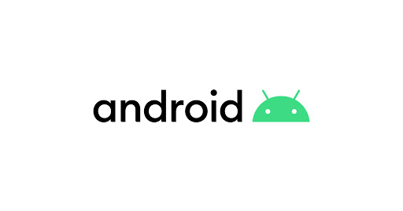

Occasionally you will hear somebody say, (or you yourself may say) something like:

> Software nowadays is bloated

What is bloat, anyway?

From [Wikipedia](https://en.wikipedia.org/wiki/Software_bloat)

> Software bloat is a process whereby successive versions of a computer program become perceptibly slower, use more memory, disk space or processing power, or have higher hardware requirements than the previous version — while making only dubious user-perceptible improvements or suffering from feature creep.

I actually agree entirely with this definition.

However the devil is in the details. Especially this part:

> while making only dubious user-perceptible improvements or suffering from feature creep.

What is **dubiously user-perceptible** is a highly subjective matter.

Take for example [Microsoft Word](https://www.microsoft.com/en-us/microsoft-365/word).

Almost everybody has or is currently using it.

However, very few people know that Word has an equation editor.

Fewer people still know where it is.

And fewer people still know how to use it.

The only reason I happen to know this is I use it extensively in the course of my work and I can tell you for a fact that it is brilliant - very well thought out, very powerful and am yet to come across any equation I have been unable to express using the editor.

As a software developer I also understand how much work goes into making something look easy. I have no doubt thousands of man hours, not to mention lines of code and hours of testing have gone into this feature.

If I check the disk usage of my Office folder, this is what I get.

I am currently using Office 2019.

Assume there is a new version, Office 2020.

Assume also that due to COVID and other circumstance, the only features that were shipped were updates to the equation editor.

Somebody who does not in fact use this feature will check the disk usage of office 2020 and find that it uses 1.83GB, up from 1.73GB.

Given that nothing that they use on a day to day basis has significantly changed, this person would then conclude that the new Office 2020 is **bloated**.

Is it though?

Every so often there will be talk of a somebody asking for a "lightweight version of X, that just has the essentials and none of the fluff".

X here is anything from a document editor to a fully blown operating system.

The exact same problem arises.

What is "essential" for you is not essential for me.

I will consider an equation editor as essential.

A journalist will consider word count, dictionary, auto-correct and thesaurus as essential.

Do you know what you get when you take a basic word processor and add everybody's essential features?

Microsoft Word.

Windows is frequently accused of being bloated.

That "bloat" is why that printer you bought while in campus still works when plugged in to your computer.

That "bloat" is why software written in Visual Basic 6 (released in 1998, some 23 years ago) still runs.

[Android](https://www.android.com/) too is often accused of being bloated.

That "bloat" is why the (essentially) same operating system works in the same way for dozens of phone manufacturers, across dozens of screen sizes, form factors and feature combinations of devices.

Think back - not too far ago not only did most phone manufacturers have their own operating systems, the operating systems were even different across models of the same manufacturer!

Android found a way to solve this problem.

From a quick google a typical Android installation in terms of disk space is between 2 and 6 GB.

Contained therein is years of code, man hours of testing and experience that make the working of Android seamless regardless of manufacturer or device.

So when you ask yourself why do I need 6GB of "bloat" to make calls, send texts and WhatApp means - there's your answer.

Take as another example a comparison between [Google Sheets](https://www.google.com/sheets/about/) and [Microsoft Excel](https://www.microsoft.com/en-us/microsoft-365/excel).

For casual usage - lists, simple models - they are pretty much at par.

Casual users will consider Excel bloated.

But ask anyone who builds complex dynamic models for a living and **they will laugh Google Sheets out of town**.

So in conclusion, **one person's bloat is another person's features**.

Having said that - I don't understand why software vendors are falling over themselves to introduce Dark Mode to their products.

Happy hacking!