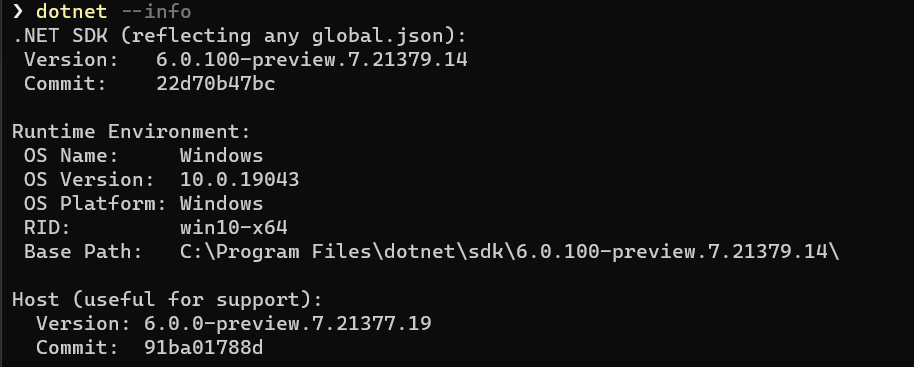
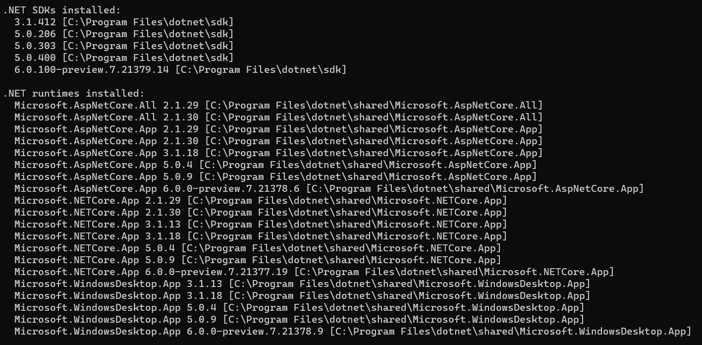
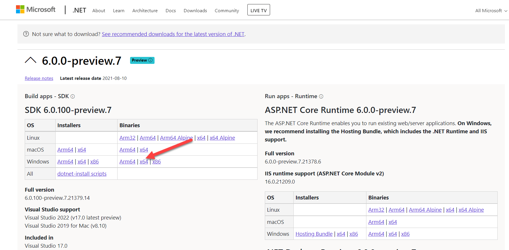
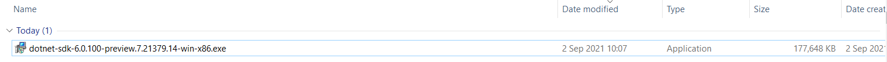

After installing the .NET 6 SDK you can confirm that it was successfully installed and recognized by running the following command:

```bash
dotnet --info
```

You should get output like this:



Here you can see I am running preview 7.

If you scroll down a bit you should see a list of the installed SDKs and runtimes.



If the info command does not report the latest SDK that you have just installed, there are two possibilities:

1. There is a `global.json` file in the current folder, or a parent folder that is [fixing the .NET version](https://docs.microsoft.com/en-us/dotnet/core/tools/global-json?tabs=netcore3x)
2. You are using a 64 bit machine but you have installed the **x86** version of the SDK instead of the **x64**.

    

    If you install the **x86** version (as I had) on a 64 bit machine it will not be recognized
    
    
    
Happy hacking!