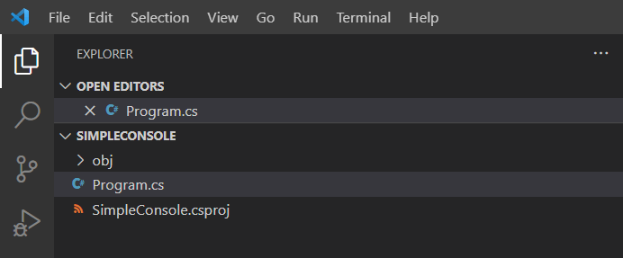
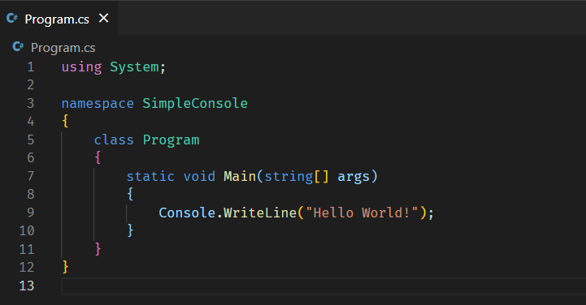
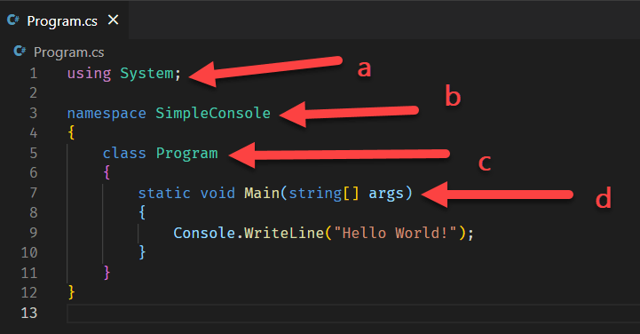
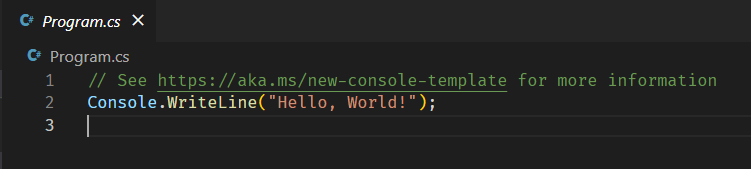

One of the challenges of developing and maintaining a programming languages and its accompanying tooling is you have to be welcoming to several demographics:
1. Experienced developers on your tool-set
2. Experienced developers from other tool-sets
3. Students
4. Complete newcomers to programming & hobbyists

The problem is the requirements of each of these are almost always in direct conflict with the others.

In .NET 5, if you wanted a console (command line) application, here is how you would generate an empty skeleton in the current folder:

```bash
dotnet new console
```

Let us open this in [Visual Studio Code](https://code.visualstudio.com/), but you of course can use any editor of your choice.

Browse to the current folder in whatever shell you are using (remember, .NET is [cross platform](https://dotnet.microsoft.com/) and works in **Linux**, **MacOS** and **Windows**) and run the following command

```bash
code .
```

Once the editor launches you should see this on the left pane, a list of the files that have been generated:



* `Program.cs` is the actual code
* `SampleConsole.csproj` is the file that tells the compiler that your project is a command line application (among other things, but for now that is the main purpose)

The generated program itself is as follows:



If you are an experience developer in Java or C++ or any of the traditional object oriented languages you will probably understand what is happening in this file. The syntax and keywords are even mostly the same.

If, however, you are a student, or are a hobbyist who wants to try out the language, you will wonder what these things are:



1. What is `using system?`
2. What is a `namespace`?
3. Obviously this is a program. Why should you have to say so? And why is it a `class`?
4. What is `static`, `void` and `Main`? And what is `string[] args`? 

These are **barriers to entry**.

Which is not to say that they are not important. They are. But do they need to be exposed right out of the gate? Probably not.

Which is the topic of today's look at .NET 6.

If, while using the .NET 6 SDK you run the same command to create a console application, this is how the file looks:



That's right. It is a single line of code.

Line 1 is a comment pointing to [this link](https://docs.microsoft.com/en-us/dotnet/core/tutorials/top-level-templates) that explains to veteran .NET developers what happened to all the ceremony. This will almost certainly be removed at some point.

It is important to point out that both this and the previous files **compile to exactly the same thing** under the hood, and are **both valid** C#.

The difference is the C# compiler will generate the plumbing under the hood if it does not find any. This is a feature called t[op level statements](https://docs.microsoft.com/en-us/dotnet/csharp/fundamentals/program-structure/top-level-statements).

Obviously you would not write an entire application like this - but a quick utility or a proof of concept? Absolutely.

This feature encourages developers to quickly **experiment**, **prototype** and **learn** without having to deal with the plumbing and best practices of how to properly structure and architect an application immediately.

Those can be added later.

And for those wondering, the `args` parameter (the arguments that are passed when running the application) is still accessible.

So your entire application can look like this:

```csharp
Console.WriteLine("Hello, World!");

Console.WriteLine($"The first parameter passed was {args[0]}");
```

# Thoughts

This feature (predictably) has received mixed reactions, especially from seasoned C# developers who object to it.

Personally I think it is overwhelmingly **a good thing** - don't assume everyone is an enterprise developer who uses the latest patterns and practices.

It is better to simplify things and add complexity later than to make them complex at the beginning.

The issue of making assumptions is [something I have discussed earlier where in some of Microsoft's documentation the assumptions made sometimes I strongly feel are unreasonable.]() 

The important thing to remember is structure and organization is not being removed - it is just being made transparent. You can add your own as and when you wish.

# TLDR

You can build an entire functioning application in a single line of code.

**This is Day 2 of the 30 Days Of .NET 6 where every day I will attempt to explain one new / improved thing in the upcoming release of .NET 6.**

Happy hacking!