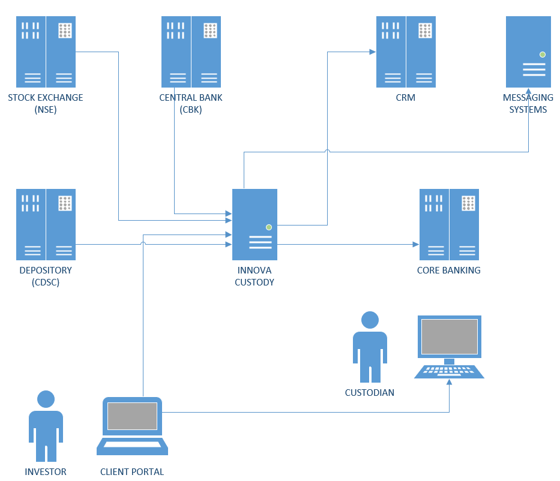

A question I commonly get is "What does [Innova](https://www.innova.co.ke/) actually do? What is a custodian and how do you help them?"

Quite simply a custodian is 

> An institution whose responsibility is to track and safeguard assets on behalf of customers.

Customers may be individuals (for example individuals investing their own of family money) or institutions (such as the National Social Security fund).

"Track and safeguard assets" is a very short statement. But what does this mean?

Let us take an example of stocks.

Say you bought 1,000 shares of a stock, TelAirCom on 1 September at  a price of 10/-.

There are several things that you need to do & keep track of.

1. There is the actual cost of buying the security - 1,000 * 10 /- = 10,000
2. The trade is effected through a broker, who charges fees. Usually this is a percentage of the purchase value
3. There are three bodies that you deal with, each of which charges a levy
    1. [Capital Markets Authority](https://www.cma.or.ke/) - the regulator of the capital markets market
    2. [Nairobi Securities Exchange](https://www.nse.co.ke/) - the instiution that actually runs the NSE
    3. [Central Deposits and Settlement Corproation](https://www.cdsckenya.com/) - the institution that provides clearing and settlement services for the capital markets. Think of this as the equivalent of the central bank
    4. (Potentially) the [Kenya Revenue authority](https://www.kra.go.ke/en/), because, tax.
4. These various levies, fees and taxes need to be calculated and charged to the buyer.
5. You need to generate the appropriate documentation and instructions to the broker

You need to know all these so that you can determine the **actual cost** of purchase. 

**You need to know your cost so that you can determine the gain/loss of your portfolio at any given instant.**
    
Once the trade has been effected, it takes some time for the shares to be reflected in the depository account of the buyer. This is the role of the CDSC - to keep these records of movements between buyer and seller up to date.

In Kenya, this takes 3 working days (when you hear T+3, this is what they mean). In other markets this period varies.

Once the shares are in your account, your portfolio is subject to the following:

1. Daily fluctuation in share prices due to market movements
2. Corporate actions that increase / decrease the number of your shares
    1. Share splits
    2. Reverse splits
    3. Bonuses
3. Corporate actions that result in cash movements into your portfolio
    1. Dividends
    2. Scrip dividends
4. Other, more elaborate corporate actions - such as tracking of rights issue entitlement, takeovers and mergers.

**You need to track all of these on a daily basis so that you can have an accurate picture of the value of your portfolio.**

Finally there is the sale/disposal process.

This is exactly the reverse of the purchase.

When you sell 500 shares of TelAirCom you need to keep do and track of:

1. Cost of selling the security - 500 * 11.50
2. Broker fees
3. Levies to CMA, CDSC & NSE
4. Taxes
5. Documentation to the broker

After the sale has been effected you need to recompute your portfolio in terms of the shares you own, their value, and your potential gain/loss.

Selling is much trickier than it looks at first glance.

Suppose you have this position
1. Purchased 500 shares at 10/-
2. Purchased 500 shares at 12/-

Then you want to sell 600 shares.

How do you determine the purchase value of the shares you are selling? Because there are several ways of doing it

1. 500 of those bought at 10/- + 100 bought at 12/-, giving a purchase value of (5,000 + 1,200 = 6,200); better known as FIFO
2. 500 of those bought at 12/- + 100 bought at 10/-, giving a purchase value of (6,000 + 1,000 = 7,000); better known as LIFO
3. Determining a weighted purchase price (details of which I won't get into here)

Keeping track of this is not trivial.

Then keep in mind there are other securities:

1. Deposits; where you need to track
    1. Daily interest accruals
    2. Daily tax accruals
    3. Maturities & maturity value
    4. Interest computation complications (leap years, changes in tax rates mid deposit,etc)
2. Bills & commercial paper (mostly as above)
3. Bonds (treasury and corporate; fixed & floating); where you need to track
    1. 4 different valuation techniques
        1. Mark To Market
        2. Straight line amortization
        3. Effective amortization
    2. Daily discount accrual
    3. Daily tax accruals
    4. Daily interest accruals
    5. Daily tax accruals
    6. Different interest computation techniques
        1. Simple interest
        2. Compound interest, with different rollover cycles
    6. Coupon payments
4. Offshores (largely same issues as stocks)
5. Exchange Traded funds
6. Loans
7. Exchange Trade funds
8. REITS
9. Fixed Assets
10. Off Market Debt
11. Guarantee Funds

Over and above managing the trades and portfolio positions, you also have to:
1. Integrate with a core banking system to move money
2. Integrate to an accounting system and post appropriate entries to generate P&L statements and balance sheets
3. Report to clients
4. Bill for services rendered

Now on top of the headache of doing all this things imagine:
1. You are managing an enormous fund like NSSF
2. You are managing securities and investment purchased in different countries, with different rules, and placed in different currencies.

This is the problem we are solving for custodians.

Over the last 10 years we have built and refined a solution that does the following:

1. Automates order placement & document generation
2. Seamlessly integrates with core banking solutions ([FlexCube](https://www.oracle.com/industries/financial-services/banking/flexcube-universal-banking/), [Finacle](https://www.edgeverve.com/finacle/), [Finastra](https://www.finastra.com/)) so that users don't have to log in to the core banking systems to actually move money
3. Integrates with the NSE and various other exchanges in Africa to automatically download stock prices, bond prices and yields for valuation in either using close of day prices or real-time (depending on client needs)
4. Values portfolios in real-time regardless of security and currency, and automatically displays valuations in reporting currency in real-time.
5. Values securities like bonds using 3 pricing techniques to aid in analysis
6. Seamlessly handles market differences when it comes to operations (364 vs 365 day markets, closing vs opening position valuation, computation methodologies). Over and above the market standard operations, we have customized our algorithms to handle some unique nuances in these jurisdictions:
    1. Kenya
    2. Uganda
    3. Tanzania
    4. Rwanda
    5. Zambia
    6. Ghana
7. Expose various APIs for integration with other banking systems such as reporting and customer relationship management systems (CRM).
8. Individual and batch messaging using existing infrastructure or our own providers.
9. A client portal for clients to view transactions and holdings statements for themselves.
10. Keep track of expected corporate actions across instruments, as well as discrepancies.
11. Automated holdings reconciliation with depository institutions.
12. Internally generate and maintain complete set of fund accounts (Balance sheet, profit & loss & trial balance), as well as ability to post to any core banking / accounting solution.
13 Enforcement of limits - from regulatory, to organization, to client limits

Among many others.

But the question isn't what features do we have - a more salient question is what **BUSINESS VALUE** does our solution generate:

1. 10 years of technical, risk and  operational of capital markets across multiple jurisdictions
2. Many of our clients' custodial departments have moved from **cost centerss** to **profit centerss** by realizing the gains of technology
3. Many clients have been able to drastically improve the productivity of their teams through effective use of technology by allowing them to focus on higher value tasks
4. Some clients have been able to increase the numbers of customers served by over 1,500%, and only added a single staff member to the department
5. Improved customer satisfaction by not only being able to provide valuations and reports in real-time, but also the quality and presentations of the reports
6. Continuous evolution of the platform to meet the environmental, operational and regulatory requirements of the day
7. Direct integration to various systems not only increases efficiency but reduces risks due to human error and fraud.
8. Consistent growth from leveraging technology - more clients, more funds under management, more revenue.

If you are a custodian, or are a client of a custodian and are interested in leveraging technology for better service delivery - talk to us [sales@innova.co.ke](https://www.finastra.com/). We are the leading provider of custodial solutions in [East Africa](https://www.innova.co.ke/client.php).