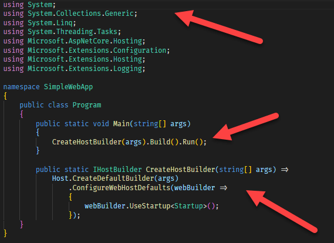
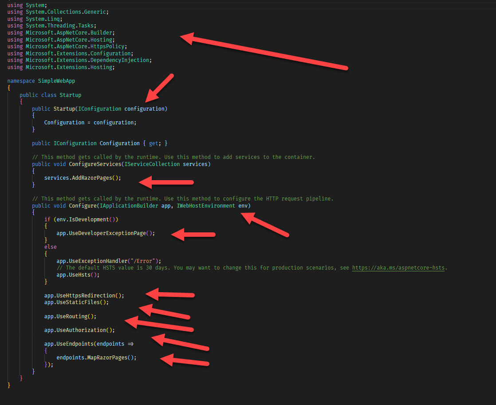
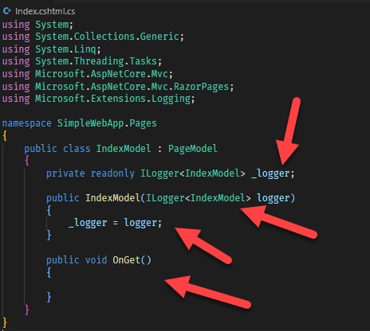
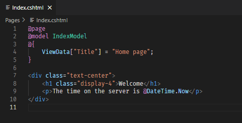
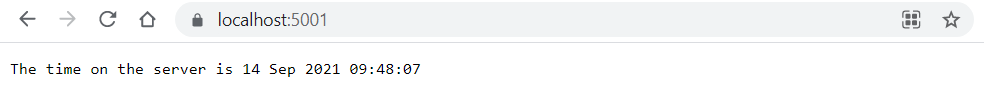
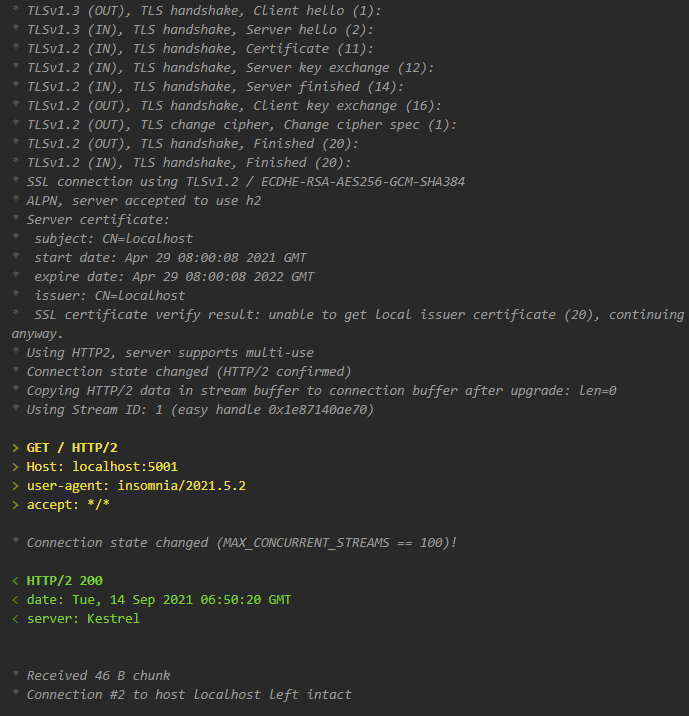
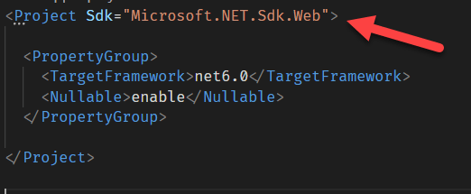
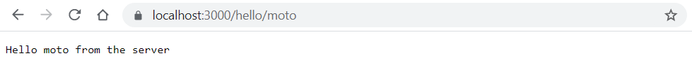

The default template for a web application in .NET 5 and previous versions looks like it was done with seasoned, disciplined developers in mind. This is not a bad thing. The issue, just like with the [previous console templates I've talked about earlier](), is it is not welcoming to those new to the platform.

The current web template looks like this, with the critical files being two key files:

`Program.cs`



`Startup.cs`



You also, by default, need a separate file for your actual code.

`Index.cshml.cs`

You've not written a single line of code yet and have to grapple with all these files, concepts and code.



Finally, by default, you need another file for your content.

`Index.cshtml`




The ceremony, I must stress again, is important if you are building any sort of scalable, maintainable application.

The team and the community have realized there is 
1. No need to expose all these things out of the gate
2. Every need to simplify these things, even for seasoned developers

So they have gone ahead and done so.

In .NET 6 all the code and files and content we have just seen can be replaced with this **COMPLETE** web application.

```csharp
using System;

// Wire up the application infrastructure (with sensible defaults)
var app = WebApplication.Create(args);

// Define a route, here the route being the root, and map content to it
app.MapGet("/", () => $"The time on the server is {DateTime.Now}");

// Run the app
app.Run();
```

You can open your browser to check that it is running.



You can even verify by looking at the raw traffic that it is a proper web application, running on HTTP/2 on port 5001 (HTTPS)



How does the compiler know that this is web application?

You tell it in the `.csproj` file.

Which looks like this in it's entirety, with the project type indicated.



At this point you may be thinking this is just a toy web application that can't do much.

You would be surprised.

By default it will run on ports 5000 (HTTP) and 5001 (HTTPS). You can change the port it is running on:

```csharp
app.Urls.Add("https://localhost:8000");
```

The code above mapped a `GET` request to the root.

```csharp
app.MapGet("/", () => $"The time on the server is {DateTime.Now}");
```

You can map the other verbs - `PUT`, `POST` and `DELETE`
;

```csharp
app.MapPost("/", () => "POST");
app.MapPut("/", () => "PUT");
app.MapDelete("/", () => "DELETE");
```

You can also configure other verbs using [MapMethods](https://docs.microsoft.com/en-us/dotnet/api/microsoft.aspnetcore.builder.endpointroutebuilderextensions.mapmethods?view=aspnetcore-5.0)

Here we are configuring the root to accept `HEAD` requests:

```csharp
// Configure the root to accept HEAD requests
app.MapMethods("/", new [] { "HEAD" }, () => "This is a head request");
```

You can also pass arguments to your routes. 

Here we are passing a string.

```csharp
// Map a new route, hello, that takes a string parameter
app.MapGet("/hello/{name}", (string name) => $"Hello {name} from the server");
```



You can of course pass an entire object, not just a string, and the runtime will take care of serialization and deserialization.

You can also constrain the parameters using [type constraints](https://docs.microsoft.com/en-us/aspnet/core/mvc/controllers/routing?view=aspnetcore-5.0).

For example we want an route, `count`, that accepts numbers, and only numbers.

```csharp
// Map a new route, count, that takes an int parameter
app.MapGet("/count/{counter:int}", (int counter) => $"Received {counter}");
```

You should see the following:


If you pass an argument that is not an integer, you get a `404` error as the runtime will complain it cannot find such a route.

Again to re-emphasize - you can still setup your project the old way and use the old routing. This is just another, simpler way to build.

# Thoughts

This has been a long time coming and I am glad it is much easier and cleaner to get started writing simple web applications without all the ceremony out of the box.

My other pet peeve - that `Startup.cs` and `Program.cs` were separate files has now been addressed. Both have been merged.

The code is in my [GitHub](https://github.com/conradakunga/BlogCode/tree/master/2021-09-14%20-%2030%20Days%20Of%20.NET%206%20-%20Day%207%20-%20Simpler%20Web%20Applications)

# TLDR

**This is Day 7 of the 30 Days Of .NET 6 where every day I will attempt to explain one new / improved thing in the upcoming release of .NET 6.**

Happy hacking!