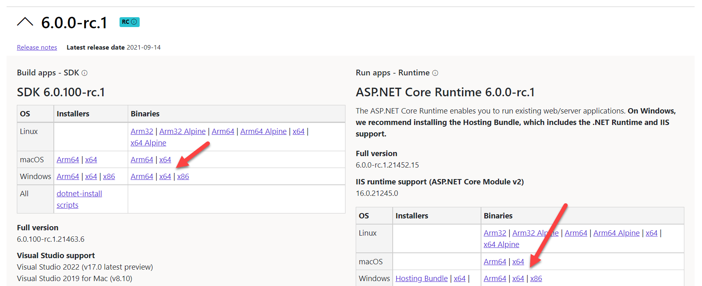

The .NET 6 Release Candidate 1 was released last week.

You can read the [details here](https://devblogs.microsoft.com/dotnet/announcing-net-6-release-candidate-1/).

What does release candidate mean? That it is officially supported and is considered good enough to go into production.

You can [download it here](https://dotnet.microsoft.com/download/dotnet/6.0).

Remember if you are using a 64 bit machine to download the correct version!

Happy hacking!