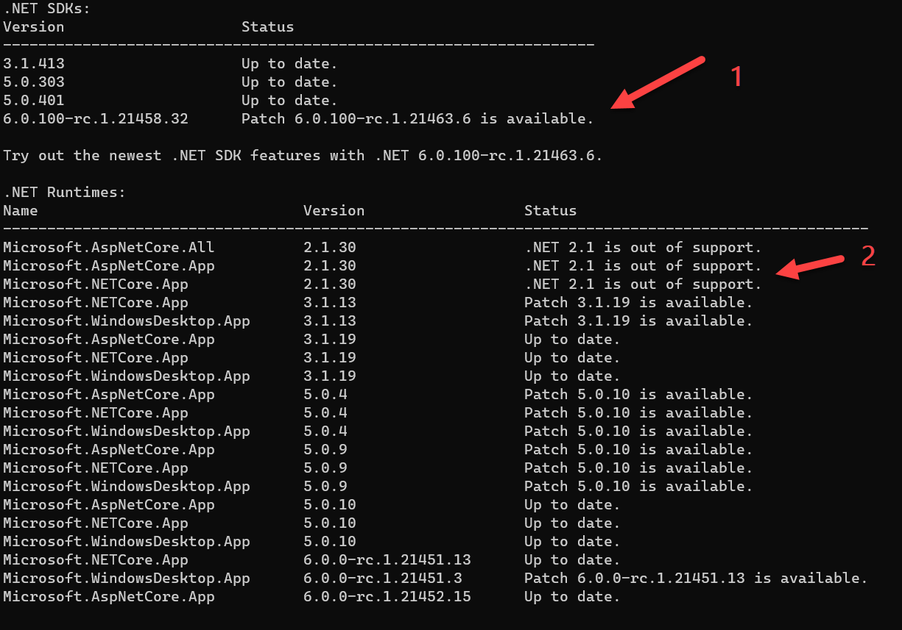

Software is always a moving target - adding features, fixing bugs or even removing features. The same challenges fall upon the tools used to develop software.

The .NET ecosystem has two main pieces:

1. **The SDK** - This is composed of all the tools used to develop and publish .NET applications, ranging from console to desktop to mobile to web.
2. **The runtime** - This is what is actually responsible for running .NET applications. 
    
    This is because the compiler does not compile to machine code, but to an [intermediate called IL](https://en.wikipedia.org/wiki/Common_Intermediate_Language). It is possible to skip this, but that is something we shall look at a bit later.
    
    
You can check what version of both you have that is active using this command:

```bash
dotnet --version
```

This will print for you the current version (what the computer understands is the active version.

It is important to note: this is not necessarily the latest version installed **this is not necessarily the latest version installed**! 

By **default**, it is the latest, but it is possible to [override this](https://docs.microsoft.com/en-us/dotnet/core/tools/global-json?tabs=netcore3x) (maybe you are doing legacy work on older versions).

It is possible to get a bit more information, maybe for troubleshooting purposes.

```bash
dotnet --info
```

This will print for you quite a but of information. On my machine this is returned:


1. The current SDK, version and commit
2. Operating system information
3. All the SDKs currently installed, and their location
4. All the runtimes currently installed, and their location

The runtimes in particular are very confusing.
1. There are actually multiple runtimes, one each for class libraries and console apps, one for ASP.NET, and one for desktop apps
2. There is no direct synergy between the SDK version and the runtime version.
    For example, my SDK Version is 6.0.100 but the runtime version is 6.0.0
    
    You can even have multiple runtimes for the same SDK. For example I have 3 runtimes for .NET 5:
        
   * 5.0.4
   * 5.0.9
   * 5.0.10

Remember, .NET is cross platform, so I can run the same on my Linux instance running in [WSL](https://docs.microsoft.com/en-us/windows/wsl/install).

These are the results.


The problem is that even with this information, there is no way to tell whether or not there are new versions of either the SDK or the runtime, or whether there are bug fixes to existing ones.

In fact there are only two ways to check
1. Use a tool like [chocolatey](https://chocolatey.org/) or [winget](https://docs.microsoft.com/en-us/windows/package-manager/winget/) to install for you the SDK and runtimes, and after that let it check for you.
2. Manually check the [Microsoft.NET website](https://dotnet.microsoft.com/) for updates

Neither of these are optimal solutions.

So .NET 6 has introduced a solution to this problem: a tool to check.

Run this command:

```bash
dotnet sdk check
```

You should get something that looks like this:



The output is similar to that of `dotnet --info` but it also shows:
1. Whether an update is available
2. Additional relevant information, such that [.NET Core 2.1 is out of support](https://dotnet.microsoft.com/platform/support/policy/dotnet-core)

This would be very useful when troubleshooting or knowing whether or not to update a server or a client machine.

# Thoughts

This is a most welcome tool. Keeping up to date with updates is often a challenge.

However I wish the team had done one better:

* `dotnet sdk update`
* `dotnet sdk install`
* `dotnet sdk remove`

# TLDR

The `dotnet sdk` check tool helps you determine if you are running the latest SDK and runtimes, and informs you if there are updates.

**This is Day 10 of the 30 Days Of .NET 6 where every day I will attempt to explain one new / improved thing in the upcoming release of .NET 6.**

Happy hacking!

