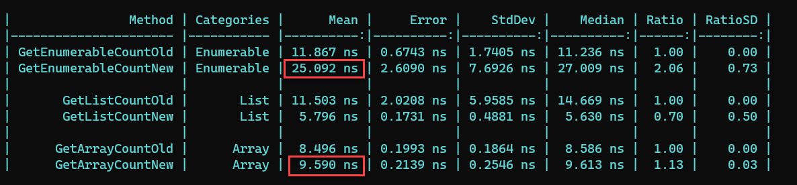
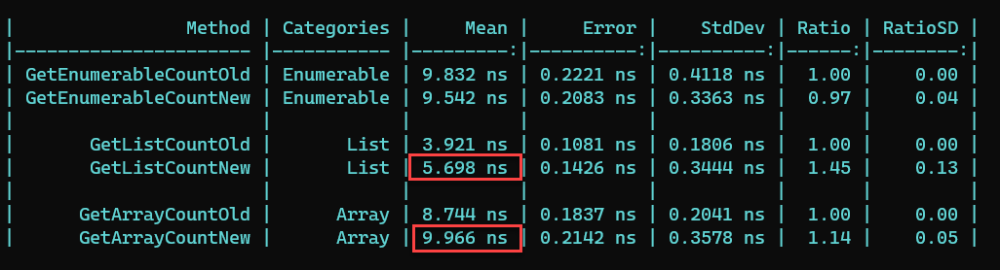
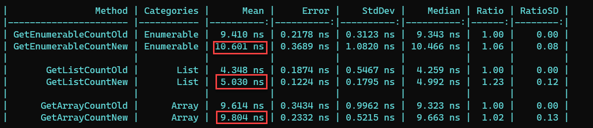
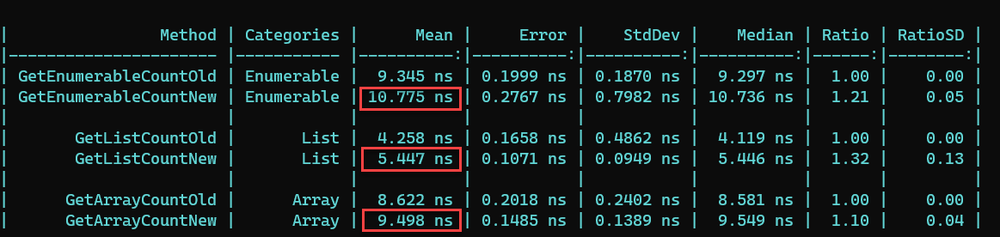

A fairly common operation is determining the length of a collection, for a myriad of reasons - loop control, buffer space allocation etc.

There is a way to determine this - the [Count()](https://docs.microsoft.com/en-us/dotnet/api/system.linq.enumerable.count?view=net-6.0) method of the [Enumerable](https://docs.microsoft.com/en-us/dotnet/api/system.linq.enumerable?view=net-6.0) class.

How this works internally depends on the underlying collection.

If it is an [IColleciton](https://docs.microsoft.com/en-us/dotnet/api/system.collections.icollection?view=net-6.0), there is a [Count](https://docs.microsoft.com/en-us/dotnet/api/system.collections.icollection.count?view=net-6.0) property that already has this information, so that is returned immediately.

However there are cases where the runtime will actually have to enumerate the collection to determine the number of items.

It is for this reason that a new method has been introduced to try and quickly establish the count int the fastest way possible - [TryGetNonEnumeratedCount](https://docs.microsoft.com/en-us/dotnet/api/system.linq.enumerable.trygetnonenumeratedcount?view=net-6.0)

You invoke it as follows:

```csharp
var success = collection.TryGetNonEnumeratedCount(out var count);
if (success)
{
    // We succeeded!
    Console.WriteLine($"The collection has {count} items");
}
else
{
    // We failed    
}
```

**NOTE: This method will return a count of 0 if it is unable to quickly get a count of the collection.**

You should therefore make it a habit wrap it around harness like this:

```csharp
if (!enumerable.TryGetNonEnumeratedCount(out var count))
{
	// do your slow count here
}
```

For the tests it just so happens that `Enumerable.Range` has been optimized such that this method works for this use case.

However if you modify the range (perhaps with a `Where` filter, the method returns `false`)

I have attempted to verify the speed of this with some tests:

```csharp
public class Test
{
    IEnumerable<int> enumerable;
    List<int> list;
    int[] array;

    public Test()
    {
        enumerable = Enumerable.Range(0, 25);
        list = enumerable.ToList();
        array = enumerable.ToArray();
    }

    [Benchmark(Baseline = true)]
    [BenchmarkCategory("Enumerable")]
    public int GetEnumerableCountOld()
    {
        var count = enumerable.Count();
        return count;
    }

    [Benchmark]
    [BenchmarkCategory("Enumerable")]
    public int GetEnumerableCountNew()
    {
        enumerable.TryGetNonEnumeratedCount(out var count);
        return count;
    }

    [Benchmark(Baseline = true)]
    [BenchmarkCategory("List")]
    public int GetListCountOld()
    {
        var count = list.Count();
        return count;
    }

    [Benchmark]
    [BenchmarkCategory("List")]
    public int GetListCountNew()
    {
        list.TryGetNonEnumeratedCount(out var count);
        return count;
    }

    [Benchmark(Baseline = true)]
    [BenchmarkCategory("Array")]
    public int GetArrayCountOld()
    {
        var count = array.Count();
        return count;
    }
    [Benchmark]
    [BenchmarkCategory("Array")]
    public int GetArrayCountNew()
    {
        array.TryGetNonEnumeratedCount(out var count);
        return count;
    }
}
```
**My results have been largely inconclusive as to whether in fact this method is any better than [Enumerable.Count()](https://docs.microsoft.com/en-us/dotnet/api/system.linq.enumerable.count?view=net-6.0)**

My first run got this:



It was actually **SLOWER** for `Enumerables` (by 106%) and `Arrays` (by 13%). `Lists` performed better, (by 30%).

My second run got this:



Here `Lists` and `Arrays` performed slower, and `Enumerables` were only marginally better.

My third run got this:



**All** were slower!

My final run got this:



Again, **all** were slower.

# Thoughts
If indeed in release candidate 2 (or the final release) the performance is consistent, this would be a good addition to the developer toolbelt to cheaply discover the size of a collection.

The code for the tests is in my [Github](https://github.com/conradakunga/BlogCode/tree/master/2021-09-28%20-%2030%20Days%20Of%20.NET%206%20-%20Day%2012%20-%20Collection%20Count%20Performance%20Improvements). I encourage you to run them for yourself and comment your results.

You run the benchmarks by executing this command in the folder with the code:

```bash
dotnet run -c Release
```

You must run it in the `Release` configuration for the metrics to be captured correctly.

Also if there is an issue with the setup of the tests, you can send a pull request.

# TLDR

There is a [TryGetNonEnumeratedCount](https://docs.microsoft.com/en-us/dotnet/api/system.linq.enumerable.trygetnonenumeratedcount?view=net-6.0) method that should allow you to cheaply determine the size of a collection.

**This is Day 12 of the 30 Days Of .NET 6 where every day I will attempt to explain one new / improved thing in the upcoming release of .NET 6.**

Happy hacking!