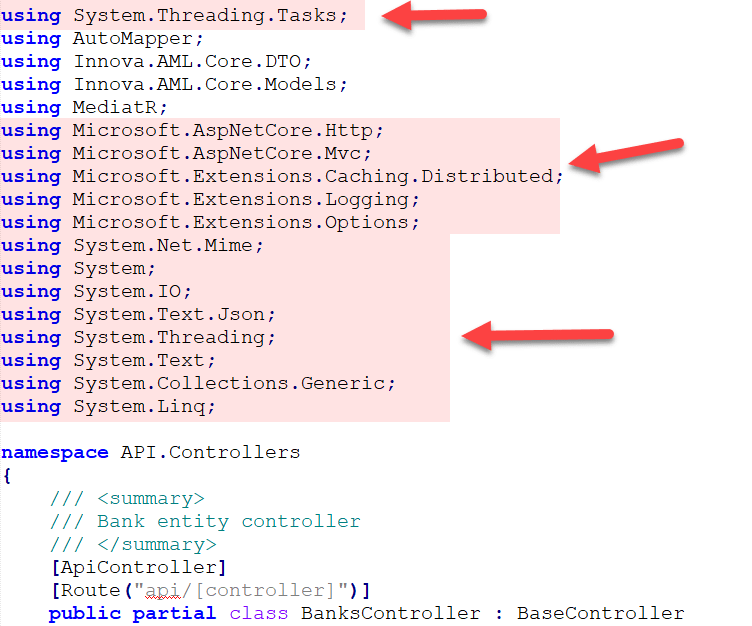
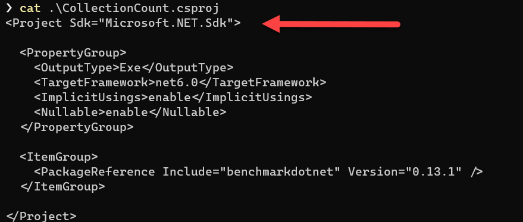
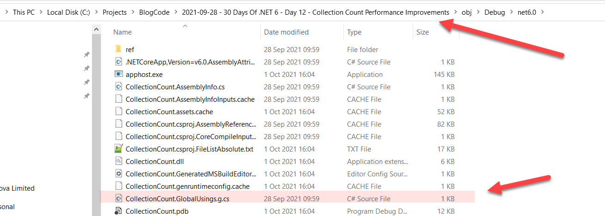
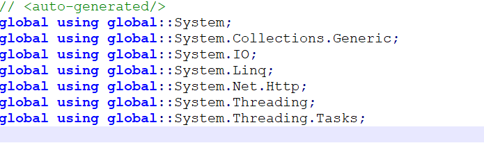

When developing an application, you invariably will need to use logic or functionality encapsulated elsewhere.

This could either be another library (or DLL) or sourced from a [Nuget](https://www.nuget.org/) package.

This brings up the question of what should be in the core language and runtime, and what should be added on in the form of packages.

And even if the pieces that you require are present, you have to notify the compiler which ones you are making use of so it knows where to search for the actual functionality.

This is achieved using the `using` statement.

I have taken a sample here of a controller for a web application:



There are 18 using statements in this file.

And given the project has several controllers, each file essentially has the same `using` statements.

I have always wondered two things:

First, given this is a web API, **OBVIOUSLY** I will need access to things like Content Responses, JSON, HTML Encoding, Routing, etc. Why do I need to keep referencing them in my files? I have already indicated this is a web application at the point of setting up the project. This should be enough to signal my intent.

Secondly, there are a whole bunch of things that should be automatically referenced. For example the `System` namespace contains fundamental things like the `DateTime` type. If you don't have a `using System;` clause in your code, you won't have access to them!

For many years this problem has been solved at IDE level - when you create a new controller or class or whatever construct, the IDE inserts for you the appropriate `using` statements.

However you might not always have access to an IDE. And also, even if you do - less clutter in your source is always a good thing.

In .NET 6 this has been addressed using implicit global namespaces. 

This has been addressed at compiler level for three types of projects:

1. Library & executable desktop projects (`Microsoft.Net.Sdk`)
2. Web applications and Web API applications (`Microsoft.NET.Sdk.Web`)
3. Worker services (`Microsoft.NET.Sdk.Worker`)

You can tell what type by looking at the source of your `.csproj`

You can either do this directly in the IDE or using `cat` or any such tool.



How it has been implemented is a file is generated at compile time and placed in the `obj` folder. The compiler then uses this during the compilation process to stitch everything together.

For this particular project I have located the file in the `obj` folder of my project.



If you open this file you should see the following:



As you can see it is automatically generated, so if you edit it manually it will be overwritten when it is regenerated.

The IDE as well can use this file to offer intellisense and other such functionality.

The inevitable question arises: what if you don't want a particular namespace imported?

For example there are two commonly used objects called `Task` - one is in [System.Threading ](https://docs.microsoft.com/en-us/dotnet/api/system.threading.tasks.task) and the other is in [Microsoft.Build.Utilities](https://docs.microsoft.com/en-us/dotnet/api/microsoft.build.utilities.task?view=msbuild-16-netcore).

How does the compiler know what you mean? You will get a compiler error if you try to compile code that references just `Task`.

There are **four** solutions to this.

The first is in your source code file you `alias` the one you mean:

```csharp
using Task = System.Threading.Tasks.Task;
```

The problem with this is you must do it in **every file** you want to use the type.

The second is to add **your own** global using to your file - any file.

A `global using` is not the same as a normal `using`. [You can read more details here](https://docs.microsoft.com/en-us/dotnet/csharp/language-reference/keywords/using-directive).

```csharp
global using System.Threading.Tasks;
```

You can add this line to any file in your project. A strategy is to create a single file for this purpose that has nothing but these statements.

The third way is to create an `ItemGroup` in your `.csproj` and register your namespace imports there.

```xml
<ItemGroup>
  <Import Include="System.Threading.Tasks" />
</ItemGroup>
```

The beauty of this approach is you can correspondingly **remove** a namespace you don't want to use:

```xml
<ItemGroup>
  <Import Remove="System.Net.Http.Json" />
</ItemGroup>
```

The fourth way is to **turn off this feature completely**, which you would be considering if you are migrating an existing project and don't want to have type clashes.
  
For this you place the `ImplicitUsings` tag into a property group in your `.csproj` and specify `disable`

```xml
<PropertyGroup>
  <ImplicitUsings>disable</ImplicitUsings>
</PropertyGroup>
```

Note that for new .NET projects, (created by .NET 6 Release Candidate 1 going forward) [**this feature is enabled by default**](https://docs.microsoft.com/en-us/dotnet/core/compatibility/sdk/6.0/implicit-namespaces). It wasn't even in the preview versions.

# Thoughts

This is a welcome change, and would go a long way to reducing boiler plate and allowing use of less sophisticated IDEs and plain text editors to code.

# TLDR

Implicit `usings` free developers from having to repeatedly specify namespace imports.

**This is Day 14 of the 30 Days Of .NET 6 where every day I will attempt to explain one new / improved thing in the upcoming release of .NET 6.**

While you're here's an update to the Day 12 article on [performance improvements of count]().

Happy hacking!