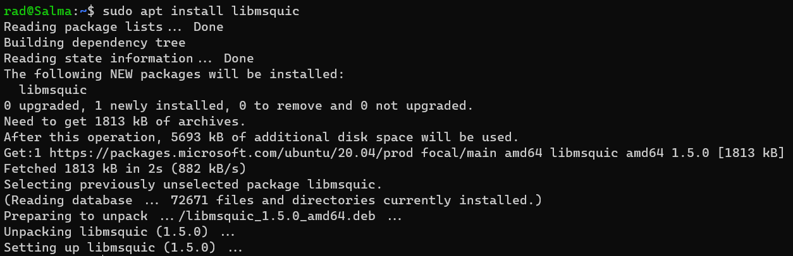
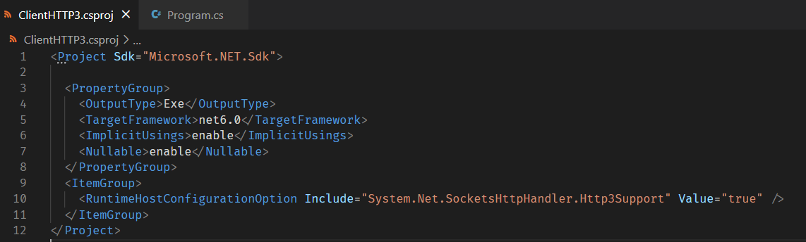
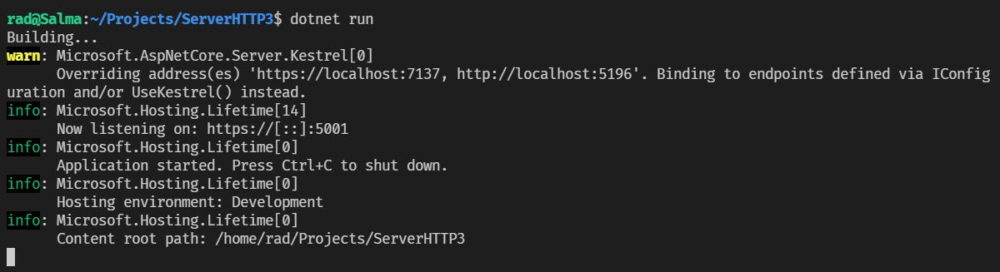
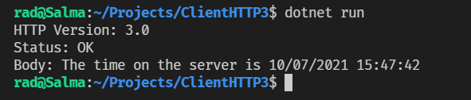
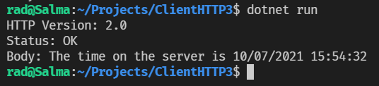

The [Hypertext Transfer Protocol](https://en.wikipedia.org/wiki/Hypertext_Transfer_Protocol) is the protocol at the heart of the internet. 

For a long time the prevalent version was `HTTP/1` but there has since been a move to [HTTP/2](https://en.wikipedia.org/wiki/HTTP/2) and now [HTTP/3](https://en.wikipedia.org/wiki/HTTP/3) is in active development.

`HTTP/3` has a number of [benefits over HTTP/2](https://blog.cloudflare.com/http-3-vs-http-2/)

.NET 6 has support for `HTTP/3`.

However there are caveats:

1. For Windows, it is only available on Windows 11 and Windows Server 2022
2. It is not presently available in Mac OSX at all, but support will be added in the future.

On Linux it is supported, but you have to do some extra work to get it running.

First, you need to install the library `libmsquic` that has support for the required transport protocols for `HTTP/3`. (The transport is named QUIC, and you can read about the details [here](https://www.chromium.org/quic))

```bash
sudo apt install libmsquic
```

You should see the following:



Next we will create the server side as a Web API project.

```bash
dotnet new webapi -o ServerHTTP3
```

We then make a very simple minimal API, and configure it as appropriate.

```csharp
// This namespace contains the HttpProtocols enum
using Microsoft.AspNetCore.Server.Kestrel.Core;
// This namespace contains the IPAddress type
using System.Net;

var builder = WebApplication.CreateBuilder(args);

// Configure kestrel (the web server)
builder.WebHost.ConfigureKestrel((context, options) =>
{
    // Listen on port 5001
    options.Listen(IPAddress.Any, 5001, listenOptions =>
    {
        // Serve traffic using HTTP/2 or HTTP/3
        listenOptions.Protocols = HttpProtocols.Http2 | HttpProtocols.Http3;
        // Use HTTPS
        listenOptions.UseHttps();
    });
});

var app = builder.Build();

// Configure the root to also accept GET requests
app.MapGet("/", () => $"The time on the server is {DateTime.Now}");

app.Run();
```

Here we are explicitly configuring the [Kestrel](https://docs.microsoft.com/en-us/aspnet/core/fundamentals/servers/kestrel?view=aspnetcore-5.0) web server to serve `HTTP/2` and `HTTP/3` requests.

Next we turn to the client.

Create a new console application:

```bash
dotnet new console -o ClientHTTP3
```

`HTTP/3` is not supported out of the box, and must be turned on as a flag on the project.

Add the following tag to your `.csproj`

```xml
<ItemGroup>
    <RuntimeHostConfigurationOption Include="System.Net.SocketsHttpHandler.Http3Support" Value="true" />
</ItemGroup>
```

This turns on `HTTP/3` support for the [HttpClient](https://docs.microsoft.com/en-us/dotnet/api/system.net.http.httpclient?view=net-5.0).

Your `.csproj` should now look like this:

.

Finally we run the WebAPI.

```bash
dotnet run
```

You should see the following:



Next we create a `HttpClient` that makes a request to our web service over `HTTP/3`.

The code is as follows:

```csharp
using System.Net;

// Create a handler to turn off SSL validation
var httpClientHandler = new HttpClientHandler();
httpClientHandler.ServerCertificateCustomValidationCallback = (message, cert, chain, sslPolicyErrors) =>
{
    return true;
};

// Create a new HttpClient and wire it to our handler
var client = new HttpClient(httpClientHandler)
{
    // Specify that requests should be for HTTP/3
    DefaultRequestVersion = HttpVersion.Version30,
    DefaultVersionPolicy = HttpVersionPolicy.RequestVersionExact
};


// Get our response
var response = await client.GetAsync("https://localhost:5001/");
// Read the body
var body = await response.Content.ReadAsStringAsync();


// Print the relevant headers to verify our results
Console.WriteLine($"HTTP Version: {response.Version}");
Console.WriteLine($"Status: {response.StatusCode}");
Console.WriteLine($"Body: {body}");
```

A couple of things of interest:
1. We turn **OFF** SSL validation as the self signed certificate is not trusted. This is done using a custom handler. [You can read more about this here]()
2. We configure the `HttpClient` to explicitly request HTTP/3 traffic.

Finally we run this project to connect to our WebAPI. This you can do in a different terminal window.

```bash
dotnet run
```

You should see the following:



To prove that the server will respond with the HTTP version we request, let us change the code to make a `HTTP/2` request.

```csharp
var client = new HttpClient(httpClientHandler)
{
    // Specify that requests should be for HTTP/2
    DefaultRequestVersion = HttpVersion.Version20,
    DefaultVersionPolicy = HttpVersionPolicy.RequestVersionExact
};
```

Running this should return the following:



Note the HTTP version.

# Thoughts

`HTTP/3` support should be a welcome addition to build and run high performance web applications.

The code is in my [Github](https://github.com/conradakunga/BlogCode/tree/master/2021-10-06%20-%2030%20Days%20Of%20.NET%206%20-%20Day%2016%20-%20HTTP3%20Support)

# TLDR

.NET 6 supports `HTTP/3`, depending on the underlying operating system support.

**This is Day 16 of the 30 Days Of .NET 6 where every day I will attempt to explain one new / improved thing in the upcoming release of .NET 6.**

Happy hacking!