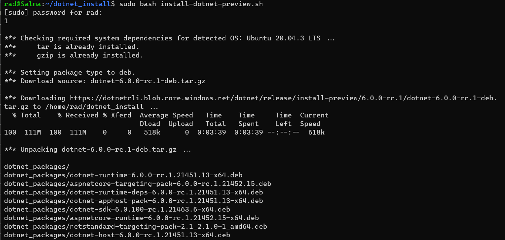
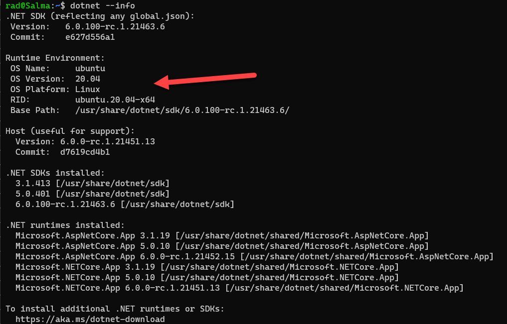

It is again worth repeating that .NET 6, like 5, 3 and 2 before it are [cross platform](https://dotnet.microsoft.com/) and can be used to build applications in Linux and OSX.

There are two ways to get them running on Linux:

1. Download and run the binaries from the [.NET website](https://dotnet.microsoft.com/download)
2. Run an installation script that sets up the environment and tools for you. (Details are available on [this link](https://github.com/dotnet/core/blob/main/release-notes/6.0/preview/6.0.0-preview.1-install-instructions.md))

The second method is probably better as unlike the binaries that are distribution specific, the script should run on most mainstream Linux distributions.

First, you create a directory to hold the downloaded scripts and intermediate artifacts.

```bash
mkdir $HOME/dotnet_install && cd $HOME/dotnet_install
```

Next, you download the bash file that does the actual setup.

```bash
curl -L https://aka.ms/install-dotnet-preview -o install-dotnet-preview.sh
```

Get into the habit of reading these before you execute them!

```bash
vi install-dotnet-preview.sh
```

Then, execute the file

```bash
sudo bash install-dotnet-preview.sh
```

You should see the following:



Note here it is the release candidate being installed. I expect it is updated regularly.

Finally you can verify that it was successfully installed.

```bash
dotnet --version
```

I am running [Ubuntu 20.04](https://ubuntu.com/) on [Windows Subsystem For Linux](https://docs.microsoft.com/en-us/windows/wsl/about)

You can also get more detailed information like so:

```bash
dotnet --info
```

You should see something like this:



Happy hacking!