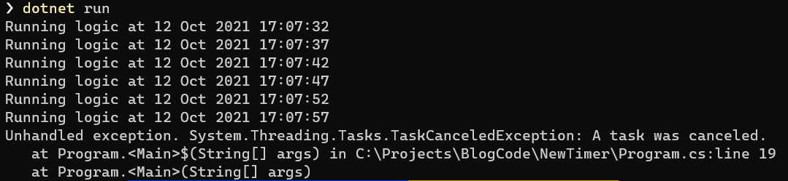

If there is one thing that .NET has plenty of it is **timers**.

The timer is an object that exposes functionality allow you to write code to fire either:
1. After a certain duration
2. When your logic detects a certain time or date.

There are 5 at present:

### [System.Timers.Timer](https://docs.microsoft.com/en-us/dotnet/api/system.timers.timer?view=net-6.0)

This timer is designed for use in server applications and multi-threaded environments.

### [System.Threading.Timer](https://docs.microsoft.com/en-us/dotnet/api/system.threading.timer?view=net-6.0)

This timer makes use of threads from the runtime thread pool.

### [System.Windows.Forms.Timer](https://docs.microsoft.com/en-us/dotnet/api/system.windows.forms.timer?view=windowsdesktop-5.0&viewFallbackFrom=net-6.0)
This is a timer optimized for the [Windows Forms](https://docs.microsoft.com/en-us/dotnet/desktop/winforms/overview/?view=netdesktop-5.0) UI framework, and must in fact be used in the context of a Window.

### [System.Web.UI.Timer](https://docs.microsoft.com/en-us/dotnet/api/system.web.ui.timer?view=netframework-4.8&viewFallbackFrom=windowsdesktop-5.0)

This timer is for use in web applications, on the full .NET framework.

### [System.Windows.Threading.DispatcherTimer](https://docs.microsoft.com/en-us/dotnet/api/System.Windows.Threading.DispatcherTimer?view=netframework-4.8&viewFallbackFrom=windowsdesktop-5.0)

This is a timer optimized for the [Windows Presentation Foundation](https://docs.microsoft.com/en-us/visualstudio/designers/getting-started-with-wpf?view=vs-2019), and is integrated into the [dispatcher](https://docs.microsoft.com/en-us/dotnet/api/system.windows.threading.dispatcher?view=netframework-4.8) queue.

To add onto this, .NET 6 has introduced a sixth timer - the [PeriodicTimer](https://docs.microsoft.com/en-us/dotnet/api/system.threading.periodictimer?view=net-6.0).

Why a sixth timer?

This one is designed to be used in an **asynchronous** context.

Unlike the other timers that are wired to events, a `PeriodicTimer` is used like this:

```csharp
// Create a timer that fires every 5 seconds
using (var timer = new PeriodicTimer(TimeSpan.FromSeconds(5)))
{
    // Wire it to fire an event after the specified period
    while (await timer.WaitForNextTickAsync())
    {
        Console.WriteLine($"Firing at {DateTime.Now}");
    }
}
```

This should print the following to the console:


The PeriodicTimer also supports cancellation using the [Cancellation](https://docs.microsoft.com/en-us/dotnet/standard/threading/cancellation-in-managed-threads) framework introduced in .NET 4.

For example we can setup our timer to stop after 20 seconds.

```csharp
// Create a cancellaton token source that will cancel in 20 seconds
var cts = new CancellationTokenSource(TimeSpan.FromSeconds(20));
// Create a timer that fires every 5 seconds
using (var timer = new PeriodicTimer(TimeSpan.FromSeconds(5)))
{
    // Wire it to fire an event after the specified period
    while (await timer.WaitForNextTickAsync(cts.Token))
    {
        Console.WriteLine($"Firing Cancellable timer at {DateTime.Now}");
    }
}
```

If you run this you should see the following:


Note that an [OperationCancelled](https://docs.microsoft.com/en-us/dotnet/api/system.operationcanceledexception?view=net-5.0) exception is thrown, that you can catch and then manage as appropriate.

You can also cancel the task yourself by obtaining a [CancellationToken](https://docs.microsoft.com/en-us/dotnet/api/system.threading.cancellationtoken?view=net-5.0) from the [CancellationTokenSource](https://docs.microsoft.com/en-us/dotnet/api/system.threading.cancellationtokensource?view=net-5.0) and then canceling yourself.

```csharp
// Create a cancellation token source
var cts = new CancellationTokenSource();
// Create a timer that fires every 5 seconds
using (var timer = new PeriodicTimer(TimeSpan.FromSeconds(5)))
{
    // Create a counter to simulate logic
    var counter = 0;
    // Wire it to fire an event after the specified period
    while (await timer.WaitForNextTickAsync(cts.Token))
    {
        // Cancel when the counter gets to 5
        if (counter == 5)
            cts.Cancel();
        Console.WriteLine($"Running logic at {DateTime.Now}");
        counter++;
    }
```

If you run this you should get the following:



Not that this time instead of an `OperationCancelledExceptoion` you get a [TaskCancelledException](https://docs.microsoft.com/en-us/dotnet/api/system.threading.tasks.taskcanceledexception?view=net-5.0).

Naturally you will write an error handler to catch and handle this exception, rather than what has been done in this example.

# Thoughts

This seems like a very clean, lightweight timer for async timed operations.

The code is in my [Github](https://github.com/conradakunga/BlogCode/tree/master/2021-10-12%20-%2030%20Days%20Of%20.NET%206%20-%20Day%2017%20-%20New%20Timer%20-%20PeriodicTimer)

# TLDR

The `PeriodicTimer` is a timer designed for async usage.

**This is Day 17 of the 30 Days Of .NET 6 where every day I will attempt to explain one new / improved thing in the upcoming release of .NET 6.**

Happy hacking!