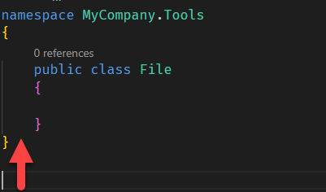

As your codebase grows, it becomes important to organize your code. This is done using a concept called namespaces.

When you write to the console, for example, you need to tell the runtime where exactly the `Console` is.

There are two was to achieve this:

1. Directly, by specifying the full path to the object
    ```csharp
    System.Console.WriteLine("Hello");
    ```

2. Letting the Compiler know in advance
    ```csharp
    using System;

    Console.WriteLine("Hello");
    ```

    
This hierarchy is achieved using **namespaces**.

For example, the namespace where you will find classes for dealing with files is named `System.IO`.

Over and above allowing you to logically organize your code, namespaces also allow you to deal with clashes of names.

For example anyone can create a type named `File`. How will the compiler differentiate yours from the one in the framework? `Namepaces`.

The built in one is `System.IO.File`

Yours is, for example, `MyCompany.Tools.File`

At any point in time it is possible to specify which one exactly you want to use.

To create your own `namespace` you use the **namespace** keyword:

```csharp
namespace MyCompany.Tools
{
    public class File
    {

    }
}
```

You can have multiple namespaces in the same file, and can even have classes with the same name but in different namespaces.

For example you can do this:

```csharp
namespace MyCompany.Tools.Legacy
{
    public class File
    {

    }
}
namespace MyCompany.Tools.CuttingEdge
{
    public class File
    {

    }
}
```

Depending on your needs you can use the appropriate one my referencing it through the required namespace.

This is fine, but if you look closer there is this indentation, and accompanying curly braces to demarcate the namespace:



An improvement has been made in C# 10 - you can scope namespaces at file level, and do away with the indentation and the curly braces.

So the exact same code can be rewritten like this:

```csharp
namespace MyCompany.Tools;
public class File
{

}
```

Notice the `namespace` declaration is a single line, and there are no opening and closing braces.

Some caveats:
1. This can only be done **ONCE** per file - the scoping is at **file** level. So you can only declare one namespace per file.
2. Unlike the traditional way of namespace management (which is still available), you cannot nest namespaces.
3. You cannot mix file scoped namespaces and traditional namespaces.

File scoped namespace can be thought of as follows: anything in the file after the namespace declaration is assumed to belong to that namespace.

You can even add other classes to the file and they will be assumed to the namespace.

So you can do this:

```csharp
namespace MyCompany.Tools;
public class File
{

}
public class OtherFile
{

}
```

# Thoughts

This may not be a pivotal change, but saved indentations and nested braces makes life for developers that little bit easier.

# TLDR
File scoped namespaces have been introduced to simplify the developer experience in the management of simple namespace structures.

**This is Day 18 of the 30 Days Of .NET 6 where every day I will attempt to explain one new / improved thing in the upcoming release of .NET 6.**

Happy hacking!