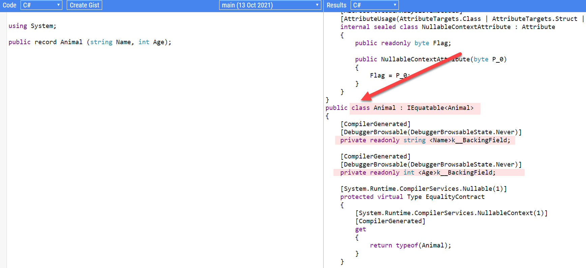
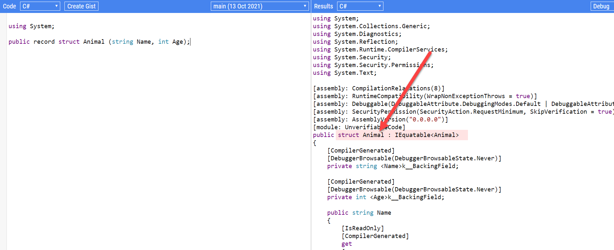
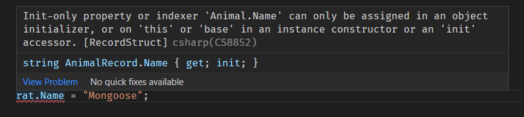

Today's item, record struts, is a bit more elaborate to explain, but I shall do my best.

If you want to combine multiple types into a more complex type there are several ways to do this in .NET:

**Note: In my sample code I have created multiple namespaces to keep from having to declare multiple types with different names.**

**I differentiate them in the main program like this:**

```csharp
using AnimalClass = Animal.Class.Animal;
using AnimalStruct = Animal.Struct.Animal;
using AnimalRecordStruct = Animal.RecordStruct.Animal;
using AnimalRecord = Animal.Record.Animal;
using ReadOnlyAnimalRecordStruct = Animal.ReadOnlyRecordStruct.Animal;
```

### Classes

This is the most common way - you declare and name a `class` and go on to declare its constituent types.

```csharp
public class Animal
{
    public string Name { get; set; }
    public byte Legs { get; set; }
}
```

Here we have declared an `Animal` class with two public properties that can be changed. This is a mutable class. You can control the mutability using the appropriate modifiers: `init`, `private set`; or not have a setter at all

### Structs

A `struct` is syntactically almost identical to a `class`.

```csharp
public struct Animal
{
    public string Name { get; set; }
    public byte Legs { get; set; }
}
```

Which begs the question what is the difference between a `class` and a `struct`?

There are a whole bunch of differences but the main ones are these:

**First:** A `struct` is a **value** type. This essentially means if you assign an instance of a `struct` to a variable, all the properties of the `struct` are copied to this new variable. This means if you change the original `struct`, the new one is unaffected.

This is unlike a `class`, which is a **reference** type. This means if you copy an instance of a `class` to a variable, what is actually copied is a pointer/reference to the original `class`, so if you modify either, **changes will reflect on both**.

This is best explained with some code:

Here we create one class, assign it to a variable, print some properties, and then modify the original. We then print the properties again.

```csharp
var firstClass = new AnimalClass() { Name = "Dog", Legs = 4 };
var secondClass = firstClass;

Console.WriteLine($"First class name is {firstClass.Name} and legs is {firstClass.Legs}");
Console.WriteLine($"Second class name is {secondClass.Name} and legs is {secondClass.Legs}");

firstClass.Name = "Cat";

Console.WriteLine($"First class name is {firstClass.Name} and legs is {firstClass.Legs}");
Console.WriteLine($"Second class name is {secondClass.Name} and legs is {secondClass.Legs}");
```

The results look like this:

```plaintext
First class name is Dog and legs is 4
Second class name is Dog and legs is 4
First class name is Cat and legs is 4
Second class name is Cat and legs is 4
```

Of interest here is that we only changed the `firstClass` name, but in the output the second class name has changed as well to `Cat`.

This underscores the point - `firstClass` and `secondClass`, despite being different variables, **refer to the same thing**.

If we change to a `struct`, the code looks like this:

```csharp
var firstStruct = new AnimalStruct() { Name = "Dog", Legs = 4 };
var secondStruct = firstStruct;

Console.WriteLine($"First struct name is {firstStruct.Name} and legs is {firstStruct.Legs}");
Console.WriteLine($"Second struct name is {secondStruct.Name} and legs is {secondStruct.Legs}");

firstStruct.Name = "Cat";

Console.WriteLine($"First struct name is {firstStruct.Name} and legs is {firstStruct.Legs}");
Console.WriteLine($"Second struct name is {secondStruct.Name} and legs is {secondStruct.Legs}");
```

The output should look like this:

```plaintext
First struct name is Dog and legs is 4
Second struct name is Dog and legs is 4
First struct name is Cat and legs is 4
Second struct name is Dog and legs is 4
```

Note here that the second `struct` name remains `dog`, even after we change the name of the first.

**Second:** A `class` is allocated on the stack, and is garbage collected, while a `struct` is allocated on the heap.

You can read a good explanation of this [here](https://www.c-sharpcorner.com/article/C-Sharp-heaping-vs-stacking-in-net-part-i/)

There are some other differences, and you can read about them here:
1. [How to choose between using a struct and a class (Microsoft)](https://docs.microsoft.com/en-us/dotnet/standard/design-guidelines/choosing-between-class-and-struct)
2. [Differences between a struct and a class (C-Sharp Corner)](https://www.c-sharpcorner.com/blogs/difference-between-struct-and-class-in-c-sharp)

The main gist is **generally**, use a class.

In addition to `class` and `struct`, there are some additional structures:

### Tuple

In .NET Framework 4 a new type was introduced to allow developers to quickly couple a bunch of types together to address the very common use case of returning multiple types from a method without having to create a `class` (or a `struct`) to package them together - [System.Tuple](https://docs.microsoft.com/en-us/dotnet/api/system.tuple?view=net-5.0).

It works like this:

```csharp
var animalTuple = Tuple.Create("Dog", 4);

Console.WriteLine($"Animal Tuple name is {animalTuple.Item1} and legs is {animalTuple.Item2}");
```

This should print the following:

```plaintext
Animal Tuple name is Dog and legs is 4
```

What the compiler does here is create an object with as many types properties as there are items passed into the static [Create](https://docs.microsoft.com/en-us/dotnet/api/system.tuple.create?view=net-5.0) method.

You can also create a `Tuple` directly like this:

```csharp
var animalTuple2 = new Tuple<string, int>("Dog", 4);
```

The properties are named `Item{n}`, where `n` is from 1 to 8. `Item8`, by the way, is **ANOTHER** tuple, so if if you wanted to pass for example 8 items, you must create `Item8` as another `Tuple` with 1 item.

In other words, the element in `Item7` is accessed like this:

```csharp
tuple.Item7
```

The element in `Item8`, however, is accessed like this:

```csharp
tuple.Item8.Item1
```

This is because `Item8` is a `Tuple`.

This allows you to return more than 8 items - just keep nesting the 8th `Tuple`.

Now if you are returning more than 8 items you are probably better off reexamining your design and should consider creating an object directly.

The `Item{n}` properties are strongly typed - in our example above `Item1` is a `string` and `Item2` is an `int`.

The problem with this construct is it is a nightmare to use and maintain, You literally have no clue what `Item6` represents without having to go and look at the code that creates it.

This led to the creation of...

### ValueTuple

The [ValueTuple](https://docs.microsoft.com/en-us/dotnet/api/system.valuetuple?view=net-5.0) was introduced in .NET Framework 4.7 and .NET Core 1.

It is essentially and improvement of the `System.Tuple`.

You use it like this:

```csharp
var animalValueTuple = (Name: "Dog", Legs: 4);

Console.WriteLine($"Animal Value Tuple name is {animalValueTuple.Name} and legs is {animalValueTuple.Legs}");
```

This should print the following:

```plaintext
Animal Value Tuple name is Dog and legs is 4
```

A couple of things to note:

1. In addition to providing the **value**, you also provide a **name** that the compiler will use to create the appropriate property name
2. Unlike the `Tuple` that provides access to the types using **properties**, the `ValueTuple` provides them as **fields**
3. As a result of the above, `ValueTuple` values are **mutable**, unlike `Tuple` values that cannot be changed as they are read-only properties.

You can convert a `ValueTuple` to a `Tuple` by using the [ToTuple](https://docs.microsoft.com/en-us/dotnet/api/system.tupleextensions.totuple?view=net-5.0#System_TupleExtensions_ToTuple__1_System_ValueTuple___0__) extension method:

```csharp
var converted =  animalValueTuple.ToTuple();

Console.WriteLine($"Converted Animal Value Tuple name is {converted.Item1} and legs is {converted.Item2}");
```

Of course doing this you lose the property names, which are converted to `Item{n}`.

If you really want to modify a `Tuple` properties, you can convert it to `ValueTuple` using the [ToValueTuple](https://docs.microsoft.com/en-us/dotnet/api/system.tupleextensions.tovaluetuple?view=net-5.0) extension method:

```csharp
var convertedValueTuple = animalTuple.ToValueTuple();
```

What happens here is the `Item1` and `Item2` are converted from `readonly` **properties** to mutable public **fields**.

So far those are four techniques of packaging types.

.NET 5 introduced a new one:

### Records

The rationale behind records is that there is a considerable use case requiring a lightweight type for packaging data, that had sensible default behaviour to for this purpose.

This is a very common case for distributed systems where you have data access objects (no behaviour, immutable) that are used to pass around data.

This is best illustrated using an example:

First, you declare the record type:

```csharp
public record Animal(string Name, int Legs);
```

Note the keyword `record`

Next you have your logic:

```csharp
var dog = new Animal("Dog", 4);
var otherDog = new Animal("Dog", 4);

Console.WriteLine($"The animal record name is {dog.Name} and legs are {dog.Legs}");
```

This looks so far pretty much like a `class`.

The difference is the out of the box features that you get:

#### Immutability

Out of the box, the properties are read only, and therefore the record is immutable. You can achieve this using classes but it is a lot more work writing a class that is immutable.

#### Logical Comparisons

The following code will return `true`:

```csharp
var dog = new Animal("Dog", 4);
var otherDog = new Animal("Dog", 4);

Console.WriteLine(dog == otherDog);
```

This will not be the case with a `class` or a `struct`, which consider them to be different. If you want the comparison to work you must override the `==` operator as well as (potentially) the [.Equals](https://docs.microsoft.com/en-us/dotnet/api/system.object.equals?view=net-5.0) method. 

This is not practical for a project with several classes.

The logic here is two records whose properties have the same values is logically the same thing.

#### ToString()

You get a built in, pretty good `.ToString()` implementation that actually prints the object values.

If you run this:

```csharp
Console.WriteLine(dog.ToString());
```

It will print this:

```plaintext
Animal { Name = Dog, Legs = 4 }
```

#### Nondestructive mutation

If you really want to mutate a record, you can't do it directly but you can do it by quickly creating a copy and changing the value that you want.

For example:

```csharp
var amputatedDog = dog with { Legs = 3 };
Console.WriteLine($"The amputated dog record name is {amputatedDog.Name} and legs are {amputatedDog.Legs}");
```

Here we copy the `dog` object as is, but change the `Legs` property to 3.

This is also useful to quickly create copies of records for other uses.

#### Outright Mutation

Although records are generally meant to be immutable, you can in fact create mutable records.

This is done by using an alternative syntax to declare your `record`, which looks a lot like that of a `class`.

```csharp
public record Cat
{
    public string Name { get; set; }
    public int Legs { get; set; }
}
```

The cat record here is fully mutable.

#### Init-Only Initialization

The default record implementation means you create objects like this:

```csharp
var dog = new Animal("Dog", 4);
```

This is a bit difficult to read. What does that *4* stand for?

You can of course make it easier by doing this:

```csharp
var dog = new Animal(Name: "Dog", Legs: 4);
```

This is better. The trouble with this is there is now way to enforce this in your code.

You can work around this by declaring your record like this:

```csharp
public record Cat
{
    public string Name { get; init; }
    public int Legs { get; init; }
}
```

Once we have done this we create a `cat` like this:

```csharp
var cat = new Cat() { Name = "Lion", Legs = 4 };
```

Here it is very explicit what the property values being set are.

The `init` keyword means that the property can only be set once.

Which brings us to the **sixth** technique of packaging types:

### Record Structs

Unbeknownst to many, a `record` is actually a `class` under the hood.

We can demonstrate this using [SharpLab](https://sharplab.io/), a very handy tool that allows you to see what the C# compiler is doing behind the scene to generate code.



Among the considerable code the compiler generates to support the implementation of `records`, of note is the fact that ultimately a `record` is a `class`.

In .NET 6 (C# 10) you can now use `record structs`.

The syntax of a `record struct` is pretty much that of a normal `record`. Just add the keyword `struct`.

```csharp
namespace Animal.RecordStruct
{
    public record struct Animal(string Name, int Age);
}
```

If we consult [SharpLab.io](https://sharplab.io/) to look at the generate code, we see the following:



Here we see that the generated type is actually a struct.

The code is also less (121 vs 187 lines).

But what is the difference between a `record struct` and a `record class`?

The most important distinction is the name - a `record struct` is a `struct`, and a `record class` is a `class`.

This means the constraints/benefits of classes vs structs apply

More nuanced is the following:

####  Record classes Are Immutable. Record structs are not

Using our declaration above of a record struct, we can do the following:

```csharp
var mouse = new AnimalRecordStruct("Mouse", 4);

mouse.Name = "Mongoose";
```

The equivalent code for a `record class` will not compile:

```csharp
var rat = new AnimalRecord("Rat", 4);

rat.Name = "Mongoose";
```

You will get the following error:



This is because for `record classes`, the properties are **immutable**.

Aside from this, most of the other features behave the same:
1. Equality comparisons
2. `ToString()`
3. `with` copy semantics
4. Initializers

The question arises - what if you want an **immutable** `record struct`?

To achieve this you add the `readonly` keyword to the deceleration:

```csharp
namespace Animal.ReadOnlyRecordStruct
{
    public readonly record struct Animal(string Name, int Age);
}
```

This code will not compile, as the properties now are `readonly`

```csharp
var rabbit = new ReadOnlyAnimalRecordStruct("Rabbit", 4);

rabbit.Name = "Mongoose";
```

#### Record structs should offer better performance

`Record structs` by virtue of being `structs` should offer better performance in most use cases.

# Thoughts

The multiplicity of options is likely going to cause **a lot of confusion** for developers:
1. `Classes` with properties that have `init` modifiers, which will be immutable, like `record classes`.
2. `Structs` with properties that have `init` modifiers, which will be immutable, like `record structs`.
3. Normal mutable `classes`
4. Normal mutable `structs`
5. `Record structs`
6. `Record classes`
7. `Readonly record structs`

However, with a sufficient understanding of `record classes` and `record structs` as well as knowledge of your use cases in the problem domain, it should be clear when to use which.

The benefits of `record structs` and `readonly record structs` in terms of communicating intent should make it easier to write and understand high performance, distributed systems.

The code is in my [Github](https://github.com/conradakunga/BlogCode/tree/master/2021-10-19%20-%2030%20Days%20Of%20.NET%206%20-%20Day%2019%20-%20Record%20Structs)

# TLDR

.NET 6 had introduced a `record struct` type, that brings `record` semantics to `structs` similar to `record` classes.

**This is Day 19 of the 30 Days Of .NET 6 where every day I will attempt to explain one new / improved thing in the upcoming release of .NET 6.**

Happy hacking!