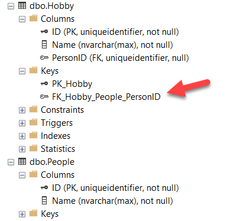
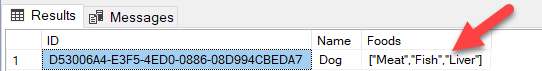

Suppose you have the following class that you wish to persist using the [Entity Framework Core](https://docs.microsoft.com/en-us/ef/) ORM.

```csharp
public class Person
{
    [Key]
    public Guid ID { get; set; }
    [Required]
    public string Name { get; set; }
    public List<string> Hobbies { get; set; } = new();
}
```

If you try to persist this, you will get the following error:

```plaintext
The property 'Person.Hobbies' could not be mapped because it is of type 'IList<string>', which is not a supported primitive type or a valid entity type. 

Either explicitly map this property, or ignore it using the '[NotMapped]' attribute or by using 'EntityTypeBuilder.Ignore' in 'OnModelCreating'.
```

This essentially means that Entity Framework Core does not directly support persistence of primitive types.

There are two ways around this problem:

# Create A Wrapper Object

The first is to create a wrapper class for the `Hobby`, and then change the collection to be of this new type rather than a `string`.

This we do like so:

```csharp
public class Hobby
{
    [Key]
    public Guid ID { get; set; }
    [Required]
    public string Name { get; set; }
}
```

We then change our `Person` class like so:

```csharp
public class Person
{
    [Key]
    public Guid ID { get; set; }
    [Required]
    public string Name { get; set; }
    public List<Hobby> Hobbies { get; set; } = new();
}
```

With this done we can create and persist a `Person` and their `Hobbies` like so:

```csharp
using (var ctx = new PersonContext())
{
    // Create a sample person if there aren't any
    if (!ctx.People.Any())
    {
        var person = new Person() { Name = "James" };

        //Add the hobbies to the person
        var hobbies = new[] {
                new Hobby(){ Name = "Fishing"},
                new Hobby(){ Name = "Archery"}
            };

        // Persist the person
        person.Hobbies.AddRange(hobbies);
        ctx.People.AddRange(person);
        ctx.SaveChanges();
    }
}
```

This technique creates two tables, and a foreign key to relate the two.



The benefit of this approach is you can directly  query the database to answer any questions without going through the domain.
  
The drawback of this approach is you have to change your object model to create the wrapper classes. Generally, you should think twice about changing your domain model to accommodate persistence concerns.

# Use A Value Converter

The second way is to use the `ValueConverter` type. This is a class that allows you to convert objects when reading them from the database or writing them to the database.

We can use this class for our example.

```csharp
public class Animal
{
    [Key]
    public Guid ID { get; set; }
    [Required]
    public string Name { get; set; }
    public List<string> Foods { get; set; } = new();
}
```

Our design here is to persist the `Foods` property, which is a `List` of `Strings`, as an string. We will use [Json.NET](https://www.newtonsoft.com/json) for this.

The idea here is to convert the list to a string in `Json` and persist that.

To achieve this we override the `OnModelCreating` event of our `DBContext` and configure it to attach the `ValueConverter`.

```csharp
protected override void OnModelCreating(ModelBuilder modelBuilder)
{
    // Configure the value converter for the Animal
    modelBuilder.Entity<Animal>()
        .Property(x => x.Foods)
        .HasConversion(new ValueConverter<List<string>, string>(
            v => JsonConvert.SerializeObject(v), // Convert to string for persistence
            v => JsonConvert.DeserializeObject<List<string>>(v))); // Convert to List<String> for use
}
```

The code in the main program will look like this:

```csharp
if (!ctx.Animals.Any())
{
    var animal = new Animal() { Name = "Dog" };

    //Add foods to the animal
    var foods = new[] { "Meat", "Fish", "Liver" };
    animal.Foods.AddRange(foods);

    // Persist the changes
    ctx.Animals.AddRange(animal);
    ctx.SaveChanges();
}
```

If we query the database directly, you will see that this is persisted in a single table and the `Foods` are stored as an array in Json.



The benefit of this technique is you do not need to change your object model to accommodate Entity Framework

The drawback is you cannot easily directly query the database without putting some extra effort to manipulate the `Foods` column.

The code is in my Github.

Happy hacking!


