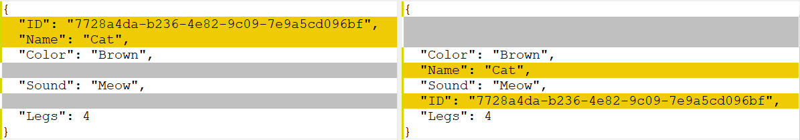

Today we look at what might be a niche feature, but nevertheless in some use cases might actually be quite useful.

Take this `record class`:

```csharp
public record Animal
{
    public string Name { get; init; }
    public byte Legs { get; init; }
    public string Sound { get; init; }
}
```

If we were to serialize this to Json, we would do it like this:

```csharp
var cat = new Animal() { Name = "Cat", Legs = 4, Sound = "Meow" };

var options = new JsonSerializerOptions() { WriteIndented = true };

var json = JsonSerializer.Serialize(cat, options);

Console.Write(json);
```

This would print the following:

```json
{
  "Name": "Cat",
  "Legs": 4,
  "Sound": "Meow"
}
```

Now imagine we wanted the keys of the Json to be in a **particular order**. Perhaps we are using the Json for diff purposes, or for some other reason, the order is sensitive.

For example, you want to avoid this problem where the objects are technically exactly the same, but the representation is different.



A new attribute, [JsonPropertyOrder](https://docs.microsoft.com/en-us/dotnet/api/system.text.json.serialization.jsonpropertyorderattribute?view=net-6.0) has been introduced for this purpose.

We write our class like this:

```csharp
public record Animal
{
    [JsonPropertyOrder(3)]
    public string Name { get; init; }
    [JsonPropertyOrder(2)]
    public byte Legs { get; init; }
    [JsonPropertyOrder(1)]
    public string Sound { get; init; }
}
```

If we serialize this, we get the following:

```json
{
  "Sound": "Meow",
  "Legs": 4,
  "Name": "Cat"
}
```

Note the order of the keys!

Now you might ask yourself does this mean that you have to provide the order for each and every key? No. 

If you don't provide the attribute, the serializer treats it as if you specified the attribute with a default value of `0`.

So, if this is the class:

```csharp
public record Animal
{
    public string Name { get; init; }
    [JsonPropertyOrder(2)]
    public byte Legs { get; init; }
    [JsonPropertyOrder(1)]
    public string Sound { get; init; }
    public string Color { get; init; }
}
```

The output will look like this:

```csharp
{
  "Name": "Cat",
  "Color": "Brown",
  "Sound": "Meow",
  "Legs": 4
}
```

`Name` and `Color` appear first because since no order was specified, the serializer treated them as if the order specified was `0`. And since there are two with the same order, it ordered them in the order they appeared in the object.

The documentation however says that the sequencing for properties with the same order value is **undefined**, so we cannot assume the order necessarily will always be that of the object.

What if after the object has been in use for some time, we introduce a new property and for some reason we want it to appear even before all the existing fields?

You can use a **negative** order value.

```csharp
public record Animal
{
    public string Name { get; init; }
    [JsonPropertyOrder(2)]
    public byte Legs { get; init; }
    [JsonPropertyOrder(1)]
    public string Sound { get; init; }
    public string Color { get; init; }
    [JsonPropertyOrder(-1)]
    public Guid ID { get; init; }
}
```

If we serialize this we should see the following:

```json
{
  "ID": "7728a4da-b236-4e82-9c09-7e9a5cd096bf",
  "Name": "Cat",
  "Color": "Brown",
  "Sound": "Meow",
  "Legs": 4
}
```

Here we see ID, with an order of `-1`, go **BEFORE** the attributes with order `0`.

If you want to add another property to appear **before** `ID`, give it an order of `-2`.

# Thoughts

This is a handy feature especially in cases where the consumption or storage of the object has some requirements beyond your control.

The code is in my [Github](https://github.com/conradakunga/BlogCode/tree/master/2021-10-27%20-%2030%20Days%20Of%20.NET%206%20-%20Day%2020%20-%20Json%20Property%20Ordering)

# TLDR

The [JsonPropertyOrder](https://docs.microsoft.com/en-us/dotnet/api/system.text.json.serialization.jsonpropertyorderattribute?view=net-6.0) attribute allows you to control the order of the serialization of object properties.

Happy hacking!

**This is Day 20 of the 30 Days Of .NET 6 where every day I will attempt to explain one new / improved thing in the upcoming release of .NET 6.**