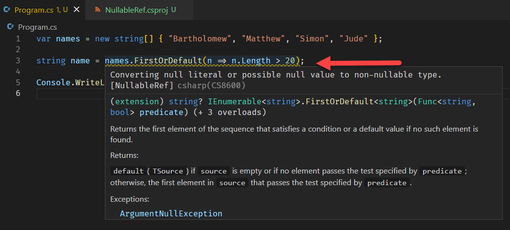

The great computer scientist [Tony Hoare](https://en.wikipedia.org/wiki/Tony_Hoare), credited with inventing the `null` reference, famously confessed this to be his '[billion dollar mistake](https://www.infoq.com/presentations/Null-References-The-Billion-Dollar-Mistake-Tony-Hoare/)'.

Developers of all ages, ranks and experience are **VERY** familiar with the null reference, especially when it manifests as an exception.

A great deal of work (and code) goes into preventing these from arising in the first place, as well as detecting them when they arise and recovering from them.

.NET 6 has introduced a new approach to dealing with this problem - you can specify whether or not you want the compiler to aggressively check for conditions where a value potentially evaluates to null and catch this at compile time.

Take this code:

```csharp
var names = new string[] { "Bartholomew", "Matthew", "Simon", "Jude" };

string name = names.FirstOrDefault(n => n.Length > 20);

Console.WriteLine(name);
```

If you try to build it, you will get this warning:

```plaintext
C:\Projects\BlogCode\NullableRef\Program.cs(3,15):
warning CS8600: Converting null literal or possible null value to non-nullable type.
[C:\Projects\BlogCode\NullableRef\NullableRef.csproj]
1 Warning(s)
```
You will also get a warning in the IDE



Note **the exact expression does not matter** - you would **still** get the warning whether or not the expression was satisfied.

What is happening here is as follows:

The query 

```csharp
names.FirstOrDefault(n => n.Length > 20)
```

can return exactly one of two options:

* A `string`, if the expression found at least one match
* A `null`, if the expression was not satisfied

If a `null` is returned, this will be assigned to the `name` variable.

But we have specified that `name` is a `string`.

If we want to signal that we are OK with getting back a `null`, we change the code like this:

```csharp
string? name = names.FirstOrDefault(n => n.Length > 20);
```

This signals to the compiler that we expect `name` to be either a `string`, or a `null`, and therefore the code will compile without any warnings.

In other words `string?` tells the compiler that "*this is a string, but it might also be a null; and I am OK with that.*"

This feature is called [nullable references](https://docs.microsoft.com/en-us/dotnet/csharp/nullable-references), and is controlled at project level.

If you open the `.csproj` you should see the following:

```xml
<Project Sdk="Microsoft.NET.Sdk">

  <PropertyGroup>
    <OutputType>Exe</OutputType>
    <TargetFramework>net6.0</TargetFramework>
    <ImplicitUsings>enable</ImplicitUsings>
    <Nullable>enable</Nullable>
  </PropertyGroup>

</Project>
```

The idea here is to force you to think about how to handle the edge case when your expression does not return anything.

You could handle this by using the new overload for `FirstOrDefault` where you specify a default. This w[e talked about in this post]()

```csharp
string notNullName = names.FirstOrDefault(n => n.Length > 20, "");
```

If we do this, there is **no way** anything other than a `string` is returned. So the return is never `null`.

To turn **OFF** this feature entirely, which is ON by default, change `Nullable` to `disable`. With this the project will behave like it was prior to .NET 6.

# Thoughts

This feature should help developers catch some very subtle bugs at compile time, resulting in better quality code.

The code is in my [Github](https://github.com/conradakunga/BlogCode/tree/master/2021-11-04%20-%2030%20Days%20Of%20.NET%206%20-%20Day%2023%20-%20Nullable%20References).

# TLDR

Nullable references allow developers to catch possible bugs due to unexpected `null` values at compile time, and will enforce better domain design.

Happy hacking!

**This is Day 23 of the 30 Days Of .NET 6 where every day I will attempt to explain one new / improved thing in the upcoming release of .NET 6.**