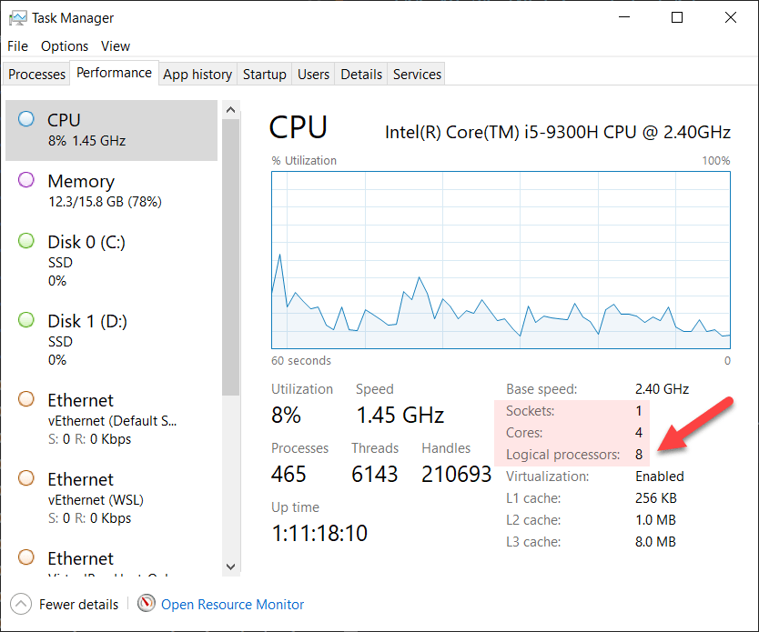

Computing "power" over the past decades has changed from being a speed game "megahertz" to a parallelism game - multi-processor, multi-core.

Programming languages and runtimes have also been forced to adapt to the times, and most have rich support for parallelism and parallelism constructs.

Take for example this trivial function:

```csharp
public async Task DoSomething(int number)
{
    await Task.Delay(TimeSpan.FromSeconds(5));
}
```

It simulates work by waiting 5 seconds before returning.

If we were to run this in a simple program to process 15 numbers, the program would look like this:

```csharp
// Setup our logging infrastructure using Serilog
var config = new LoggerConfiguration().WriteTo.Console().CreateLogger();
Log.Logger = config;

var numbers = Enumerable.Range(0, 15);

foreach (var number in numbers)
{
    await DoSomething(number);
    Log.Information($"Completed {number}");
}
```

Logging is done using the [Serilog.Sinks.Console package](https://github.com/serilog/serilog-sinks-console)

If you run this program, it will print the following:

```plaintext
[10:41:51 INF] Completed 0
[10:41:56 INF] Completed 1
[10:42:01 INF] Completed 2
[10:42:06 INF] Completed 3
[10:42:11 INF] Completed 4
[10:42:16 INF] Completed 5
[10:42:21 INF] Completed 6
[10:42:26 INF] Completed 7
[10:42:31 INF] Completed 8
[10:42:36 INF] Completed 9
[10:42:41 INF] Completed 10
[10:42:46 INF] Completed 11
[10:42:51 INF] Completed 12
[10:42:56 INF] Completed 13
[10:43:01 INF] Completed 14
```
The times, of course, will vary on your machine.

The code here is is taking 5 seconds to process each 'job'.

Is there a way to run these in parallel? There is - the [Parallel](https://docs.microsoft.com/en-us/dotnet/api/system.threading.tasks.parallel?view=net-5.0) class.

We can rewrite our program like this:

```csharp
Log.Information("Starting");

Parallel.ForEach(numbers, async (number) =>
{
    await DoSomething(number);
    
    Log.Information($"Completed {number}");
});
```

What is happening here is we are taking the collection of `numbers` (0-14), we are extracting an element (`number`) from it, and then we are asynchronously calling the function `DoSomething()` **in parallel** 15 times.

If we run this program, it should return the following:

```plaintext
[10:52:21 INF] Starting
[10:52:26 INF] Completed 2
[10:52:26 INF] Completed 10
[10:52:26 INF] Completed 7
[10:52:26 INF] Completed 1
[10:52:26 INF] Completed 12
[10:52:26 INF] Completed 3
[10:52:26 INF] Completed 11
[10:52:26 INF] Completed 13
[10:52:26 INF] Completed 5
[10:52:26 INF] Completed 6
[10:52:26 INF] Completed 8
[10:52:26 INF] Completed 9
[10:52:26 INF] Completed 14
[10:52:26 INF] Completed 4
[10:52:26 INF] Completed 0
```

A close look at the timestamps shows that the program took a total of 5 seconds to run **all** the jobs - here we have achieved our desired parallelism.

However, as with all things, parallelism is not this simple.

Assume `DoSomething()` looks like this:

```csharp
public async Task DoSomething(int number)
{
    var client = new HttpClient();
    var url = $"https://google.com?ID={number}";
    Log.Information($"Requesting {url}", url);
    await client.GetStringAsync(url);
}
```

Here we are creating a `HttpClient` and then using that to get the contents of a dynamically constructed URL.

**NOTE: This is *not* how you should use a `HttpClient` - you should create only one instance, and pass it to your function to make requests on your behalf. I have done it this way to illustrate a point**

Assuming we call this method with a collection of 100,000 numbers - what would happen?

Given there are only so many sockets that can be opened by a `HttpClient`, if we invoke that method 100,000 times in parallel we will quickly run out of sockets and get a [SocketException](https://docs.microsoft.com/en-us/dotnet/api/system.net.sockets.socketexception?view=net-6.0) error.

And even if, hypothetically speaking we were able to make as many socket connections as required, any upstream server receiving 100,000 simultaneous requests from the same IP at the same time would probably consider it a [DOS attack](https://en.wikipedia.org/wiki/Denial-of-service_attack)

To avoid this problem, we would need to batch our requests, and then wait for each batch to successfully complete before moving on to the next batch.

It is for this precise use case that the Parallel class has been enhanced with a new method - [Parallel.ForEachAsync](https://docs.microsoft.com/en-us/dotnet/api/system.threading.tasks.parallel.foreachasync?view=net-6.0)

Using our previous example with numbers, we can rewrite the program like this:

```csharp
var numbers = Enumerable.Range(0, 30);
	
Log.Information("Starting");

await Parallel.ForEachAsync(numbers, async (number, token) =>
{
    await DoSomething(number);
    
    Log.Information($"Completed {number}");
});
```

It is very similar to [Parallel.ForEach](https://docs.microsoft.com/en-us/dotnet/api/system.threading.tasks.parallel.foreachasync?view=net-6.0#System_Threading_Tasks_Parallel_ForEachAsync__1_System_Collections_Generic_IAsyncEnumerable___0__System_Func___0_System_Threading_CancellationToken_System_Threading_Tasks_ValueTask__), with two key differences:
1. You must provide a [CancellationToken](https://docs.microsoft.com/en-us/dotnet/api/system.threading.cancellationtoken?view=net-6.0) to the invocation. You don't have to use it, but you must provide it.
2. If you do not specify otherwise, the invocation will use the number of processors (what is returned by [Environment.ProcessorCount](https://docs.microsoft.com/en-us/dotnet/api/system.environment.processorcount?view=net-6.0#System_Environment_ProcessorCount)) to determine the batch size.

The code above, when run, should print the following:

```plaintext
[11:48:06 INF] Starting
[11:48:11 INF] Completed 7
[11:48:11 INF] Completed 6
[11:48:11 INF] Completed 4
[11:48:11 INF] Completed 1
[11:48:11 INF] Completed 5
[11:48:11 INF] Completed 2
[11:48:11 INF] Completed 0
[11:48:11 INF] Completed 3
[11:48:16 INF] Completed 8
[11:48:16 INF] Completed 15
[11:48:16 INF] Completed 11
[11:48:16 INF] Completed 14
[11:48:16 INF] Completed 9
[11:48:16 INF] Completed 13
[11:48:16 INF] Completed 12
[11:48:16 INF] Completed 10
[11:48:21 INF] Completed 21
[11:48:21 INF] Completed 20
[11:48:21 INF] Completed 17
[11:48:21 INF] Completed 19
[11:48:21 INF] Completed 22
[11:48:21 INF] Completed 23
[11:48:21 INF] Completed 18
[11:48:21 INF] Completed 16
[11:48:26 INF] Completed 26
[11:48:26 INF] Completed 28
[11:48:26 INF] Completed 27
[11:48:26 INF] Completed 29
[11:48:26 INF] Completed 24
[11:48:26 INF] Completed 25
```

Note that every 5 seconds, a 8 numbers are processed. This is because my machine has 8 cores.



If you want to control this, you can do it by providing a [ParallelOptions](https://docs.microsoft.com/en-us/dotnet/api/system.threading.tasks.paralleloptions?view=net-5.0) parameter to your invocation.

```csharp
var options = new ParallelOptions()
{
    // Use a batch size of 5
    MaxDegreeOfParallelism = 5
};

// Invoke with our custom partitioning
await Parallel.ForEachAsync(numbers, options, async (number, token) =>
{
    await DoSomething(number);
    
    Log.Information($"Completed {number}");
});
```

This should return the following:

```plaintext
[12:06:58 INF] Starting
[12:07:03 INF] Completed 1
[12:07:03 INF] Completed 4
[12:07:03 INF] Completed 0
[12:07:03 INF] Completed 3
[12:07:03 INF] Completed 2
[12:07:08 INF] Completed 6
[12:07:08 INF] Completed 7
[12:07:08 INF] Completed 8
[12:07:08 INF] Completed 5
[12:07:08 INF] Completed 9
[12:07:13 INF] Completed 13
[12:07:13 INF] Completed 11
[12:07:13 INF] Completed 14
[12:07:13 INF] Completed 12
[12:07:13 INF] Completed 10
[12:07:18 INF] Completed 18
[12:07:18 INF] Completed 16
[12:07:18 INF] Completed 19
[12:07:18 INF] Completed 17
[12:07:18 INF] Completed 15
[12:07:23 INF] Completed 20
[12:07:23 INF] Completed 21
[12:07:23 INF] Completed 22
[12:07:23 INF] Completed 24
[12:07:23 INF] Completed 23
[12:07:28 INF] Completed 28
[12:07:28 INF] Completed 25
[12:07:28 INF] Completed 29
[12:07:28 INF] Completed 27
[12:07:28 INF] Completed 26
```

Note here that the numbers are still processed **every 5 seconds**, but the processing is grouped into **batches of 5**.

You can use the [CancellationToken](https://docs.microsoft.com/en-us/dotnet/api/system.threading.cancellationtoken?view=net-6.0) `token` to control the cancellation should you need to cancel the processing.

`Parallel.ForEachAsync` thus offers benefits over `Parallel.ForEach` as it allows you to control the parallelism of the processing **and** retrieval of the results.

# Thoughts

`Parallel.ForEachAsync` makes it easier for code that needs to run in parallel to be batched and executed with the results being periodically collected.

# TDLR

`Parallel.ForEachAsync` provides a simple API to partition and batch asynchronous operations.

**This is Day 24 of the 30 Days Of .NET 6 where every day I will attempt to explain one new / improved thing in the upcoming release of .NET 6.**