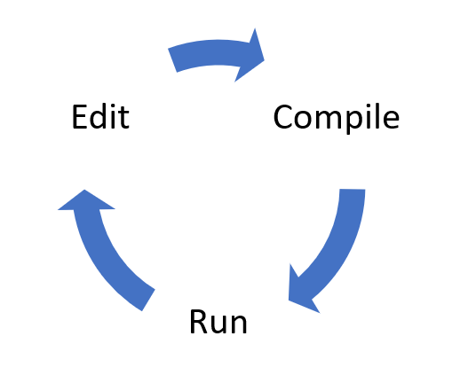
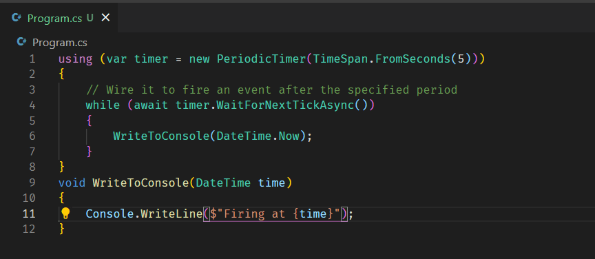
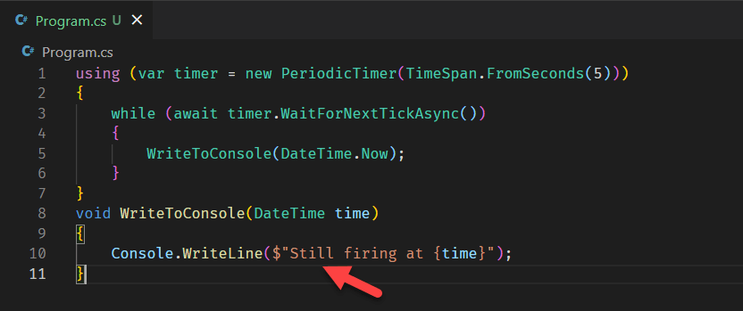
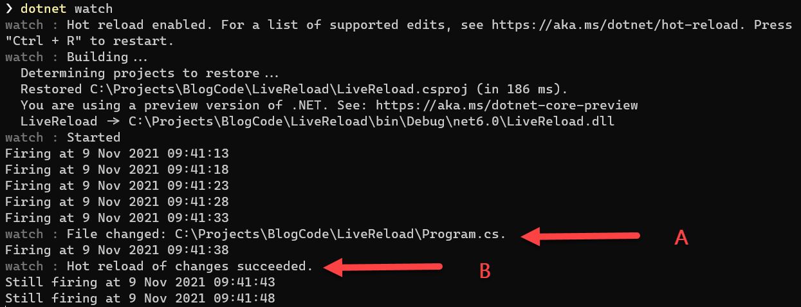

Programming has been with us for almost a century now but the cycle surprisingly has largely been the same:



There have been a lot of incremental improvements to improve this cycle over the decades.

For example in for .NET languages (C#, VB.NET and F#), if you are using the SDK, you compile your programs like this:

```bash
dotnet build
```

You then run them like this:

```bash
dotnet run
```

It was quickly realized that it is tedious having to run two commands given that to run a program you probably want to build it first. And so `dotnet run` first builds and then proceeds to run the program.

Another improvement is you can run a program but also instruct the SDK to rebuild it if it detects a change in the code.

Instead of running `dotnet run` you run this:

```bash
dotnet watch
```

This is accomplished using the [dotnet watch](https://docs.microsoft.com/en-us/aspnet/core/tutorials/dotnet-watch?view=aspnetcore-6.0) tool.

If the source code changes `dotnet watch` will **rebuild** the code and then **re-launch** the program.

.NET 6 has a further improvement - [Hot Reload](https://devblogs.microsoft.com/dotnet/introducing-net-hot-reload/).

Hot Reload allows developers to change the source code of the application and have those changes reflect in real-time by modifying the running application.

This is different from just re-compiling and re-running. Here the effect is of the application essentially being re-written in memory while it is still loaded.

Take this simple program which fires an event every 5 seconds:

```csharp
using (var timer = new PeriodicTimer(TimeSpan.FromSeconds(5)))
{
    while (await timer.WaitForNextTickAsync())
    {
        WriteToConsole(DateTime.Now);
    }
}
void WriteToConsole(DateTime time)
{
    Console.WriteLine($"Still firing at {time}");
}
```

If we run it it will print the following:

```plaintext
Firing at 9 Nov 2021 09:41:13
Firing at 9 Nov 2021 09:41:18
Firing at 9 Nov 2021 09:41:23
Firing at 9 Nov 2021 09:41:28
Firing at 9 Nov 2021 09:41:33
```

With the program still running, make a change to the source code:

Before:



After:



Immediately the code is saved, the output changes:



- **A** - the change in the source code is detected
- **B** - the Hot Reload updates the changes and applies them to the running application.

If you look closely at the timestamps you will notice the event still fires after **exactly 5 seconds** even factoring in the changes.

Needless to say, there are limits to the sort of changes that can me made in real-time - these are outlined [here](https://docs.microsoft.com/en-us/visualstudio/debugger/supported-code-changes-csharp?view=vs-2022)

# Thoughts

This is a brilliant aid to developers that will make the edit - build - run cycle less frictional; improving productivity.

# TLDR

[Hot Reload](https://devblogs.microsoft.com/dotnet/introducing-net-hot-reload/) allows running programs to have their source edited and applied immediately while they are still running.

There was some controversy when Microsoft [attempted to pull this feature from Release Candidate 2 and restrict it to Visual Studio](https://devblogs.microsoft.com/dotnet/update-on-net-hot-reload-progress-and-visual-studio-2022-highlights/). The community was [infuriated](https://www.theregister.com/2021/10/22/microsoft_net_hot_reload_visual_studio/#:~:text=Hot%20Reload%20is%20a%20feature,results%20in%20the%20running%20application.) and the outrage led to it's [reinstatement](https://devblogs.microsoft.com/dotnet/net-hot-reload-support-via-cli/).

Happy hacking!

**This is Day 25 of the 30 Days Of .NET 6 where every day I will attempt to explain one new / improved thing in the upcoming release of .NET 6.**