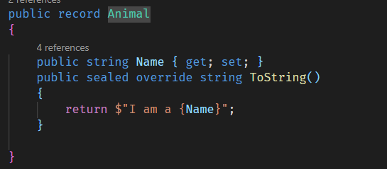
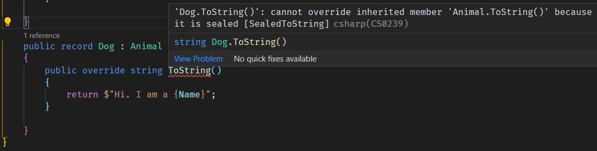

One of the things you get for free when using a `record` is that the compiler will write for you a `ToString()` method for free.

For example, take this record:

```csharp
public record Animal
{
    public string Name { get; set; }
}
```

If we run this program:

```csharp
var animal = new Animal() { Name = "Animal" };
Console.WriteLine(animal.ToString());
```

It will print the following:

```plaintext
Animal { Name = Animal }
```

You might want to change this and provide your own implementation of `ToString()`.

```csharp
public record Animal
{
    public string Name { get; set; }
    public sealed override string ToString()
    {
        return $"I am a {Name}";
    }
}
```

If we re-run the program it should print the following:

```plaintext
I am a Animal
```

Given that a `record` can be inherited from, we can make use of this to extend the hierarchy.

```csharp
public record Dog : Animal
{
}
```

We can then modify our program as follows:

```csharp
var animal = new Animal() { Name = "Animal" };
Console.WriteLine(animal.ToString());

var dog = new Dog() { Name = "Dog" };
Console.WriteLine(dog.ToString());
```

If we run this it should print the following:

```plaintext
I am a Animal
I am a Dog
```

Given `ToString()` is an overrideable method, we can extend `Dog` as follows:

```csharp
public record Dog : Animal
{
    public override string ToString()
    {
        return $"Woof. I am a {Name}";
    }
}
```

If we re-run the program we should get the following:

```plaintext
I am a Animal
Woof. I am a Dog
```

You may not want this to happen - perhaps you want the original implementation to be the standard. So you might enforce this by using the `sealed` modifier.

This does not work in .NET 5, and in fact you get an error:


This has been changed in .NET 6 which now supports sealing of `ToString()` in records.



Once you do this, you break the `ToString()` for the `Dog` record.



This means you cannot override `ToString()` for any descendant classes.
  
This means they will all use the implementation of the `Animal` version, and thus it will be predictable across the board.

# Thoughts

A bit of a niche feature, but it will allow developers to control how `ToString()` to behave in descendants.

# TLDR

The ability to seal `ToString()` allows for control of the method in records, and child descendants of records that inherit.

**This is Day 26 of the 30 Days Of .NET 6 where every day I will attempt to explain one new / improved thing in the upcoming release of .NET 6.**