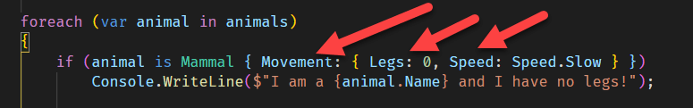
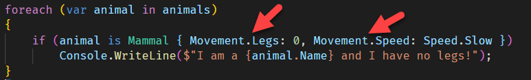

Pattern matching is a powerful feature borrowed from functional languages that can make a whole class of problems simpler to solve.

Take for example these (somewhat convoluted) types:

```csharp
public enum Speed { VeryFast, Fast, Medium, Slow }
public record Movement
{
    public byte Legs { get; init; }
    public byte Fins { get; init; }
    public Speed Speed { get; init; }
}
public record Animal
{
    public string Name { get; init; }
    public Movement Movement { get; init; }
}
public record Mammal : Animal { }
public record Bird : Animal { }
```

We have a parent `Animal` record, and two inherited records, `Mammal` and `Bird`.

Each has within a complex property, `Movement`.

Suppose then we had a collection of Animal:

```csharp
var animals = new Animal[]{
    new Mammal(){ Name = "Dog", Movement = new Movement() { Legs = 4, Speed = Speed.Medium }},
    new Mammal(){ Name = "Cat", Movement = new Movement() { Legs = 4, Speed = Speed.Slow }},
    new Mammal(){ Name = "Dolphin", Movement = new Movement() { Fins = 2, Speed=Speed.Fast }},
    new Mammal(){ Name = "Whale", Movement = new Movement() { Fins = 2, Speed=Speed.Slow }},
    new Bird(){ Name = "Chicken", Movement = new Movement() { Legs = 2, Speed = Speed.Slow }},
    new Bird(){ Name = "Duck", Movement = new Movement() { Legs = 2,Speed = Speed.Slow }}
};
```

Suppose we then wanted to filter:
1. Mammals
2. With no legs
3. That are slow

The most obvious way is a LINQ expression:

```csharp
var result = animals.Where(a => a is Mammal && a.Movement.Legs == 0 && a.Movement.Speed == Speed.Slow);
foreach (var animal in result)
    Console.WriteLine($"I am a {animal.Name} and I have no legs!");
```

This will print, as expected,

```plaintext
I am a Whale and I have no legs!
```

Another way to do this is to use property patterns.

You can rewrite the code like this without using LINQ

```csharp
foreach (var animal in animals)
{
    if (animal is Mammal { Movement: { Legs: 0, Speed: Speed.Slow } })
        Console.WriteLine($"I am a {animal.Name} and I have no legs!");
}
```

This code works in C# 9. But if you look at this bit:



It is a bit unwieldy.

This has been improved in C# 10.

You can rewrite the code like this:

```csharp
foreach (var animal in animals)
{
    if (animal is Mammal { Movement.Legs: 0, Movement.Speed: Speed.Slow })
        Console.WriteLine($"I am a {animal.Name} and I have no legs!");
}
```

Note the subtle difference:



The properties now are specified as simple nested properties, without the need for nested braces.

# Thoughts

This simplified syntax makes these expressions easier to read, especially for deeply nested types.

The code is in my [Github](https://github.com/conradakunga/BlogCode/tree/master/2021-11-19%20-%2030%20Days%20Of%20.NET%206%20-%20Day%2027%20-%20Extended%20Property%20Patterns)

# TLDR

[Extended Property](https://docs.microsoft.com/en-us/dotnet/csharp/language-reference/proposals/csharp-10.0/extended-property-patterns) Patterns make it easier to write filtering expressions on complex objects.

**This is Day 27 of the 30 Days Of .NET 6 where every day I will attempt to explain one new / improved thing in the upcoming release of .NET 6.**

Happy hacking!