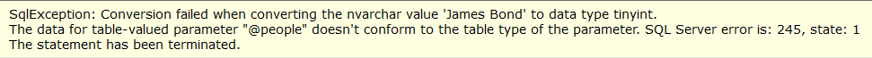

[User Defined Table Types](https://docs.microsoft.com/en-us/sql/relational-databases/tables/use-table-valued-parameters-database-engine?view=sql-server-ver15) are a very nifty way to pass data to a stored procedure for processing.

Say we have this type:

```sql
CREATE TYPE dbo.Person AS TABLE
    (
        FullNames NVARCHAR(100) NOT NULL,
        Age       TINYINT       NOT NULL
    );
```

And then we have this procedure that accepts this type as a parameter:

```sql
CREATE PROC ProcessPeople
    (@People Person READONLY)
AS
    -- this is some dummy processing
    SELECT
        COUNT(1)
    FROM
        @People;
```

We can invoke this from code, using the excellent [Dapper](https://github.com/DapperLib/Dapper) library to interact with the database and the [DataTableProxy](https://github.com/tdietrich513/DataTableProxy) library to allow us to easily map plain C# objects to a [DataTable](https://docs.microsoft.com/en-us/dotnet/api/system.data.datatable?view=net-6.0) that can then be used to create a structured object for the parameter.

Our program would look like this:

```csharp
// Create a collection of people
var people = new Person[] { new Person() { Name = "James Bond", Age = 40 },
new Person() { Name = "Evelyn Salt", Age = 30 },
new Person() { Name = "Jason Bourne Salt", Age = 35 }};

// Convert the collection into a datatable

var tableParameter = people.ToTable(new ClassMapping<Person>()
    .AddColumn("Name", i => i.Name)
    .AddColumn("Age", i => i.Age)
);

// Call the procedure
using (var cn = new SqlConnection("Data source=;database=Empty;trusted_Connection=true"))
{
    cn.Execute("[ProcessPeople]",
    	new { people = tableParameter.AsTableValuedParameter("Person") },
    	commandType: CommandType.StoredProcedure);
}
```

This will run fine.

However, if you changed the order of the mapping, like so:

```csharp
var tableParameter = people.ToTable(new ClassMapping<Person>()
    .AddColumn("Age", i => i.Age)
    .AddColumn("Name", i => i.Name)
);
```

Running the program would yield the following:



**In other words, for user defined table types, the column order matters - you must pass the columns in the order they were defined**

Happy hacking!
