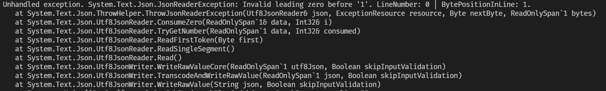

Serialization of objects to JSON, as we have seen, is easily achieved using the native Json serializer, [System.Text.Json](https://docs.microsoft.com/en-us/dotnet/api/system.text.json?view=net-6.0).

You can also use [Newtonsoft.Json](https://www.newtonsoft.com/json), the older brother that had different design goals - flexibility.

But for today we are discussing the [System.Text.Json](https://www.newtonsoft.com/json) serializer.

99% of the time it will do the right thing without you needing to do anything.

However there are times when you need to step in and control the output of the Json.

In theory you can achieve this using any of the **many** methods of outputting text. However you need to do a lot of manual work to control things like delimiting, indentation, etc.

However, there is an easier way to do this - a [UTF8JsonWriter](https://docs.microsoft.com/en-us/dotnet/api/system.text.json.utf8jsonwriter?view=net-6.0).

Let us take this example:

```csharp
public record Animal
{
    public string Name { get; init; }
    public byte Legs { get; init; }
}
```

First we construct an array of animals

```csharp
// Create an array of animals
var animals = new[]
{
    new Animal(){ Name = "Octopus" , Legs = 8},
    new Animal(){ Name = "Octopus Plus" , Legs = 10},
};
```
  
We would serialize this as follows:

```csharp
// Stream to standard output
var options = new JsonSerializerOptions() { WriteIndented = true };
using (var stream = Console.OpenStandardOutput())
{
    JsonSerializer.Serialize(stream, animals, options);
}
```

The results would be as follows:

```plaintext
[  
  {
    "Name": "Octopus",
    "Legs": 8
  },
  {
    "Name": "Octopus Plus",
    "Legs": 10
  }
]
```

Now imagine, for some reason, that the target system required the number of legs to be in [octal](https://en.wikipedia.org/wiki/Octal).

The Json serializer will not do this natively. You have to do the heavy lifting yourself.

One way to do it is as follows:

```csharp
var writeOptions = new JsonWriterOptions() { Indented = true };
// Create a memory stream that will be written to by the writer
using (var ms = new MemoryStream())
{
	// Create a Utf8Json writer, and configure it to indent
    using (var writer = new Utf8JsonWriter(ms, writeOptions))
    {
        writer.WriteStartObject();
        writer.WriteStartArray("Animals");
        foreach (var animal in animals)
        {
            writer.WriteStartObject();
            writer.WritePropertyName(nameof(animal.Name));
            writer.WriteStringValue(animal.Name);
            writer.WritePropertyName(nameof(animal.Legs));
            writer.WriteNumberValue(ConvertToOctal(animal.Legs));
            writer.WriteEndObject();
        }
        writer.WriteEndArray();
        writer.WriteEndObject();
    }
}
```

The `ConvertToOctal` method itself is as follows:

```csharp
public int ConvertToOctal(int number)
{
    // Convert the number to a string (in octal) and then
    // parse it back to a number
    return int.Parse(Convert.ToString(number, 8));
}
```

This will print the following:

```json
{
  "Animals": [
    {
      "Name": "Octopus",
      "Legs": 10
    },
    {
      "Name": "Octopus Plus",
      "Legs": 12
    }
  ]
}
```

Now the values here are correctly in octal. However, the problem here is that it is not obvious to anyone looking at the Json that these values are in octal.

To make this obvious, we need to prefix a 0 to the values so that it is clear that they are octal.

The native [WriteNumberValue](https://docs.microsoft.com/en-us/dotnet/api/system.text.json.utf8jsonwriter.writenumbervalue?view=net-6.0) method will not let you do this.

However, you can override that and control the actual written value using the [WriteRawValue](https://docs.microsoft.com/en-us/dotnet/api/system.text.json.utf8jsonwriter.writerawvalue?view=net-6.0) method.

First, we write another method to convert and format our value:

```csharp
string ConvertToOctalForJson(int number)
{
    // Convert the number to a string (in octal), and format it
    return $"0{Convert.ToString(number, 8)}";
}
```

Then we change our code to invoke `WriteRawValue` instead of `WriteNumberValue` like this:

```csharp
writer.WriteRawValue(ConvertToOctalForJson(animal.Legs), skipInputValidation: true);
```

The `skipInputValidation` parameter is required to be set to **true** (default is false) because if you do not set it, you will get this error:




This is because a number with a prefix of 0 is not, in fact, valid Json under [RC8259](https://datatracker.ietf.org/doc/html/rfc8259).

We therefore need to tell the writer to **skip** Json validation.


If we run the code now we should get the following:

```json
{
  "Animals": [
    {
      "Name": "Octopus",
      "Legs": 010
    },
    {
      "Name": "Octopus Plus",
      "Legs": 012
    }
  ]
}
```

Note that the legs are now properly displayed as numeric values, in octal.

It is important to also note that `WriteRawValue` can also accept **complete JSON** as a parameter, so you can stitch together Json fragments into a larger document

# Thoughts

The ability to control Json serialization and still retain good performance is an immensely powerful feature.

The code is is in my [Github](https://github.com/conradakunga/BlogCode/tree/master/2021-12-06%20-%2030%20Days%20Of%20.NET%206%20-%20Day%2029%20-%20Custom%20Json%20Serialization%20Using%20UTF8JsonWriter)

# TLDR

The [Utf8Json](https://docs.microsoft.com/en-us/dotnet/api/system.text.json.utf8jsonwriter?view=net-6.0) writer now exposes the [WriteRawValue](https://docs.microsoft.com/en-us/dotnet/api/system.text.json.utf8jsonwriter.writerawvalue?view=net-6.0) method to allow for custom serialization of values.

**This is Day 29 of the 30 Days Of .NET 6 where every day I will attempt to explain one new / improved thing in the new release of .NET 6.**

Happy hacking!