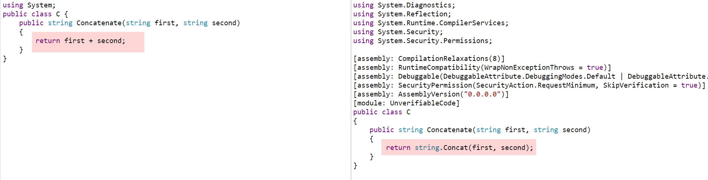
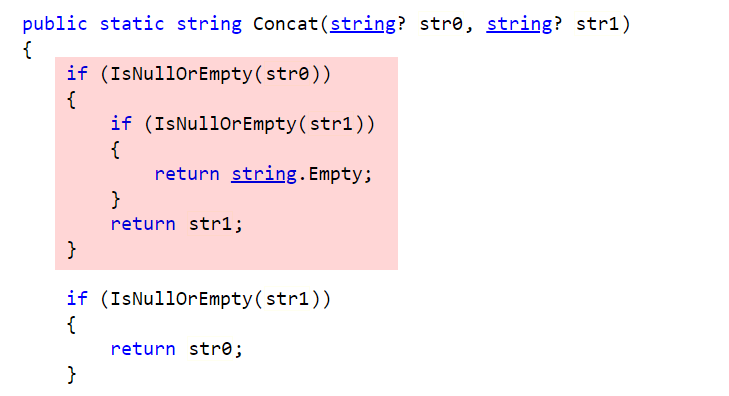

One of the things you will quickly learn after doing software development for any amount of time is that you cannot assume users of your software will do the right thing.

For example take this method:

```csharp
string Concatenate(string first, string second)
{
    return first + second;
}
```

It takes two `strings` as parameters and concatenates them.

Calling this method is simple enough:

```csharp
Console.WriteLine(Concatenate("one", "two"));
```
  
This should print the following:  

```plaintext
onetwo
```

Simple enough.

Now, assume it is called like this:

```csharp
Console.WriteLine(Concatenate(null, "two"));
```

Here, instead of providing a valid `string`, the caller has passed a `null`.

It will print the following:

```plaintext
two
```

Which, I must confess, I found surprising - I thought I would get back another `null`.

When I find such things I like to dig a bit deeper.

Turning to our old friend [Sharplab.io](https://sharplab.io/), it shows that the compiler changes the `+` operator to a method call to [String.Concat](https://docs.microsoft.com/en-us/dotnet/api/system.string.concat?view=net-6.0)



We then fire up the .NET source [browser](https://source.dot.net/#System.Private.CoreLib/String.Manipulation.cs,55b2f6374a7cf7c1) (remember C# and the .NET runtime is fully open source) to see what is happening.

And here we go:



Mystery solved.

But going back to our original business - perhaps we want to be explicit to the users that we do not accept null parameters.

So we would update our method like this:

```csharp
string Concatenate(string first, string second)
{
    if (string.IsNullOrEmpty(first))
    	throw new ArgumentNullException(nameof(first));
    if (string.IsNullOrEmpty(second))
    	throw new ArgumentNullException(nameof(second));
    	
    return first + second;
}
```

If we re-ran this code:

```csharp
Console.WriteLine(Concatenate(null, "two"));
```

we would get this exception:

```plaintext
Unhandled exception. System.ArgumentNullException: Value cannot be null. (Parameter 'first')
```

In C# 10, this can be further simplified as follows:

```csharp
string Concatenate(string first, string second)
{
    ArgumentNullException.ThrowIfNull(first);
    ArgumentNullException.ThrowIfNull(second);

    return first + second;
}
```

If we re-run the code we get the following:

```plaintext
Unhandled exception. System.ArgumentNullException: Value cannot be null. (Parameter 'first')        
   at System.ArgumentNullException.Throw(String paramName)
   at System.ArgumentNullException.ThrowIfNull(Object argument, String paramName)
```

Note that the compiler has been able to figure out the name of the argument, unlike before where we had to use the `nameof(first)` to do so.

# Thoughts

This helper method make writing of the mundane validation code a lot easier.

The code is in my [Github](https://github.com/conradakunga/BlogCode/tree/master/2021-12-21%20-%2030%20Days%20Of%20.NET%206%20-%20Day%2030%20-%20Argument%20Null%20Checking)

# TLDR

C# 10 has introduced a helper method to the `ArgumentNullException`, [ThrowIfNull](https://docs.microsoft.com/en-us/dotnet/api/system.argumentnullexception.throwifnull?view=net-6.0) to make it easier to write argument validation code.

**This is Day 30 of the 30 Days Of .NET 6, the final post in the series where every day I will attempt to explain one new / improved thing in the new release of .NET 6.**

Happy hacking!