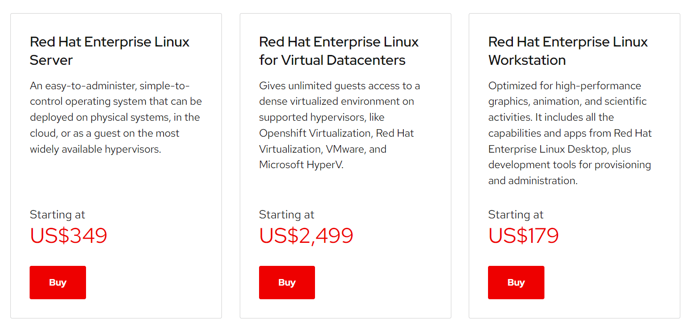
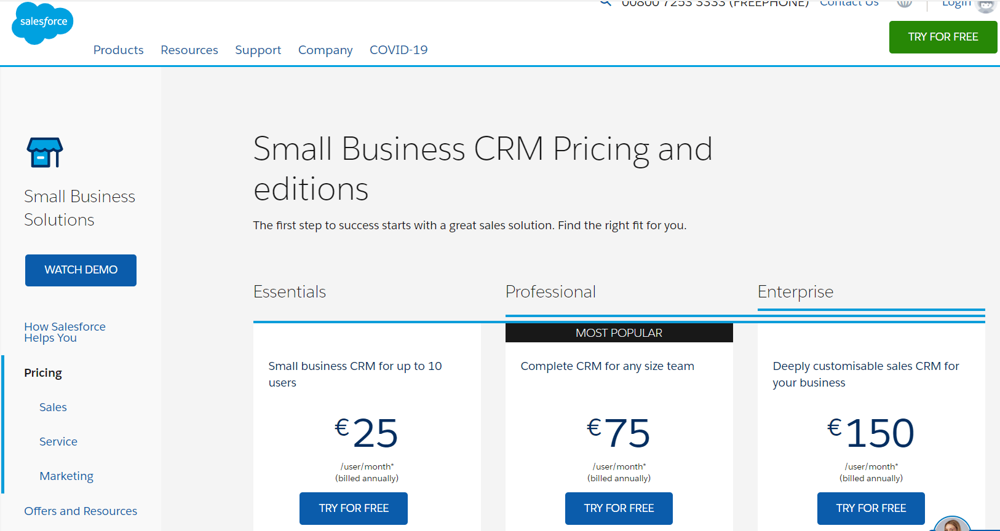

In my experience, parents are generally of the opinion that their sons are handsome and their daughters are beautiful.

And if not, they certainly think of them as better looking than they actually may be.

This is millions of years of evolution at work.

The same is the case with creators and their creations, from Frankenstein and his monster to modern day software development.

Go to any enterprise software vendor's website where they are pitching their product. They will invariably say things like these:

- Easy to use
- Robust
- Scalable
- High performing
- Secure

Here's the thing - this stuff does not do **anything** to move the needle for prospective buyers for two reasons:

1. These metrics are **completely subjective**. Almost everyone will feel their software is all these things, even if the reality on the ground is different. Because your sons are handsome and your daughters are beautiful
2. In the larger scheme of things, this stuff **doesn't matter** in terms of moving the needle for the decision makers.

When procuring enterprise software, these are the stakeholders who will make the call, arranged by their influence (where applicable)

* Board
* Chief executive
* Relevant C-level executive, usually COO
* Finance
* Risk & Audit
* IT
* The leader of the business unit the software is for
* Operational member of the business unit the software is for (User)

The exact order may vary (especially for Risk & Finance).

So let's revisit that list of items:

- Easy to use
- Robust
- Scalable
- High performing
- Secure

Let's then come up with a table of who 
1. Understands
2. Cares about these things

| Item        | Who Understands & Cares |
|-------------|-------------------------|
| Easy To Use | User |
| Scalable | IT, COO |
| Robust | IT, Risk & Audit |
| High performing | IT, Risk & Audit |
| Secure| IT, Risk & Audit |

Notice that lots of stakeholders don't appear at all in this table.

Is it that they don't care at all about this stuff? Yes, but only in a very abstract sense.

For example, the board will be interested in whether the software is secure. But they probably have zero capacity to establish this. So they will ask IT as well as Risk & Audit.

But this will be a tertiary level, after the stuff they are truly interested in has been evaluated.

So, what are the things that truly move the needle in terms of the decision to procure the software?

It is these:

1. **Increase revenue** - will thing thing bring in more money, directly or indirectly?
2. **Reduce cost** - will this thing reduce our costs, and thus increase our profits?
3. **Uplift our brand** - will this thing make us look better than our rivals & peers?
4. **Improve efficiency** - will this thing enable us to do more, with minimal changes to personnel levels, processes and systems?
5. **Reduce fraud** - will this thing help up avoid, and if not possible detect fraud, internally and externally?

This can be summarized as

> Make me money, save me money, or make me look better than the other guy

If your software can answer yes to one or more or these, you have a foot in the door. If you can answer yes to all of these, then you are probably already in.

Why? Because across these items **all the stakeholders are universally agreed**.

It is especially more effective if you can quantify these items. And that is a topic I will revisit another day.

These 5 items are the holy grail of enterprise software that will decide whether or not your software has a chance of being paid for.

After this initial hurdle then comes the inevitable one - cost. And chances are, if you've done a good job demonstrating those 5 items, the value preposition (what are we paying vs what are we getting in return) will be quite clear - the value preposition must be more than the cost.

In other words, if you can make your customer an additional 5 million dollars they weren't going to, they should have no problem paying you 1 million dollars.

They are never going to pay 1 million dollars fo "easy to use".

Then an only then will things like "easy to use" even merit examination.

If you ask around you will find software solutions that are notoriously difficult to use, or require inordinate amounts of resources to run but are still chugging along with zero chance of being removed why? Because they deliver tremendous value and there is zero compelling reason to replace them, despite spirited attempts by rivals (experienced or startups).

This is why you will find banks and other institutions running [core systems built in COBOL](https://www.wealthsimple.com/en-ca/magazine/cobol-controls-your-money) or older versions of Java still running along decades later.

You can try to displace them but on top of all the items I have discussed above you need a good counter to the fact that the systems in place, over and above the value they deliver have other aces up their sleeves 
1. They are **battle tested** - miscellaneous outages, hacker attention, denial of service attacks, regulatory upheaval, recessions etc.
2. They have been over time **improved** by adding of features and fixing of bugs and adjustments and tweaking of operational parameters and features.
3. There is **institutional knowledge** from those who use it and those who maintain it.

This is also why despite the fact that Linux is free, [RedHat](https://www.redhat.com/) Linux, [despite not being free](https://www.redhat.com/en/store/linux-platforms), has been selling well for quite some time. This is because the market feels their value offering is worth the cost.

Similarly, in a world full of free CRM solutions, [Salesforce](https://www.salesforce.com/) stands head and shoulders above the others despite its price point - because of the value it delvers.

So, when pitching enterprise software, pitch value. If you've played your cards right, everything else will fall into place.