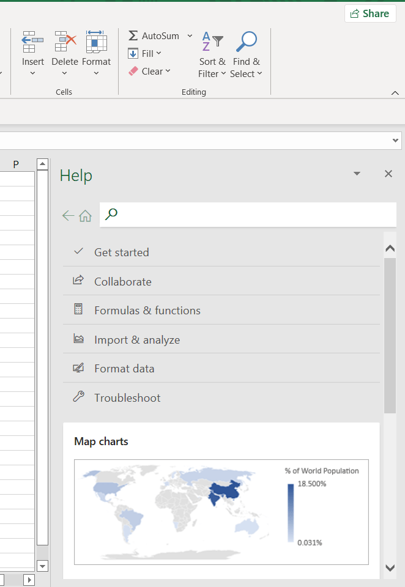

There is a famous question those in the software industry ask themselves:

> How hard can it be?

**Oh, very, very hard.**

Let me illustrate with an example.

Let us say you are a heavy [Excel](https://www.microsoft.com/en-us/microsoft-365/excel) user. Let us then assume, for whatever reason, Excel does NOT have a function that returns the current date. 

So you do your research and find out that in fact, there isn't such a function and Google is full of desperate Excel users looking for a solution.

> How hard can it be?

So you decide to write your own Date function.

Which works like this:

```vbnet
= CURRENT_DATE()
```

Your function returns this:

```plaintext
14/04/2022
```

How awesome is that?

Since you are shrewd and you don't want to make any assumptions, you post in various Excel focused user groups and blogs about your new formula. You even talk about it on your blog.

Pandemonium!

Everyone wants it!

**"Shut up and take my money!"** is the overwhelming response.

You are so encouraged you even do some *data sciency* stuff and collect data


The results are overwhelming. Dates is such a problem in Excel that 80% of people are willing to pay 50$ for your awesome software.

So you decide to take advantage of this opportunity, quit your day job and set up a new company to dedicate to this problem.

~~And then you lived happily ever after.~~

Ha. Of course not.

Your first problem is how to get your custom formula into users' Excel.

[Registering a custom formula](https://support.microsoft.com/en-us/office/create-custom-functions-in-excel-2f06c10b-3622-40d6-a1b2-b6748ae8231f) is not a trivial exercise for the average non - IT person.

Since you have no idea how to tackle this problem, you ask around your programmer friends who can create an installer wizard where your users just click Next > Next > Next and have the function registered for you.

As it so happens, one of your friends has some experience in this. And he gives you some things to think about

1. What version of Excel did you develop your logic in?
    - 2013
    - 2016
    - 2019
    
    This matters because there are slight differences in how the formulas work in these versions. In your `CURRENT_DATE` function, did you use Excel 2019 specific features? Because those won't work in earlier versions.
    
2. What version(s) of Excel do you want to target?

3. You will need a software developer to help you develop the installation wizard for your software, of which your friend is one. He will charge you a friendly rate, but charge you nevertheless.

4. Given you are packaging your software in an installer, you have some additional things to think about
    - What version of Windows will your users be running?
        - Windows 7
        - Windows 8
        - Windows 10
        - Windows 11
    - What architecture will your users be running?
        - 32 bit
        - 64 bit
        
Your friend will tell you you need to pay for software to help you with problem 1. [Software like this](https://www.add-in-express.com/purchase/index.php?family=net)

Your friend will also tell you you need to pay for software to help you with problem 4. [Software like this](https://www.advancedinstaller.com/purchase.html)

You discover to your surprise that the [online Excel has a different mechanism](https://docs.microsoft.com/en-us/office/dev/add-ins/excel/custom-functions-overview) for writing and registering custom functions!

You decide to first concentrate on those using desktop Excel.

So you buy all this extra software and pay your developer to do his thing.

You tell your developer friend that you want to sell your software online. To which he responds with another set of problems:

1. Which payment modes will you accept?
    - Cheque
    - Credit card
    - Bank transfer
    - Paypal
2. Which jurisdictions will you be accepting payments for?
3. How will you handle fraud?
4. How will you handle refunds?
5. How will you handle taxes?
6. How will you handle GDPR and other such regulatory issues?

Luckily for you, he knows a company that [handles such problems](https://stripe.com/pricing) for a fee.

He then goes on to build a complete online purchase experience and you are in business.

Things start off well.

And then your personal email, which you left on your website explodes with emails like these:

> "Your component is giving me the wrong result. It's printing 14 April 2022 as 04/14/2022, which is nonsense.
> 
> Thanks, James"

And ...

> "This component sucks. I can't believe I paid good money for this. The date it is printing is wrong!  
> 
> Disappointed"

So in a panic you write to some of these customers to find out what the problem is, as you're sure the component is working perfectly.

Well, it is, but it also isn't.

After a few days of irate email you narrow down the problem.

14 April, 2022 is written differently across countries.

| Country        | Short Date Format |
|----------------|-------------------|
| USA | 04/14/2022  |
| UK | 14/04/2022  |
| Japan | 2022/04/14  |
| Italy | 14.08.2022  |

So after thinking about it for some time, you decide to update your function.

```vbnet
= CURRENT_DATE(country_code)
```
So it is called like this:

```vbnet
' Print for the US
= CURRENT_DATE("US")

' Print for the UK
= CURRENT_DATE("UK")
```

So you call your programmer friend to update the installer.

At which points he tells you:

> "You can't just replace the old function. It has already been used in timetables and models and simulations. If you update the function, you will break people's spreadsheets
> 
> This will REALLY upset them."

What do to do? 

> You have to support BOTH the old version and the new version. This is called backwards compatibility.
> 
> You also have to document the new function and explain how to use it, on your websites and in the embedded documentation for your function."

*"Embedded documentation?"* You ask.

> Oh yes, in fact I forgot to tell you that. You have to embed your documentation for your software to be taken seriously. So when the user presses F1, they see this:
> 
> 


*"Oh. How do I do that?"* You ask.

[Software like this](https://www.helpandmanual.com/order.html)

So you put back the original code that you deleted and now your functions look like this

```vbnet
= CURRENT_DATE()
= CURRENT_DATE(country_code)
```

You have also documented them inline, and on your website.

So your developer uploads version 2.0 of your software and you email all your customers, because you made them register online.

You also let your customers know of a new email address to which they can email their support requests.

~~Finally, peace and quiet.~~

Ha. Of course not.

Emails start coming in

> "Hello sir.
> 
> My name is Mohammed Mohammed and I live and work in Somaliland. How do I get a date in Somaliland?"

You quickly reply:

> "Hi Mohammed, 
> 
> As explained in the documentation, you put the 2 digit ISO code for Somaliland as the second parameter."


Mohammed responds.

> "Yes, thank you sir, but Somaliland does not have such a code."


[So you check](https://en.wikipedia.org/wiki/List_of_ISO_3166_country_codes).

> "Hi Mohammed,
> 
> Kindly use `SO` as the code"

To which he responds:

> "Thank you, but `SO` is the code for Somalia. Our position is Somalia and Somaliland are different countries."

You also get another bunch of emails that say the same thing:

> "Hi,
> 
> is there a way to specify the month in full? The current format is confusing.
> 
> Is 04 01 2022 1st April or 4th January? I'd like the format to read as follows:
> 
> 1 Apr 2022 or 4 Jan 2022"

So you ask your programmer friend for some advice.

> "As a matter of fact, yes there are special characters called format strings. You can use these to describe how to format dates. Let me send you a table of what you can use for a sample date of 4 Jan 2022"


| FormatString   | Value          |
|----------------|----------------|
| d | 4 |
| dd | 04 |
| ddd | Mon |
| dddd | Monday |
| M | 1 |
| MM | 01 |
| MMM | Jan |
| MMMM | January |
| YY | 22 |
| YYYY | 2022 |

"So, if you want the date to be 2022, 01 January (Monday) - the FormatString will be this: `yyyy, dd, MMMM (dddd)`"

You get to work.

Your new function looks like this:

```vbnet
'Original version
= CURRENT_DATE()
'New Version
= CURRENT_DATE(FormatString)
```

You then update your documentation and sample code

```vbnet
' Print a custom string
= CURRENT_DATE("yyyy, dd, MMMM (dddd)")
```

Returns:

```plaintext
2022, 01 January (Monday)
```

So you call your friend and ...

> "What did we say about backward compatibility? There is no way Excel will know the difference between the FormatString version and the Country Code version.
> 
> You will have to call this new function some other name to avoid confusing your customers."


And so your version 3 looks like this:

```vbnet
' Original version - v1
= CURRENT_DATE()
' Version for country code - v2
= CURRENT_DATE(country_code)
' Version for format string - v3
= CURRENT_FORMATTED_DATE(format_string)
```

~~And then, finally, the customers were happy.~~

Ha. Of course not.

> "Hi,
> 
> I was trying to use your new function. I live and work in Kenya and speak Swahili. FYI the months printed by your functions are wrong. 
> 
> For your reference, these are the months in Kiswahili:
> 
> - Januari
> - Februari
> - Machi
> - Aprili
> - Mei
> - Juni
> - Julai
> - Agosti
> - Septemba
> - Octoba
> - Novemba
> - Decemba"

You get a tirade of similar complaints from French, Spanish, Russian, Swede ...

Version 4 is released to address this problem. It accepts a country code to control how to display the date data.

```vbnet
' Original version - v1
= CURRENT_DATE()
' Version for country code - v2
= CURRENT_DATE(country_code)
' Version for format string - v3
= CURRENT_FORMATTED_DATE(format_string)
' Version for format string with country code - v4
= CURRENT_FORMATTED_DATE(format_string, country_code)
```
Sample code:

```vbnet
' Print a custom string
= CURRENT_DATE("yyyy, dd, MMMM (dddd)", "KE")
```

Returns:

```plaintext
2022, 01 Januari (Jumatatu)
```

By this point it is now not feasible to handle both the development of the product, as well as the support. You need to invest in a support team.

You also need to invest in tooling to support the team. So at the very least:

* Ticketing system - to track complaints from receipt to resolution
* Online forum - to serve as a knowledge base and also place for peer support
* Alternative support channels, like chat, integrated into the ticketing system.

In addition the amounts of money coming in require proper records and book-keeping.

At this point your small project now requires an actual physical presence, with associated costs - rent, operations, power, water, staff, etc.

One day you get this message from your support team.

> "Hello.
> 
> We are having a strange issue with the function. Some customers are reporting a problem with 29 Feb 2020. Aside from the fact that it is a leap year, we don't know why some customers report an error and others it works OK."


After a week of calling customers and emails, you isolate the problem.

| Version        | Customers      |
|----------------|----------------|
| 1 | 20,000 |
| 2 | 30,000 |
| 3 | 40,000 |
| 4 | 60,000 |

There are 4 versions of your software.

The bug manifests only in versions 1 and 3, because you fixed the bug in version 2 and then re-introduced it in version 3 before fixing in in version 4.

You think fast and email your support.

> "Have you asked them to upgrade to version 4? This fixes their issues plus gives them added functionality!"


Support replies:

> "Yes, that was our first suggestion. They responded that they are happy with the software as is, and see no need to spend more money on the upgrade. They are waiting for us to fix the problem on their version."

And so you fix the problematic versions and upload them to the site.

Now you have 6 version running in the wild:

| Version | Notes |
|---------||--------|
| 1       | Original Version |
| 1.1      | Updated version with bug fix |
| 2       | Original Version |
| 3       | Original Version |
| 3.1       | Updated version with bug fix |
| 4       | Original Version |

You then realize after a month of analyzing your statistics that not everyone on v1 and v3 updated their software. Perhaps they don't know about the bug, or they no longer use the software.

This means whenever a customer has an issue, your first order of business is to establish what actual version they are running.

You also get an interesting statistic from your QA team.

| Version        | Customers      | Unique Customer Support Requests |
|----------------|----------------|----------------|
| 1 | 20,000 | 5,000 |
| 2 | 30,000 | 7,000 |
| 3 | 40,000 | 10,000 |
| 4 | 60,000 | 62,000 |

On average 25% of your clients have been sending requests but in version 4, more unique customer requests than registered customers have been received.

This means, your software is being pirated.

One one hand, this is a compliment as your software is good enough to attract pirates.

But the other, more salient fact is that support is a cost. Someone has to read your email / handle your call / handle your chat, triage the problem, find solutions and communicate them.

This costs money.

Also, these clients who have not paid are consuming scarce resources (support staff time and attention) at the expense of paying customers. Thus their satisfaction decreases.

So ask your friend how to address this problem.

As usual, there is [Software like this](http://xheo.com/products/copy-protection/pricing).

Remember also that the market is not standing still. Others will have seen the opportunity and will be building similar products.

Microsoft themselves might decide to plug the gap in Excel.

In other words, the opportunity shrinks by the day and you need to continuously be thinking of adding value to convince users to upgrade.

This is drummed in as the newest figures of version 5 and 6 come in:

| Version        | Customers      |
|----------------|----------------|
| 1 | 20,000 |
| 2 | 30,000 |
| 3 | 40,000 |
| 4 | 60,000 |
| 5 | 30,000 |
| 6 | 17,500 |

At which point you start thinking of alternative business models, because depending on new customers is no longer working.

But that is a discussion for another day.

In the course of your operations in addition to the bugs and security flaws in your own software, you are also at the mercy of the bugs and security flaws of the [other](https://www.advancedinstaller.com/release-19.0.html#enhancements) [systems](https://stripe.com/blog/changelog) and [libraries](https://www.add-in-express.com/news-latest.php) that you use.

You have to keep on top of these because much as they are not your problem, they are also your problem because your software may introduce security and other risks to your customers.

That too, is a discussion for another day.

For today just remember all this grief I have outlined came from a simple question:

> I want to sell this very simple software that computes the date for Excel.
> 
> How hard can it be?
