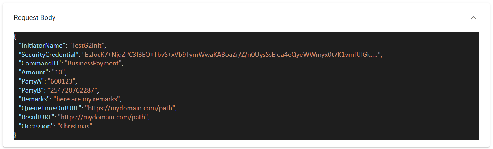

Remember [last time when I said coding is easy?]()

**Well, I lied.**

> Coding, or at least coding well, is not easy either.

The problem is at first glance, **it doesn't look difficult at all**. Not to the end users, and, surprisingly, **not to many software developers either**!

Let me explain.

In 2022 you must be living under a rock if you have not heard of APIs. **EVERYONE** is talking about APIs. This magical 3 letter acronym that allows you to do magic.
  
String enough APIs together, the thinking goes, and you can do anything.

So a CTO will come across the Safaricom MPESA API, [Daraja](https://developer.safaricom.co.ke/Documentation).

This API allows third parties to leverage MPESA in terms of sending prompts and collecting payments.

Pretty detailed documentation.

The important bit, where you can request a payment from a user to a paybill, is the B2C flow.

The heavy lifting is done here:

Essentially, to leverage this API you need to provide some information to the API, the most important ones being these:

1. Who is being asked to pay? (Phone number)
2. Where is the money going (Paybill)
3. How much do you want to be paid?
4. What should happen on success?
5. What should happen if the request times out?

This is very easy.

So the CTO will call a software developer friend on this.

> "Ah, that is very easy. That is a few lines of code - to setup the security and then to call the API to make the payment."

The CTO thinks, and rightly so, that this is a good avenue to expose an additional channel for revenue collection.

So he will write a proposal to recruit some developers in house to execute stuff like this in house. This will give the business things like "agility", and "competitive edge".

The board loves this. The green light is given, and a budget. The recruitment process for 3 developers begins.

As this is going the CTO gives me a call.

> "I'm setting up a team to do this stuff like MPesa integration, as part of my 2022-2023 strategy. I know [you guys do stuff like this](https://www.innova.co.ke/) in terms of collection channels. Out of curiosity, what would it cost if I were to give you this work?"

As this is a question I have been asked repeatedly, I actually have an answer ready.

> "3,866,897 Megaflorins".

*(The exact number and currency don't matter - the important bit is that this number is bigger than expected.)*

The CTO is aghast.

> "What do you mean? All that money for a few lines of code? It's pretty straightforward to allow collection of money from customers!"

Is it, though?

First - **customer satisfaction**. This is an [MPesa](https://www.safaricom.co.ke/personal/m-pesa) API. This means it is specific to Safaricom. What about your other customers on [Airtel](https://www.airtelkenya.com/)? On [Telkom](https://www.telkom.co.ke/)? Executing this only for your Safaricom customers will annoy those who aren't. Who will now feel like second class customers.

So, either you prepare a story for irate customers who will call to complain that they are forced to come to your office / go to the bank to deposit money, unlike other customers or also find and execute the same with corresponding APIs for Airtel and Telkom. So your original costs just trebled.

You could also be clever and go through a payment gateway to handle all this hassle - but they are not free!

Secondly - **fraud**. How do you know that developer you fired for indiscipline changed the code before he left? The change was such that every payment request had an extra 10 shillings added at the end.

So the following would happen:

- Application requires payment of 10,000
- User gets a prompt to pay 10,010
- User assumes the 10 bob is fees
- Company paybill received 10,000 as requested
- Developer's paybill receives the 10

You will never catch this because you yourself do not have the capacity to read / understand the code.

But the code needs to be audited. By someone who knows what to look for.

Third - **scalability**. Let us assume for argument's sake you code is correct, and works flawlessly. So your company is featured in the business news, and within a minute you have 20,000 potential customers attempting to register and pay via MPesa.

I am 100% sure you and your developers did not anticipate this in your design. Requests arrive at a rate faster than they can be processed and your application will then without much fanfare collapse in a heap. And then you have angry customers complaining about your "useless, prematurely launched" app on Facebook, Instagram, Tiktok and Twitter.

Fourth - **resilience** in the face of dependencies. Your application depends on Safaricom's API. Naturally Safaricom will move hell and high water to make sure [Daraja](https://developer.safaricom.co.ke/) is always up, but life is life. There will be times when [Daraja](https://developer.safaricom.co.ke/) is down - either scheduled outage, or faults. What happens to your app then?

You must have code in place for this provision to handle edge cases where the downstream dependencies you need are not available and fail gracefully.

Or when they are available but they are busy. For example it may happen there are lots of requests simultaneously and the downstream API might take longer than usual to process them, and so your application times out. Those of us old enough to remember, there was a time when the Safaricom network as reliably as clockwork went down in a heap on Friday evenings due to the load.

You need code in place for this too - to notice the timeout and then to try again later.

Fifth - **idempotence**. Has this ever happened to you? 
1. You try to make a payment
2. You get an error / timeout
3. You try again
4. Second time succeeds
5. You get a prompt that the first one succeeded too
6. You check your balance and realize you have paid twice.

You have to write code in your application to prevent this from happening - you cannot rely on upstream applications to handle it. Most will in fact allow this because there are legitimate reasons to have multiple payments for a transaction; for example the total amount being paid is greater than the individual transaction limit.

Sixth - **logging & error reporting**. What provisions do you have to centrally log information, warnings and errors? Or is your code logging errors to the console / `stdout` - *where there is nobody to read them?*

You have to write code to do this properly.

Seventh - **design**. Contrary to popular belief, good code needs to be designed to follow certain principles, some of the best known being the [SOLID](https://www.baeldung.com/solid-principles) principles - that outline how you can design code.

Eighth - **testability**. How easy is the code to test? And by this I don't mean the quality assurance team's testing. Here we are referring to unit tests and integration tests. Over and above the tests themselves being code that has to be written and maintained, the algorithms and data structures need to be written in such a way as to support testability. This is tied intricately to design above,

Ninth - **maintainability**. This is a bit of a complex thing to define, but at its core is how easy is the code easy to read, therefore easy to understand, therefore easy to modify. This is tied to design, testability and design.

This is a bit of a nuanced topic, that will be the subject of a future post. But take it from me - you want code that is easy to maintain. And this requires a lot of effort, time and money to get right.

There are a few other items that I might not remember right now, but these form the gist of it.

It takes a lot of time, experience, money and painful experiences to get this other stuff right. *And that is why it costs 3,866,897 Megaflorins*

In conclusion, it is never as simple as *"It's just a few lines of code - let me get a developer"*. It is far, far more complicated than you might think at first glance.

Our industry is littered with failed projects and tragedies that started off with people naively thinking *"It's just a few lines of code. We can do it ourselves."*
