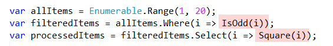

The problem is simple.

We have a list of numbers. From that list we want to get only the even numbers, and then square those.

*This example is contrived to make it simpler to explain.*

```csharp
var returnItems = Enumerable.Range(1, 20).Where(i => i % 2 != 0).Select(i => i * 2);
```

This code works, but it is difficult to understand what is happening in a single pass. You will have to spend some time mentally unraveling the pipeline to see the flow of the operations.

So we can split this like so:

```csharp
var allItems = Enumerable.Range(1, 20);
var filteredItems = allItems.Where(i => i % 2 != 0);
var processedItems = filteredItems.Select(i => i * 2);
```

This is better - the one line is split into three so the flow can be logically understood; plus it is easier to debug.

The next improvement that can be made is to simplify this:


You have to parse the code visually to understand what exactly it is doing. This is a bottleneck to the understanding and maintainability of the code.

We want to optimize for **understanding** of the code.

This can be done by refactoring the logic into functions:

```csharp
bool IsOdd(int value)
{
    return value % 2 != 0;
}
int Square(int value)
{
    return value * 2;
}
```

The code can then be written this:

```csharp
var allItems = Enumerable.Range(1, 20);
var filteredItems = allItems.Where(i => IsOdd(i));
var processedItems = filteredItems.Select(i => Square(i));
```

Much easier to visually understand.



And as a benefit you can now test `IsOdd` and `Square` independently, now that they have been abstracted away from the code.

The code now is much easier to understand, but still not testable.

For this we will need to refactor the code to create a class purely responsible for processing. This class will take a collection of numbers as input, process them, and return a new collection.

```csharp
public class ItemProessor
{
    private IEnumerable<int> _input;
    /// <summary>Constructor</summary>
    public ItemProessor(IEnumerable<int> input)
    {
        _input = input;
    }
    public IEnumerable<int> Process()
    {
        // Filter the items
        var filteredItems = _input.Where(i => IsOdd(i));
        // Square the items
        var processedItems = filteredItems.Select(i => Square(i));
        // return
        return processedItems;
    }
}
```

Our updated program is now this:

```csharp
// Create the list
var items = Enumerable.Range(1, 20);
// Create a processor
var processor = new ItemProessor(items);
// Call the logic
var result = processor.Process();
// Print the results
Console.WriteLine(result);
```


