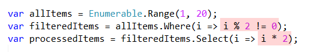
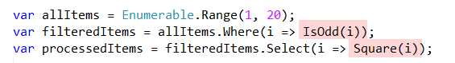

The problem is simple.

We have a list of numbers. From that list we want to get only the even numbers, and then square those.

*This example is contrived to make it simpler to explain.*

```csharp
var returnItems = Enumerable.Range(1, 20).Where(i => i % 2 != 0).Select(i => i * 2);
```

This code works, but it is difficult to understand what is happening in a single pass. You will have to spend some time mentally unraveling the pipeline to see the flow of the operations.

So we can split this like so:

```csharp
// Get a collection of 20 numbers, from 1 incrementing
var allItems = Enumerable.Range(1, 20);
// Filter where the numbers are not divisible by 2
var filteredItems = allItems.Where(i => i % 2 != 0);
// Double each of the nu,bers
var processedItems = filteredItems.Select(i => i * 2);
```

This is better - the one line is split into three so the flow can be logically understood; plus it is easier to debug.

However you need to rely on the comments to skim through what is happening. If there weren't any comments you would need to take some time to parse and understand the code.

The next improvement that can be made is to simplify the highligted sections:



The problem still remains - have to parse the code visually to understand what exactly it is doing. This is a bottleneck to the understanding and maintainability of the code.

We want to optimize for **understanding** of the code.

This can be done by refactoring the logic into functions:

```csharp
bool IsOdd(int value)
{
    return value % 2 != 0;
}
int Square(int value)
{
    return value * 2;
}
```

The code can then be written thus:

```csharp
var allItems = Enumerable.Range(1, 20);
var filteredItems = allItems.Where(i => IsOdd(i));
var processedItems = filteredItems.Select(i => Square(i));
```

Much easier to visually understand.



And as a benefit you can now test `IsOdd` and `Square` independently, now that they have been abstracted away from the code.

You can even use this logic elsewhere in your program, or in other projects.

The code now is much easier to understand, but still not fully testable.

For this we will need to refactor the code to create a class purely responsible for processing. This class will take a collection of numbers as input, process them, and return a new collection.

```csharp
public class ItemProessor
{
    private IEnumerable<int> _input;
    /// <summary>Constructor</summary>
    public ItemProessor(IEnumerable<int> input)
    {
        _input = input;
    }
    
    public IEnumerable<int> Process()
    {
        // Filter the items
        var filteredItems = _input.Where(i => IsOdd(i));
        // Square the items
        var processedItems = filteredItems.Select(i => Square(i));
        // return
        return processedItems;
    }
}
```

Our updated program is now this:

```csharp
// Create the list
var items = Enumerable.Range(1, 20);
// Create a processor
var processor = new ItemProessor(items);
// Call the logic
var result = processor.Process();
// Print the results
Console.WriteLine(result);
```

We have now introduced a class responsible for processing the numbers, a class that we can independently test, and independently improve.

Our program is also more flexible because we can introduced other classes to perform different processing.

We can enforce this by the use of contracts, or *interfaces*

The contract will look like this:

```csharp
interface IProcess
{
    public IEnumerable<int> Process();
}
```

And then we can refactor our class to give it a better, clearer name; and indicate it obeys our contract.

```csharp
public class OddItemProcessor : IProcess
{
    private IEnumerable<int> _input;
    public OddItemProcessor(IEnumerable<int> input)
    {
    	_input = input;
    }
    
    public IEnumerable<int> Process()
    {
    	// Filter the items
    	var filteredItems = _input.Where(i => IsOdd(i));
    	// Square the items
    	var processedItems = filteredItems.Select(i => Square(i));
    	// return
    	return processedItems;
    }
    bool IsOdd(int value)
    {
    	return value % 2 != 0;
    }
    int Square(int value)
    {
    	return value * 2;
    }
}
```

Our program now looks like this;

```csharp
// Create the list
var items = Enumerable.Range(1, 20);
// Create a processor
var oddProcessor = new OddItemProcessor(items);
// Call the logic
var oddResult = oddProcessor.Process();
// Print the results
Console.WriteLine(oddResult);
```

Should we need to add a different processor, say an `EvenItemProcessor`, that would look like this:

```csharp
public class EvenItemProcessor : IProcess
{
    private IEnumerable<int> _input;
    public EvenItemProcessor(IEnumerable<int> input)
    {
    	_input = input;
    }
    
    public IEnumerable<int> Process()
    {
    	// Filter the items
    	var filteredItems = _input.Where(i => IsEven(i));
    	// Square the items
    	var processedItems = filteredItems.Select(i => Square(i));
    	// return
    	return processedItems;
    }
    bool IsOdd(int value)
    {
    	return value % 2 != 0;
    }
    bool IsEven(int value)
    {
    	return !IsOdd(value);
    }
    int Square(int value)
    {
    	return value * 2;
    }
}
```

The final program looks like this:

```csharp
// Create the list
var items = Enumerable.Range(1, 20);
// Create a processor
var oddProcessor = new OddItemProcessor(items);
// Call the logic
var oddResult = oddProcessor.Process();
// Print the results
Console.WriteLine(oddResult);

var evenProcessor = new EvenItemProcessor(items);
// Call the logic
var evenResult = evenProcessor.Process();
// Print the results
Console.WriteLine(evenResult);
```

Now, it is possible to contiue refactoring still further - you can notice that the only difference between the `OddItemProcessor` and the `EvenItemProcessor` is the function that is used to filter the numbers.

You can therefore refactor to a single `Processor` class, and inject the function you want to use to filter.

But here is the thing about maintability - that too has costs. There may be immedaite benefits, but there is also more code that you are writing, which means more code to debug and more code to test.

True, the cost is usually paid up front, but I want to point out that you need to use your judgement to know when to stop - **it is possible to go overboard** if you are not careful.

You could find yourself creating super generic classes that have all functionality injected, and at this point you may have lost sight of the initial problem you were trying to solve.

Happy hacking!