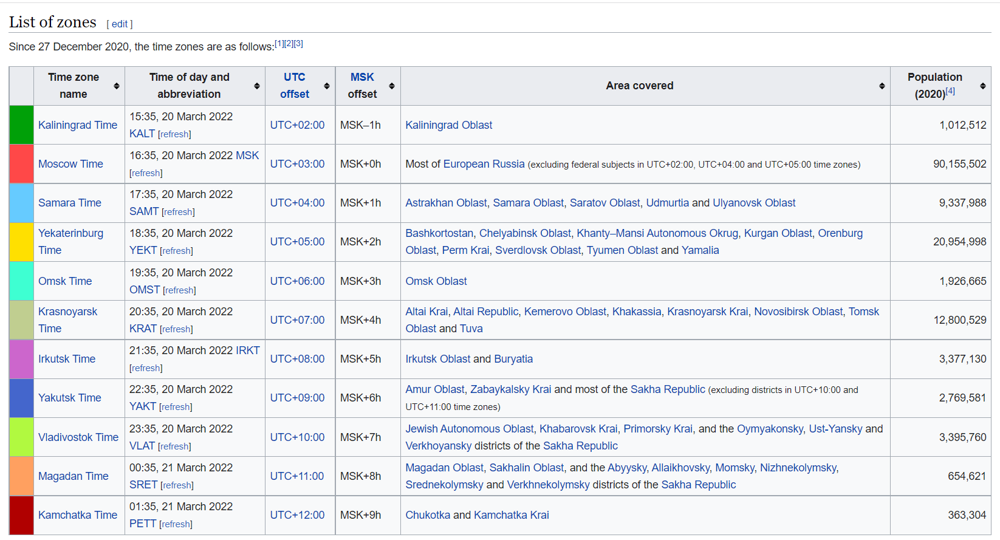
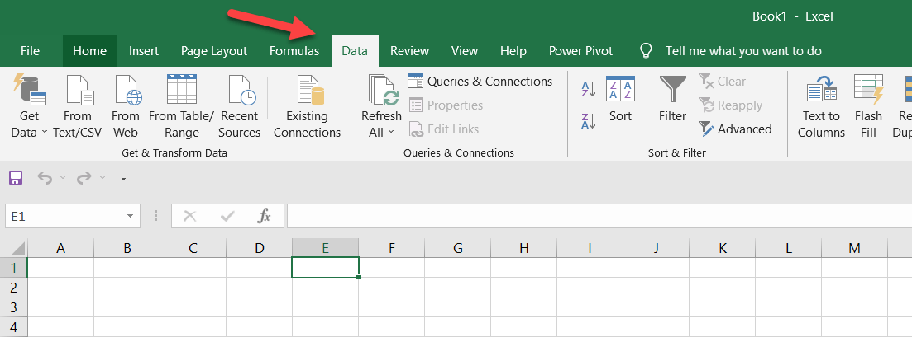
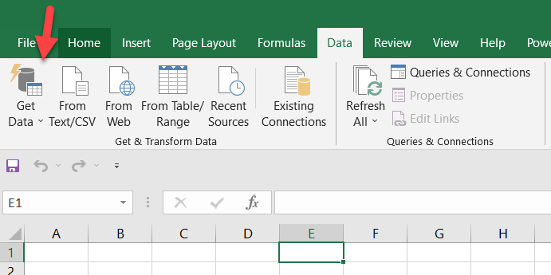
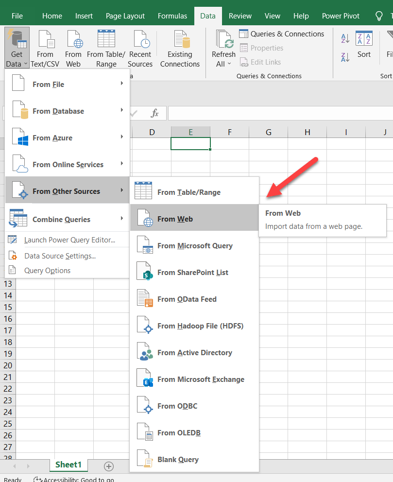
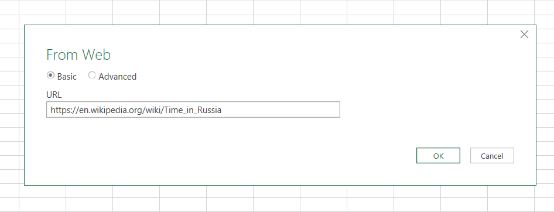
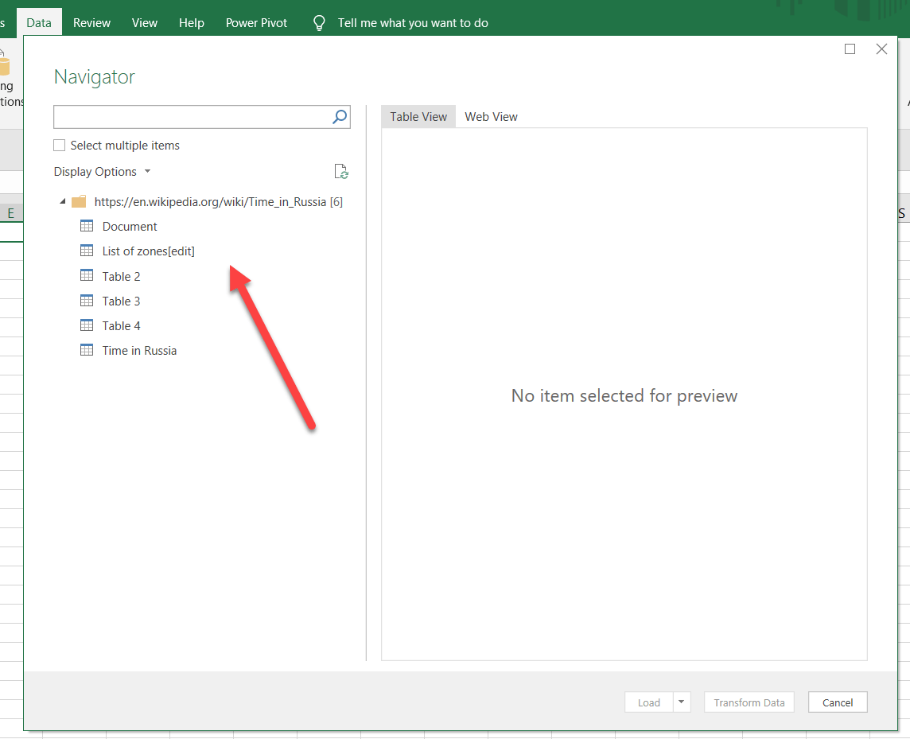
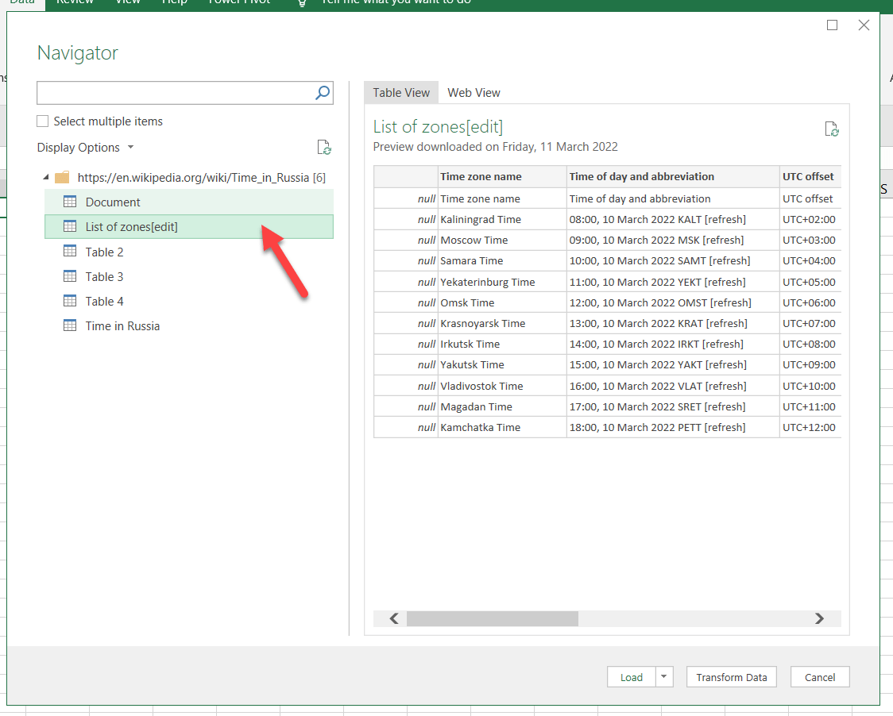
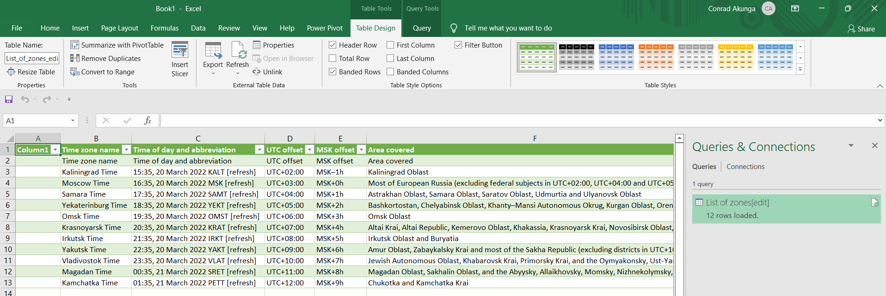
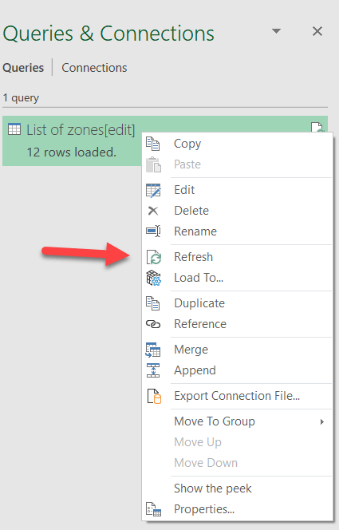

[Microsoft Excel](https://www.microsoft.com/en-us/microsoft-365/excel) is like that old, dependable, reliable friend that always has a solution to your problems.

But like all friends, you occasionally stumble onto very welcome and pleasant surprises.

For example, I have previously talked about how you can [fetch JSON data over a REST API]().

I recently needed to get into Excel a table of data - and this case was time zones in Russia.

[Wikipiedia](https://www.wikipedia.org/), as usual, came to the rescue and that data is available [here](https://en.wikipedia.org/wiki/Time_in_Russia) as a table.

Most people would typically copy the table and paste it into Excel.

Here's an even better way.

Go to the **Data** tab

Hit the **Get Data** button

Select the **From Web** in the **From Other Sources** menu

From the prompt you get, paste (or type in) the URL to the page that has the table.

You should get a prompt like this that lists all the things Excel think are potential data sources in the URL.

You can click on each to preview the sources so that you can identify your preferred one.

Once satisfied, click **Load**.

Your workbook will have a new Worksheet appropriately named.

There are a couple of benefits to doing it this way:
1. Copying and pasting data from web pages is a black art and it is usually hit or miss
2. You get a beautifully formatted [table](https://support.microsoft.com/en-us/office/overview-of-excel-tables-7ab0bb7d-3a9e-4b56-a3c9-6c94334e492c#:~:text=To%20quickly%20create%20a%20table,row%2C%20and%20then%20click%20OK.) quickly and for free.
3. Excel maintains a link to the web page, and you can update your worksheet if the Wikipedia page is updated by right clicking the data source and clicking the **Refresh** menu item.

    

    If there is any changed data, your worksheet will update.
4. This way is much tidier