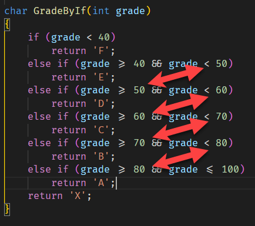
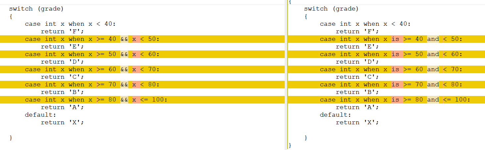
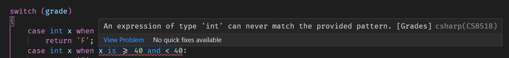

Everyone who remembers their path towards becoming a programmer, either as a hobbyist or a career software engineer, will remember the problem of writing this program - given a mark, allocates a grade according to a table like this:

| Marks | Grade |
|:-------:|:-------:|
| < 40   | F     |
| 40 - 49   | E     |
| 50 - 59   | D     |
| 60 - 69   | C     |
| 70 - 79   | B     |
| 80 - 100   | A     |
| Other  | X     |

Your first attempt will probably look like this:

```csharp
char GradeByIf(int grade)
{
    if (grade < 40)
        return 'F';
    else if (grade >= 40 && grade < 50)
        return 'E';
    else if (grade >= 50 && grade < 60)
        return 'D';
    else if (grade >= 60 && grade < 70)
        return 'C';
    else if (grade >= 70 && grade < 80)
        return 'B';
    else if (grade >= 80 && grade <= 100)
        return 'A';
    return 'X';
}
```

If you look at this closer you realize there is some repetition going on here:



So the code can be simplified even further, if we remove the redundancy **AND** change the order of the conditions.

```csharp
char GradeByIfV2(int grade)
{
    if (grade > 100)
        return 'X';
    else if (grade >= 80)
        return 'A';
    else if (grade >= 70)
        return 'B';
    else if (grade >= 60)
        return 'C';
    else if (grade >= 50)
        return 'D';
    else if (grade >= 40)
        return 'E';
    else
        return 'F';
}
```

You can also use `switch` statements to achieve this goal. Like so:

```csharp
char GradeBySwitchV1(int grade)
{
    switch (grade)
    {
        case int x when x < 40:
            return 'F';
        case int x when x >= 40 && x < 50:
            return 'E';
        case int x when x >= 50 && x < 60:
            return 'D';
        case int x when x >= 60 && x < 70:
            return 'C';
        case int x when x >= 70 && x < 80:
            return 'B';
        case int x when x >= 80 && x <= 100:
            return 'A';
        default:
            return 'X';

    }
}
```

This can be simplified even further with a slight modification:

```csharp
char GradeBySwitchV2(int grade)
{
    switch (grade)
    {
        case int x when x < 40:
            return 'F';
        case int x when x is >= 40 and < 50:
            return 'E';
        case int x when x is >= 50 and < 60:
            return 'D';
        case int x when x is >= 60 and < 70:
            return 'C';
        case int x when x is >= 70 and < 80:
            return 'B';
        case int x when x is >= 80 and <= 100:
            return 'A';
        default:
            return 'X';

    }
}
```

Now these look almost identical:



The `is` and `and` are not just syntactic sugar - they can also help the compiler find errors in your code.

So if in the IDE I introduce the following bug:

```csharp
case int x when x is >= 40 and < 40:
    return 'E';
```

Note how the compiler notifies you after it attempts to evaluate your conditions:



The compiler does not attempt to validate the previous version of the function.

C# 8 introduced [switch expressions](https://docs.microsoft.com/en-us/dotnet/csharp/language-reference/operators/switch-expression) to simplify code like this still further:

```csharp
char GradeBySwitchV3(int grade) =>
     grade switch
     {
         int x when x < 40 => 'F',
         int x when x is >= 40 and < 50 => 'E',
         int x when x is >= 50 and < 60 => 'D',
         int x when x is >= 60 and < 70 => 'C',
         int x when x is >= 70 and < 80 => 'B',
         int x when x is >= 80 and <= 100 => 'A',
         _ => 'X'
     };
```

As from the if example above, this can be simplified further:

```csharp
char GradeBySwitchV4(int grade) =>
    grade switch
    {
        int x when x > 100 => 'X',
        int x when x is >= 80 => 'A',
        int x when x is >= 70 => 'B',
        int x when x is >= 60 => 'C',
        int x when x is >= 50 => 'D',
        int x when x is >= 40 => 'E',
        _ => 'F'
    };
```

It is still possible to simplify this code further, believe it or not! This is done by removing the variable declarations. This feature is available from C# 9 going forwards.

```csharp
char GradeBySwitchV5(int grade) =>
     grade switch
     {
         < 40 => 'F',
         >= 40 and < 50 => 'E',
         >= 50 and < 60 => 'D',
         >= 60 and < 70 => 'C',
         >= 70 and < 80 => 'B',
         >= 80 and <= 100 => 'A',
         _ => 'X'
     };
```

And finally we can still simplify this to remove the redundancy to get our final version:

```csharp
char GradeBySwitchV6(int grade) =>
    grade switch
    {
        > 100 => 'X',
        >= 80 => 'A',
        >= 70 => 'B',
        >= 60 => 'C',
        >= 50 => 'D',
        >= 40 => 'E',
        _ => 'F'
    };
```

If you are wondering at this terse, almost cryptic syntax - this is borrowed heavily from functional programming paradigm.

The equivalent program in F# would look like this:

```fsharp
let grade(x) = match x with
    | x when x > 100 -> 'X'
    | x when x >= 80 -> 'A'
    | x when x >= 80 ->'B'
    | x when x >= 80 ->'C'
    | x when x >= 80 ->'D'
    | x when x >= 80 ->'E'
    | x when x >= 80 ->'F'
    | _-> 'X'
```

The code is in my [Github](https://github.com/conradakunga/BlogCode/tree/master/2022-03-29%20-%20Clearer%20Code%20With%20Swtich%20Expressions%20In%20C%23).

Happy hacking!