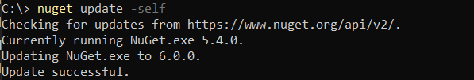
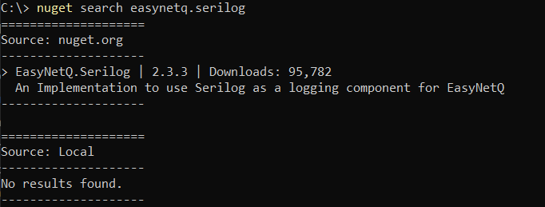

Did you know that the Nuget client (`nuget.exe`) is capable of updating itself?

Run the following command in an **administrative** PowerShell (or Command) prompt:

```powershell
nuget update -self
```

You should see the following:



Here you can see my Nuget was updated from version 5.4.0 to 6.0.0.

One of the benefits of the latest clients (from 5.8 onward) is that you can finally [search](https://docs.microsoft.com/en-us/nuget/reference/cli-reference/cli-ref-search)

```powershell
nuget search easynetq.serilog
```


Happy hacking!

