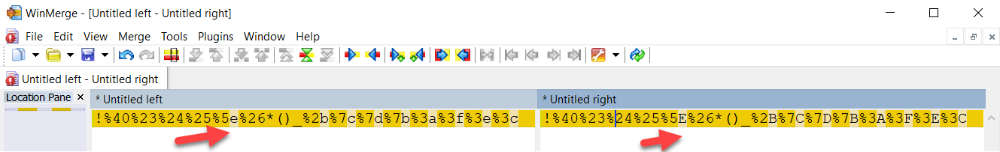
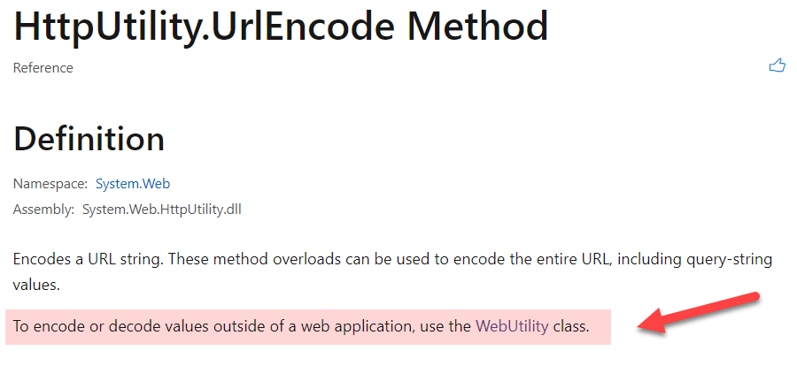
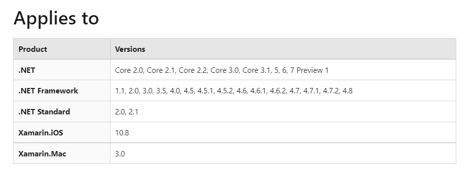
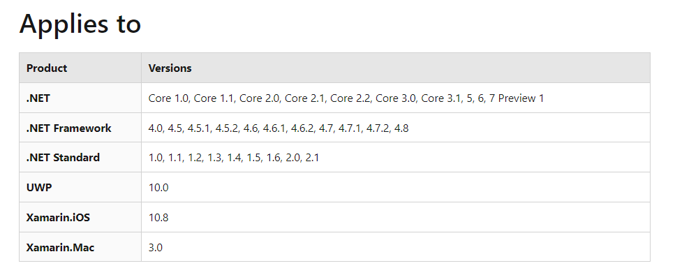

In this world of websites and APIs you will invariably be called upon to build URLs, either manually or through code.

For example, a google search typically looks like this:

`https://www.google.com/search?q=wildife`

The interesting stuff is after the `q=`

(There's some other stuff but I have trimmed that for simplicity.)

If you were to build a query programatically and then search, you would likely do it like so:

```csharp
var client = new HttpClient();
var response = await client.GetStringAsync("https://www.google.com/search?q=wildife");
Console.WriteLine(response);
```

This will print the results to the console.

The challenge comes when you want to search something like `ng'ang'a`

The apostrophe ``'`` is not in fact a valid character for a URL.

You will need to convert it to the appropriate encoding for a URL, which happens to be the string `%27`.

So the URL should be like so:

`https://www.google.com/search?q=ng%27an%27a`

The question becomes how do we know that ``'`` is %27 and a space is %20?

We don't need to.

There is a class that helps with this - the [HttpUtility](https://docs.microsoft.com/en-us/dotnet/api/system.web.httputility.urlencode?view=net-6.0) class.

Within this class is a [UrlEnocode](https://docs.microsoft.com/en-us/dotnet/api/system.web.httputility.urlencode?view=net-6.0#system-web-httputility-urlencode(system-string-system-text-encoding)) method.

So your code becomes this:

```csharp
var query = "ng'ang'a";
var encodedQuery = HttpUtility.UrlEncode(query);
Log.Information("{query} has been encoded to  {result}", query, encodedQuery);
var client = new HttpClient();
var response = await client.GetStringAsync($"https://www.google.com/search?q={encodedQuery}");
Console.WriteLine(response);
```

If you run this code, just before the results you should see a line like this:

```plaintext
[17:15:53 INF] ng'ang'a has been encoded to  ng%27ang%27a
```

To move the other way from encoded text to the actual text, there is a reverse method - [HttpUtility.UrlDecode](https://docs.microsoft.com/en-us/dotnet/api/system.web.httputility.urldecode?view=net-6.0).

So I have been using this class for years until the other day during a design session when this very problem came up and a team member responded saying "Use the [WebUtility](https://docs.microsoft.com/en-us/dotnet/api/system.net.webutility?view=net-6.0) class."

This class was not familiar to me, so off to the documentation I went.

On the surface it appears identical to `HttpUtility`. It even has [UrlEncode](https://docs.microsoft.com/en-us/dotnet/api/system.net.webutility.urlencode?view=net-6.0#system-net-webutility-urlencode(system-string)) and [UrlDecode](https://docs.microsoft.com/en-us/dotnet/api/system.net.webutility.urldecode?view=net-6.0#system-net-webutility-urldecode(system-string)) methods that function the same.

Or do they?

Let us use a more robust query:

```csharp
var query = "!@#$%^&*()_+|}{:?><";
var httpEncoded = HttpUtility.UrlEncode(query);
var webEncoded = WebUtility.UrlEncode(query);

Console.WriteLine(httpEncoded);
Console.Write(webEncoded);
```

If we run this we get the following result:

```plaintext
!%40%23%24%25%5e%26*()_%2b%7c%7d%7b%3a%3f%3e%3c
!%40%23%24%25%5E%26*()_%2B%7C%7D%7B%3A%3F%3E%3C
```

These look the same. **BUT THEY AREN'T**.

We need to do do a diff to see:

Using [Winmerge](https://winmerge.org/?lang=en) for both results I get the following:




The `values` may be the same, but the `cases` are not. `WebUtility` appears to **uppercase** the encoded values whereas `HttpUtility` appears to **lowercase** them.

**Both will decode to the same value**, so there is no concern about that. 

However if you have any unit tests and for whatever reason you are using both classes in your code, you might find the tests failing due to differences in the encoded values.

Which begs the question of why are there two classes essentially doing the same thing at all?

`HttpUtility` is in the `System.Web` namespace, which you will have to include from  `System.Web.HttpUtility.dll`. This comes for free if you are building a web or an API application. If you are building a console, class library or desktop application, you will need to explicitly add it to you project references.

`WebUtility` is in the `System.Net` namespace, which is in `System.Runtime.dll` so you don't need to include any additional DLLs into your project regardless of type.

In fact the documentation for `HttpUtility` explicitly informs you of the same:



Ok, so why wasn't `HttpUtility` dropped and all applications use `WebUtility`?

I would imagine the issue here would be backward compatibility.

`HttpUtility` has been part of the .NET Framework from version 1 - the very beginning.



`WebUtility` is a younger member of the family.



Happy hacking!