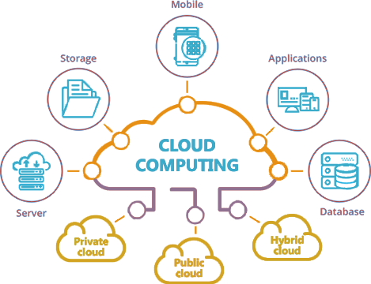

[Amazon AWS](https://aws.amazon.com/) announced the other day that they were setting up an AWS zone in Nairobi.

This is HUGE news for the ICT industry, and I for one cannot wait to see just how much Amazon will change the game.

[Microsoft](https://www.microsoft.com/en-us/) and [Google](https://about.google/?utm_source=google-KE&utm_medium=referral&utm_campaign=hp-footer&fg=1), who set up in Nairobi eons ago seem to have rested on their laurels, became complacent and I fully expect Amazon to **EAT THEIR LUNCH** in several ways.

I expect Amazon to constitute a local office and set a team on the ground to take advantage of the following:

# Local Traffic

By virtue of setting up in Kenya, I would expect Amazon to peer with other providers of connectivity in Kenya, resulting in **cheap, fast bandwidth**.

This means that for all intents and purposes applications deployed in the Kenya AWS zone will be **local traffic**.

1. Convince a multitude of industries with legacy, new and hybrid systems to take up the very low hanging fruit of doing **backups** to Amazon. They can literally knock on every door of a corporate and close backup solutions almost immediately.
2. Convince a multitude of industries, again with legacy  new and hybrid systems to take up AWS for **redundancy & high availability**. Again this is a low hanging fruit - you can't argue with having your current environment virtualized (legacy) or deployed redundantly (either as containers or as PAAS (platform as a service) or SAAS (software as a service)).
3. Provide the capacity for a whole range of applications that are multimedia rich (video & audio). Anyone doing any sort of solutions that depend on **media** (streaming video, CCTV backup, content delivery) can do so cheaply and flexibly. The [Kenya Broadcasting Corporation](https://www.kbc.co.ke/) (KBC) for instance can finally put all their decades of television and radio programming going back all the way to the 60s online cheaply!

# Data Sovereignty

There are a lot of truths, half truths, whole lies around data sovereignty laws. I personally think these laws make **no sense**.

There is no reason to insist a bank or other such institution keeps its customer data locally but then not say a word when the same bank uses globally hosted Google / Office 365 for email.

Those same email inboxes in servers spread **all over the world** are full of attachments ranging from statements to scans of IDs, passports, PIN numbers, application forms, birth certificates, etc.

Folders are synchronized globally using [OneDrive](https://www.microsoft.com/en-us/microsoft-365/onedrive/online-cloud-storage), [Google Drive](https://www.google.com/drive/), [DropBox](https://www.dropbox.com/), [Box](https://www.box.com/) and other such tools. I'm pretty sure all these folders contain all manner of personally identifiable customer data.

Amazon can avoid this "problem" by telling customers "all your data is stored locally in Kenya".

# Developer Experience

[Amazon](https://www.amazon.com/) has some 226 products in their [AWS offering](https://aws.amazon.com/products/?aws-products-all.sort-by=item.additionalFields.productNameLowercase&aws-products-all.sort-order=asc&awsf.re%3AInvent=*all&awsf.Free%20Tier%20Type=*all&awsf.tech-category=*all), most if not all, will now be available to developers in Kenya to build and support solutions hosted locally.

This opens a number of opportunities to local ICT firms such as building all sorts of solutions in the private and public sector - for national and county governments.

# Distributed Workloads

By virtue of being connected to local infrastructure another opportunity beckons - provisioning capacity to run workloads locally.

Think of scenarios that temporarily require capacity in brief spurts:
- Registration deadlines such as tax returns, school admissions
- Periodic but intense processing such as bank end of day processes
- Systems that are heavily used for brief periods such as querying KCPE and KCSE examination results, or elections tallying.

The ability to quickly and cheaply provision local capacity is compelling.

# Virtualized Infrastructure

By virtue of offering [IAAS](https://en.wikipedia.org/wiki/Infrastructure_as_a_service) (infrastructure as a service) and [PAAS](https://en.wikipedia.org/wiki/Platform_as_a_service) (platform as a service) locally firms can now create completely virtual infrastructure to supplement, complement of even outright replace legacy infrastructure.

It is entirely possible to have a virtualized server network completely in the cloud without owning a single actual server. The same with clients - you can virtualize and standardize workstations and just use tablets or low powered laptops to access these powerful virtualized workstations.

As traffic is cheap and fast, a whole range of possibilities become available, including private and hybrid clouds.

# Improved Content Delivery

Given that a lot of content providers and other organizations currently use AWS such as Amazon Prime, Netflix etc, it stands to reason these would be even more efficient for customers in Kenya with a local AWS presence.

This benefits extends to even simple solutions like hosted websites and web applications - these ought to get even cheaper.

So there is lots of opportunity for local software development firms, integrators and cloud solution providers.

Happy hacking!