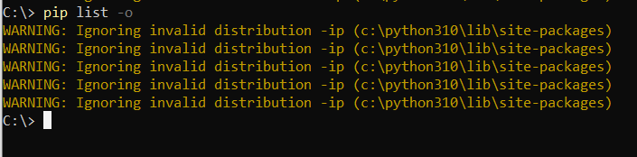
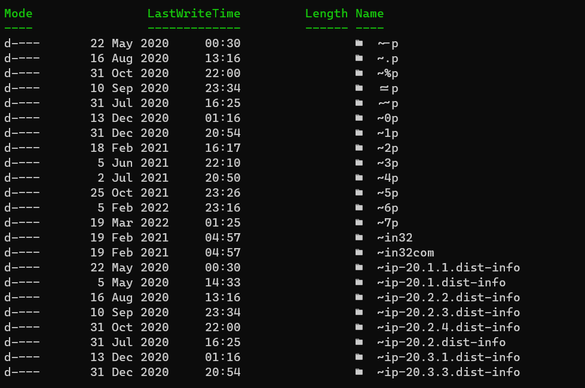

When doing `pip update` or `pip list` you might get the following warning:

```plaintext
WARNING: ignoring invalid distribution -ip
```



The problem is in the folder where the packages are stored, in my case `C:\python310\lib\site-packages`

If I list the contents of that folder I get this printout:



Those are the problematic packages - those folders prefixed by `~`.

You can list them using this [PowerShell](https://docs.microsoft.com/en-us/powershell/scripting/overview?view=powershell-7.2) command:

```powershell
ls ~*
```

The fix for this is simple. Delete them.

The following `PowerShell` command recursively deletes all folders starting with `~`

```powershell
rm -r ~*
```

You can then verify that the warning is gone:


Happy hacking!