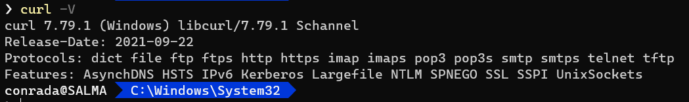
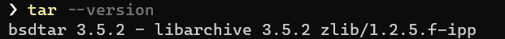
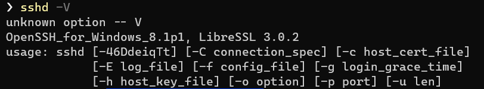

If you are running a recent build of Windows 10 (or 11) you would be surprised to learn a number of tools traditionally found in Linux are now bundled with Windows.

#### Curl

[Curl](https://curl.se/) is a popular command line tool for making requests over the internet.

You can find it using this command:

```powershell
where.exe curl
```

The exe is important there if you are running in [PowerShell](https://docs.microsoft.com/en-us/powershell/scripting/overview?view=powershell-7.2) because if you omit it it is an alias for [where-object](https://docs.microsoft.com/en-us/powershell/module/microsoft.powershell.core/where-object?view=powershell-7.2).

This should print the following:


You can check the version like so:

```powershell
curl -v
```

This should print the following:



#### Tar

[Tar](https://www.freebsd.org/cgi/man.cgi?tar(1)) is a utility for creating and managing archives, usually in the formats of zip, tar, gzip and bzip2.

You can find it using this command:

```powershell
where.exe tar
```

This should print the following:


You can check the version like so:

```powershell
tar --version
```

This should print the following:



#### SSH Client

[SSH](https://www.techtarget.com/searchsecurity/definition/Secure-Shell) is a protocol that allows secure connections to other machines.

Windows now has a bundled `ssh` client

```powershell
where.exe ssh
```


```powershell
ssh -V
```


#### SSH Server

There is also a SSH server bundled in Windows.

```powershell
where.exe sshd
```


```powershell
sshd -V
```




Happy hacking!