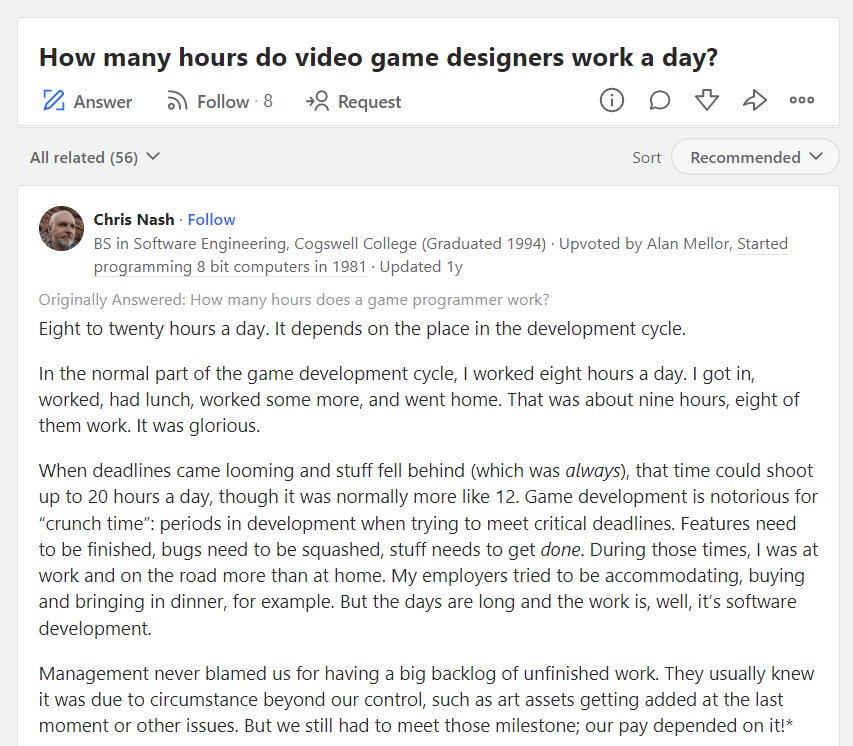

Three of the things you will quickly discover that you need in this business are the following:
1. A tough skin
2. Patience
3. An ability to accept an ambiguous state as a valid reality

Let me explain.

You have a product, **CoolThing** Version 1.

**CoolThing** is a runaway success, and you have deployed it to 4 paying enterprise customers.

All is right with the world.

And then this morning you had a call with Customer A, who wanted a feature added to the software. A preliminary analysis yielded an estimate of 10 days. (This includes development testing, documentation, etc.)

As if by telepathy, Customer B as well wants a feature added to the software. By coincidence this too yields an estimate of 10 days.

In a freak occurrence, Customers C and D also want two different features added to their software. These also turn out to be 10 days of work.

Assume that the features are legitimate, make sense, and you are willing to do the work. Assume also that the customers are willing to pay.

What could go wrong?

The first problem is the customers are each going to ask you when you are going to deliver the work. At face value this is pretty simple - after all it is 10 days of work and you have told them as much.

This is what Customer A expects to see in the project plan:

This is what Customer B expects:

This is what Customer C expects:

And finally this is what Customer D expects:

If you look closely each customer expects the work to take 10 days, as you estimated, and thus the final release is expected on 1 July.

But this is in fact the reality of the state of affairs:

To fulfill the expectations of your customers, you will require 40 working days, and the last delivery date  will be on 12th August.

You may think to yourself that each customer's work is clearly demarcated and you can simply release 4 different releases rather than one ginormous release with all the work.

This is where your first dose or reality starts.
  
Each customer will expect to be in the first slot that has a release date on 1 July. The customer that receives the release on 22 August will be the most furious.

> Why not order the work by priority?

Each customer will then promptly tell you that their work is urgent and they are expecting it done as soon as humanly possible.

> How about you add more resources to do the work?

Obvious as this may seem, this is not pragmatic. You have no reason to believe that the original estimates were arrived at by skimping on resource allocation. You also have no reason to believe that the company has anything to gain by under-resourcing the development.

Besides, estimating is hard (discussion for another day)

> You could hire more

Hiring more is not something you do at a whim. To keep things simple assume to hit the original timelines you need to quadruple the team doing the work. So that is 4 developers, 4 quality assurance engineers and 4 project managers.

You have just raised your payroll by 12 people, and as you know payroll must be ran monthly.

Going back to reality, even if you were able to hire 12 people immediately, it is not possible to have them immediately productive. They will need time to acclimatize to the organization, learn the tools, learn the problem domain, get familiar with colleagues, etc.

> Outsource the development

You might be tempted to go around the need to hire by contracting or outsourcing the development.

You have now solved one problem and introduced a number of others:
1. You have to get the people working on the problem to be familiar with the problem domain
2. You will also need to get them familiar with your code base
3. You still further also need to get them up to speed with your coding standards, development methodology, etc
4. You will then need the bandwidth to manage these contracted resources and integrate them into the projects and quality assurance processes

> Go agile!

No development methodology can work around the problem that it takes 9 months from conception to delivery of a human baby. It does not matter how many women you add to the enterprise, or what innovative maternity wear she wears. 

9 months.

Most of the time the work to be done is fairly well defined and any sort of iterative exploratory & discovery work is usually unnecessary.

Besides, it's 10 days - almost the length of a single sprint and retrospective.

> Compress timelines

It is tempting to compress timelines by having people work overtime, over weekends etc, as seems to have become the norm in the gaming industry.

This is a terrible idea for obvious reasons - on top of starting to create an unhealthy work environment, your team will burn out very quickly indeed.

> Pad your estimates

You're thinking here that originally we should not have given the 10 days estimates but instead have padded it to 30 or 40 days, confident with the knowledge that your team can do the work in 10, right?

Almost certainly there will be some IT manager or in-house developer on the other side who believes, fondly or otherwise, they can estimate development effort.

They can accept 10 days, or even 15 but 30 or 40 will raise questions such as:
1. Are you and your team competent to do the work?
2. Is the project sufficiently staffed to do the work?
3. Are you disregarding or otherwise failing to take their needs seriously?

The reality is **there isn't a way to square this circle** in a way that does not leave at least two customers, maybe even three:
1. Extremely unhappy
2. Questioning your competence
3. Questioning your resource levels
4. Questioning your loyalty

And that is just for one set of requests. Due to changes in the business environment, changes in the regulatory environment, changes in technology and changes internally - software is continuously in a fluid state. It is never truly done. **Even if it looks that way to customers**.

An example I usually give is [Microsoft Excel](https://www.microsoft.com/en-us/microsoft-365/excel). With every release everyone is sure that it is now finally complete and there is nothing else to add. Until Microsoft makes the next release and [they have found some way to add features, and make existing ones better]().

There are no pretty solutions around this challenge, that gets trickier the more clients you have. Granted, more clients implies more revenue and therefore a bigger team, but the challenge remains.

What you eventually will end up having to do is to pick the order of the work to be done, and therefore which client to disappoint in terms of delivery time. They will (understandably) not be happy, and let you know in no uncertain term, including threatening to churn.

There are ways to mitigate this, but that is a discussion for another day.

Happy hacking!