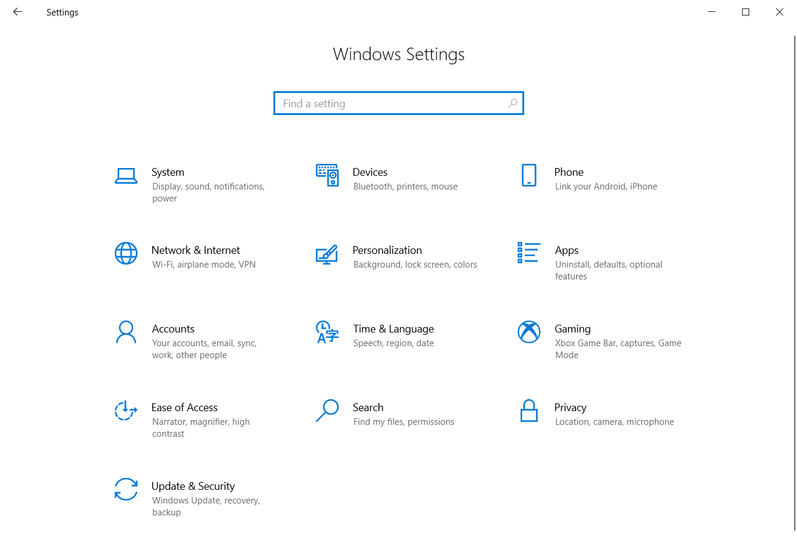
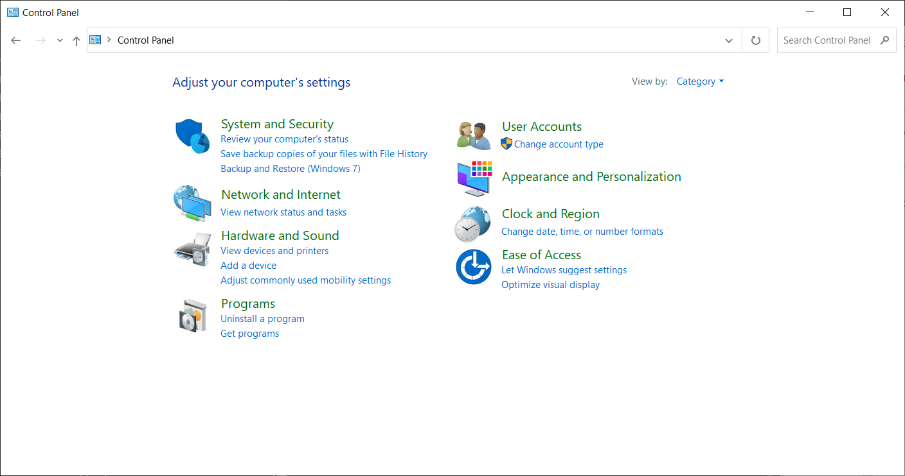
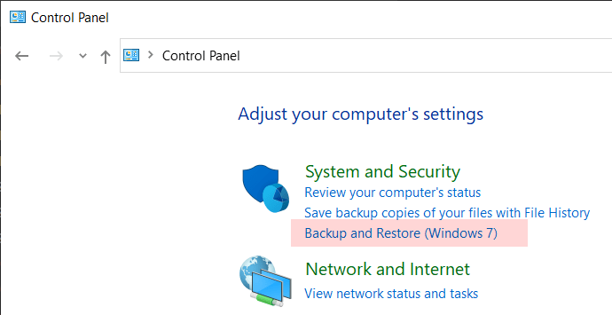
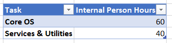
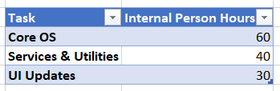

Quick - would you like to be punched in the face or punched in the stomach?

If, like most people, you are reasonable, you would not in fact like to be punched at all.

But what if you had to choose one?

This is a common choice when writing commercial software.

Take a well known example of Windows.

Windows has two distinct places to change settings on your device:

This one:

and this one:

It does not take a rocket scientist to figure out which came first.

Here's a hint:

Also, the first one clearly is more harmonized with the look and feel of the rest of Windows 10 & 11.

The question arises - why are they both there?

*Disclaimer - I do not work for Microsoft nor do I know anyone working on the Windows team - my thoughts are purely conjecture.*

I can bet a discussion along these lines took place with senior individuals in the Windows Team, whose identity and job titles are not relevant. Suffice it to say they are senior:

**Person 1:** So, with the new version of Windows, as you are aware, we are modernizing the look and feel using our new [design principles](https://docs.microsoft.com/en-us/windows/apps/design/signature-experiences/design-principles), which I think we can agree ought to make the OS look a lot more modern and, I think, easier to use.

**Person 2:** That's right. This is good stuff.

**Person 1:** This means we need to re-write any of the existing widgets and update many of the applications to this design.

**Person 2:** Hmmm. That presents a problem.

**Person 1:** What problem?

**Person 2:** Well, Windows 11 has plenty of engineering work in terms of new features to build and improvements to make in the core operating system and supporting services and utilities.

**Person 1:** I get that

**Person 2:** Now rewriting many of the existing widgets is not something we have the capacity for at this time - we had quite definitively planned our engineering timetable for this release.

**Person 1:** Capacity?

**Person 2:** Yes. We need more engineers, more time and more money. Here is our current resource allocation:

What you are proposing here would look like this:

You notice we have to allocate resources for the UI updates.

**Person 1:** Hmm. Good point.

**Person 2:** Also, the original estimates of delivery of the operating system - do you expect to honour those?

**Person 1:** Of course!

**Person 2:** That may not be practical given we have extra work to do on the UI updates.

**Person 1:** Extending the launch date is not good for us because given we have announced a new operating system is coming, sales of the old one have already started to slow down. Also, our partners software companies and software developers will be annoyed at the delay as their sales too will be compromised.

**Person 2:** Something has to give I am afraid.  

1. We add engineering, quality assurance and project management resources to try and move things faster, but as you know adding people does not necessarily speed up things at the same rate. This will require the business to find additional budget to fund this.
2. We keep the existing resources on the team but we task them with this additional work. This will require a timeline extension.
3. We keep the existing resources but we defer / remove some of the work items so that we keep the original timelines.

**Person 1:** Wow. Quite the predicament!

**Person 2:** I agree. Look at it this way. We are rewriting applications that much as they might look old fashioned, they work perfectly as they are. A developer working on re-writing the Network Applet could be better used on the new login screen, don't you think? What is the [opportunity cost](https://en.wikipedia.org/wiki/Opportunity_cost) of doing this work?

**Person 1:** You raise a good point.

**Person 2:** It's a lot like life - the list of things you would like to do is ALWAYS much longer as the amount of resources to tackle all the items of the list.

**Person 1:** What a dilemma. We have spent months championing our new UI design so we can't not have that in the final release. The market will be unimpressed. But at the same time we don't have the resources to port all the utilities and programs across in the time we have before launch.

**Person 2:** Tough choices. The middle-ground here is to defer some of the work in the core operating system and port the utilities and programs gradually over the next couple of versions. This way we ship on time, the business does not suffer and the customers are (mostly) happy.

So, in a nutshell, here are the issues at hand:

| Measure                            | Impact                                  | Risk                                                             |
|------------------------------------|-----------------------------------------|------------------------------------------------------------------|
| Increase resourcing on the project | More people to coordinate, less agility | Budget allocation might adversely affect business operations & profitability |
| Maintain resourcing, adjust timelines | Delay to the release date. Also risk of team burnout | Adverse impact on revenues, as customers will avoid purchasing current version as the await the next. Also affects partner preparations to be ready & their revenue |
| Maintain resourcing, cut features | Final product will have features deferred | Risk of disappointing users. Also, less coherence in the overall final product |

Juggling all the interests - personnel, engineering, business, strategy, vision in order to make a good decision makes it pretty clear that hard choices that disappoint one or more are inevitable.

And that is probably why as of 2022 Windows has two overlapping largely duplicated control panels with wildly differing user interfaces.

Happy hacking!