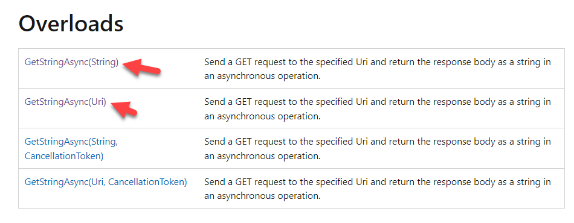

When dealing with the web, you will often require to deal with URLs.

Like so:

```csharp
// Build a HttpClient object
var client = new HttpClient();
// Download the contentent of the URL as a string asynchronously
var result = await client.GetStringAsync("https://localhost");
```

Often, you will require to specify the port. You'd typically do it like this:

*Note: Much as I am using values for parameters in these examples, interpret them as variables*

```csharp
var result = await client.GetStringAsync("https://localhost:" + 5000.ToString());
```

Or, more cleanly, using string interpolation, like this:

```csharp
var result = await client.GetStringAsync($"https://localhost:{5000}");
```

Things get a bit more complicated if you have to specify a [querystring](https://en.wikipedia.org/wiki/Query_string)

```csharp
await client.GetStringAsync($"https://localhost:{5000}/Customers?Height=10&Weight=70");
```

This is very brittle and prone to errors if you are generating the query string (and the entire URL) for that matter. You have to keep track of a bunch of things:
- The number and positions of the `/`
- The `?`
- The number and positions of the `&`
- URL encoding special characters

There is a better way to do this.

If you look at the documentation of most objects that take URL as parameters, they almost all support passing the URL as a [string](https://docs.microsoft.com/en-us/dotnet/api/system.string?view=net-6.0).

Take [this](https://docs.microsoft.com/en-us/dotnet/api/system.net.http.httpclient.getstringasync?view=net-6.0#system-net-http-httpclient-getstringasync(system-string)) for [HttpClient](https://docs.microsoft.com/en-us/dotnet/api/system.net.http.httpclient?view=net-6.0) `GetStringAsync`

They also almost all support passing the URL as a [URI](https://docs.microsoft.com/en-us/dotnet/api/system.uri?view=net-6.0) object, like [this](https://docs.microsoft.com/en-us/dotnet/api/system.net.http.httpclient.getstringasync?view=net-6.0#system-net-http-httpclient-getstringasync(system-uri))



Given it is a URI object, we can safely construct a URL using the full functionality of dedicated, typed objects using the [UriBuilder](https://docs.microsoft.com/en-us/dotnet/api/system.uribuilder?view=net-6.0) object.

We can do the following:

```csharp
var builder = new UriBuilder("https", "localhost", 5000, "Customers", $"?Height={10}");

await client.GetStringAsync(builder.Uri);
```

This is better, but still has a problem: you have to do the hard work to set and encode the query string correctly.

In this case, you are responsible for constructing this segment correctly:

```csharp
"?Height=10"
```

Suppose it was more elaborate:

```powershell
Height of 10
Weight of 70
BirthYear of 2000
```

You will have to do this:

```csharp
$"?Height={10}&Weight={70}&BirthYear={200}"
```

Or better still, 

```csharp
var query = new Dictionary<string, string>()
{
    {"Height","10"},
    {"Weight" , "70"},
    {"SkinColor", "Brown"}
};

// Project the dictionary into a collection of name/value pairs and join them into a string
var queryString = string.Join('&', query.Select(q => $"{q.Key}={q.Value}"));

var builder = new UriBuilder("https", "localhost", 5000, "Customers", $"?{queryString}");
```

Much better.

The challenge here, as you can see, is you still have to do a lot of heavy lifting to generate the querystring. This can be done as an extension method.

Or, better yet, you an use a [nuget](https://www.nuget.org/) library like [Flurl.Http](https://flurl.dev/) that has added a lot of extension methods to support precisely this scenario,

The code above can be rewritten as follows:

```csharp
// Create an anonmymous type with our values
var queryParameters = new
{
    Height = 10,
    Weight = 70,
    BirthYear = 2000
};

// Build the base url
var url = "https://localhost:5000/"
    // Append the path
    .AppendPathSegment("Customers")
    // Set the querystring
    .SetQueryParams(queryParameters);
// Invoke the request
await client.GetStringAsync(url);
```

The library is versatile enough to also work with [Uri](https://docs.microsoft.com/en-us/dotnet/api/system.uri?view=net-6.0) objects, but through a custom `Url` object. We can reuse our code that sets the various parts of the `Uri`

```csharp
// Create an anonymous type with our values
var queryParameters = new
{
    Height = 10,
    Weight = 70,
    BirthYear = 2000
};

// Build the base url
var url = new Url(new UriBuilder("https", "localhost", 5000, "Customers").Uri)
    // Set the querystring
    .SetQueryParams(queryParameters);
// Invoke the request
await client.GetStringAsync(url);
```

This code is much cleaner, easier to maintain and easier to support.

The code is in my [Github](https://github.com/conradakunga/BlogCode/tree/master/2022-08-15%20-%20Bulding%20Urls).

Happy hacking!