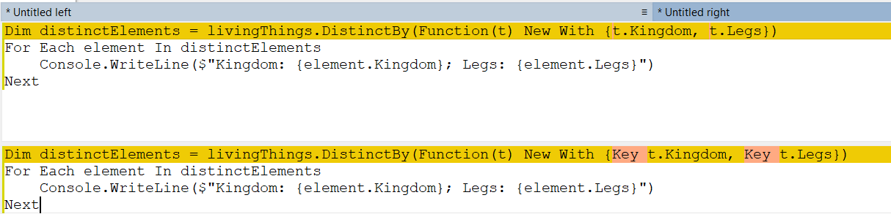

Grouping is one of the more powerful features of [LINQ](https://learn.microsoft.com/en-us/dotnet/csharp/programming-guide/concepts/linq/).

Assume you had the following data:

| Kingdom        | Name           | Legs |
|----------------|----------------|------|
| Animal | Dog | 4 |
| Animal | Cat | 4 |
| Animal | Horse | 4 |
| Animal | Millipede | 3000 |
| Animal | Centipede | 3000 |
| Animal | Octopus | 8 |
| Animal | Squid | 8 |
| Plant | Rose | 0 |
| Plant | Cabbage | 0 |
| Plant | Kale | 0 |

This would be contained in a collection like this in C#

```csharp
var livingThings = new List<LivingThing>();
livingThings.AddRange(new[] {
    new LivingThing()  {Kingdom = "Animal", Name = "Dog", Legs = 4},
    new LivingThing()  {Kingdom = "Animal", Name = "Cat", Legs = 4},
    new LivingThing()  {Kingdom = "Animal", Name = "Horse", Legs = 4},
    new LivingThing()  {Kingdom = "Animal", Name = "Millipede", Legs = 3_000},
    new LivingThing()  {Kingdom = "Animal", Name = "Centipede", Legs = 3_000},
    new LivingThing()  {Kingdom = "Animal", Name = "Octopus", Legs = 8},
    new LivingThing()  {Kingdom = "Animal", Name = "Squid", Legs = 8},
    new LivingThing()  {Kingdom = "Plant", Name = "Rose", Legs = 0},
    new LivingThing()  {Kingdom = "Plant", Name = "Cabbage", Legs = 0},
    new LivingThing()  {Kingdom = "Plant", Name = "Kale", Legs = 0}
});
```

And like this in VB.NET

```vb
Dim livingThings As New List(Of LivingThing)
livingThings.AddRange(New LivingThing() {
    New LivingThing() With {.Kingdon = "Animal", .Name = "Dog", .Legs = 4},
    New LivingThing() With {.Kingdon = "Animal", .Name = "Cat", .Legs = 4},
    New LivingThing() With {.Kingdon = "Animal", .Name = "Horse", .Legs = 4},
    New LivingThing() With {.Kingdon = "Animal", .Name = "Millipede", .Legs = 3_000},
    New LivingThing() With {.Kingdon = "Animal", .Name = "Centipede", .Legs = 3_000},
    New LivingThing() With {.Kingdon = "Animal", .Name = "Octopus", .Legs = 8},
    New LivingThing() With {.Kingdon = "Animal", .Name = "Squid", .Legs = 8},
    New LivingThing() With {.Kingdon = "Plant", .Name = "Rose", .Legs = 0},
    New LivingThing() With {.Kingdon = "Plant", .Name = "Cabbage", .Legs = 0},
    New LivingThing() With {.Kingdon = "Plant", .Name = "Kale", .Legs = 0}
})
```

If we wanted to know, what are the distinct collections of `Kingdom` and `Leg` in the collection we would do it like this:

```csharp
var distinctElements = livingThings.DistinctBy(t => new { t.Kingdom, t.Legs });
foreach (var element in distinctElements)
{
    Console.WriteLine($"Kingdom: {element.Kingdom}; Legs: {element.Legs}");
}
```

This would print the following:

```plaintext
Kingdom: Animal; Legs: 4
Kingdom: Animal; Legs: 3000
Kingdom: Animal; Legs: 8
Kingdom: Plant; Legs: 0
```

The same code is like this in VB.NET

```vb
Dim distinctElements = livingThings.DistinctBy(Function(t) New With {t.Kingdom, t.Legs})
For Each element In distinctElements
    Console.WriteLine($"Kingdom: {element.Kingdom}; Legs: {element.Legs}")
Next
```

This code, however, prints the following:

```plaintext
Kingdom: Animal; Legs: 4
Kingdom: Animal; Legs: 4
Kingdom: Animal; Legs: 4
Kingdom: Animal; Legs: 3000
Kingdom: Animal; Legs: 3000
Kingdom: Animal; Legs: 8
Kingdom: Animal; Legs: 8
Kingdom: Plant; Legs: 0
Kingdom: Plant; Legs: 0
Kingdom: Plant; Legs: 0
```

Notice it not only repeats elements, it prints as many elements that are in the original collection!

The problem here is that VB.NET behaves differently from C# - it has `slightly` different rules for determining how anonymous types are Equal

To get VB.NET to do what we want, we need to make use of the [Key](https://learn.microsoft.com/en-us/dotnet/visual-basic/language-reference/modifiers/key?redirectedfrom=MSDN) keyword.

The code should be updated to look like this:


Dim distinctElements = livingThings.DistinctBy(Function(t) New With {Key t.Kingdom, Key t.Legs})
For Each element In distinctElements
    Console.WriteLine($"Kingdom: {element.Kingdom}; Legs: {element.Legs}")
Next


The different bits are here:



This now prints what we expect.

```plaintext
Kingdom: Animal; Legs: 4
Kingdom: Animal; Legs: 3000
Kingdom: Animal; Legs: 8
Kingdom: Plant; Legs: 0
```

The code is in my [Github](https://github.com/conradakunga/BlogCode/tree/master/2022-10-02%20-%20Grouping%20In%20VB.NET).

Happy hacking!