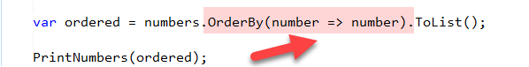

Using LINQ, you can order a collection using the [OrderBy](https://learn.microsoft.com/en-us/dotnet/api/system.linq.enumerable.orderby?view=net-7.0) (or the [OrderByDescending](https://learn.microsoft.com/en-us/dotnet/api/system.linq.enumerable.orderbydescending?view=net-7.0)) extension methods.

Let us use a simple program here to generate a collection of 15 numbers.

```csharp
// Create a new Random with a seed
var rnd = new Random(500);

// Generate a list of numbers sorted randomly
var numbers = Enumerable.Range(1, 15).OrderBy(element => rnd.Next()).ToList();

// Print the numbers
PrintNumbers(numbers);
```

Here I am passing a [seed](https://learn.microsoft.com/en-us/dotnet/api/system.random.-ctor?view=net-7.0#system-random-ctor(system-int32)) to the [Random](https://learn.microsoft.com/en-us/dotnet/api/system.random?view=net-7.0) so that I can get back a predictable set of numbers.

`PrintNumbers` is this function:

```csharp
void PrintNumbers(List<int> collection)
{
    collection.ForEach(number => Console.WriteLine(number));
}
```

This should print something like this:

```plaintext
3
4
8
13
6
2
14
10
11
12
9
7
1
5
15
```


If I want to order this collection of numbers into a second `List<int>` I do it like this:

```csharp
var ordered = numbers.OrderBy(number => number).ToList();

PrintNumbers(ordered);
```

This should print the following:

```plaintext
1
2
3
4
5
6
7
8
9
10
11
12
13
14
15
```

Notice here the lambda to sort references itself.



In .NET 7, you can do away with this altogether, using the new [Order](https://learn.microsoft.com/en-us/dotnet/api/system.linq.enumerable.order?view=net-7.0) method.

Your expression is now this:

```csharp
var ordered2 = numbers.Order().ToList();

PrintNumbers(ordered2);
```

Much cleaner.

Naturally, there is an equivalent for ordering in descending order - [OrderDescending](https://learn.microsoft.com/en-us/dotnet/api/system.linq.enumerable.orderdescending?view=net-7.0)

It works like this:

```csharp
var reversed = numbers.OrderDescending().ToList();
	
PrintNumbers(reversed);
```

This is a tiny change in the larger scheme of things, but it makes the code a lot more cleaner and understandable.

The code is in my GitHub.

Happy hacking!