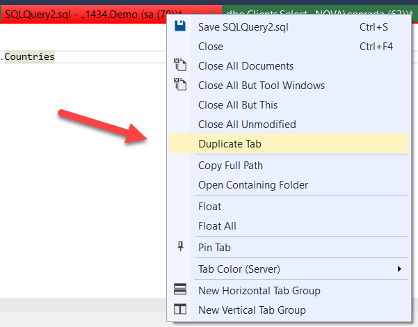

Suppose you have this query:

```sql
SELECT
    Countries.CountryID,
    Countries.Name,
    Countries.Code,
    Countries.EditUserID,
    Countries.DateModified,
    Countries.CreateUserID,
    Countries.DateCreated,
    Countries.Approved,
    Countries.ApprovedUserID,
    Countries.DateApproved
FROM
    dbo.Countries;
```
    
You want to duplicate it and make some adjustments and then run a second, different version.

The obvious way to do it is as follows:

1. Select all the text (**Ctrl + A**)
1. Create a new tab (**Ctrl + N**)
1. Switch to the new tab
1. Paste the text (**Ctrl +  V**)
1. Make any necessary modifications
1. Run

Alternatively, you can right-click the title of the tab and from the menu that displays, choose **Duplicate Tab**



Happy hacking!
