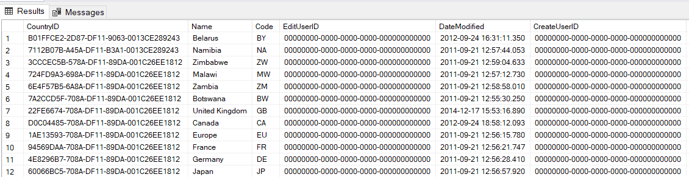
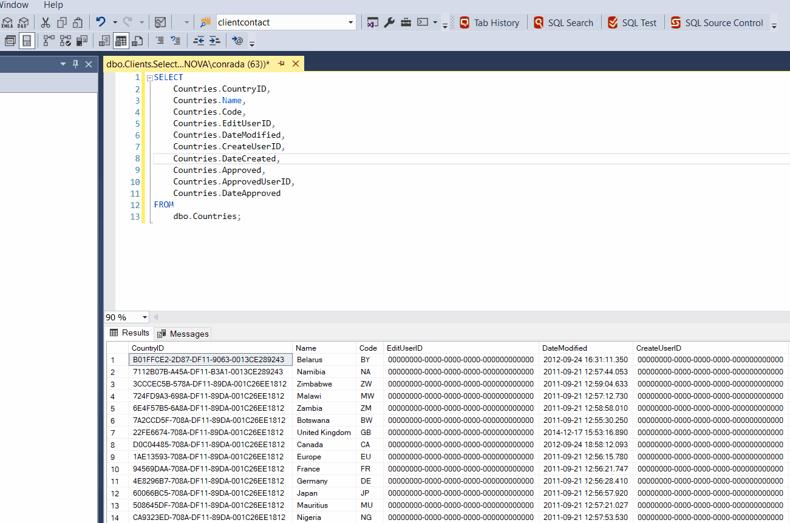

Working with results is one of the most obvious use cases of SQL Server Management Studio.

So, assuming we had this query:

```sql
SELECT
    Countries.CountryID,
    Countries.Name,
    Countries.Code,
    Countries.EditUserID,
    Countries.DateModified,
    Countries.CreateUserID,
    Countries.DateCreated,
    Countries.Approved,
    Countries.ApprovedUserID,
    Countries.DateApproved
FROM
    dbo.Countries;
```

The results would look like this:



Imagine you wanted to re-order the results, specifically the Name and the Code.

The obvious way is to re-write the query

```sql
SELECT
    Countries.CountryID,
    Countries.Code,
    Countries.Name,
    Countries.EditUserID,
    Countries.DateModified,
    Countries.CreateUserID,
    Countries.DateCreated,
    Countries.Approved,
    Countries.ApprovedUserID,
    Countries.DateApproved
FROM
    dbo.Countries;
```

An even better way is to simply **drag around the columns**.

Like so:



How easy!

Happy hacking!
