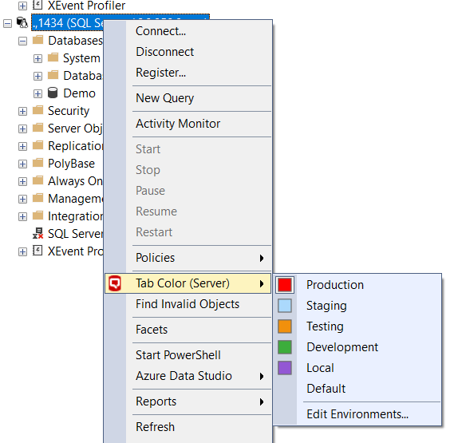
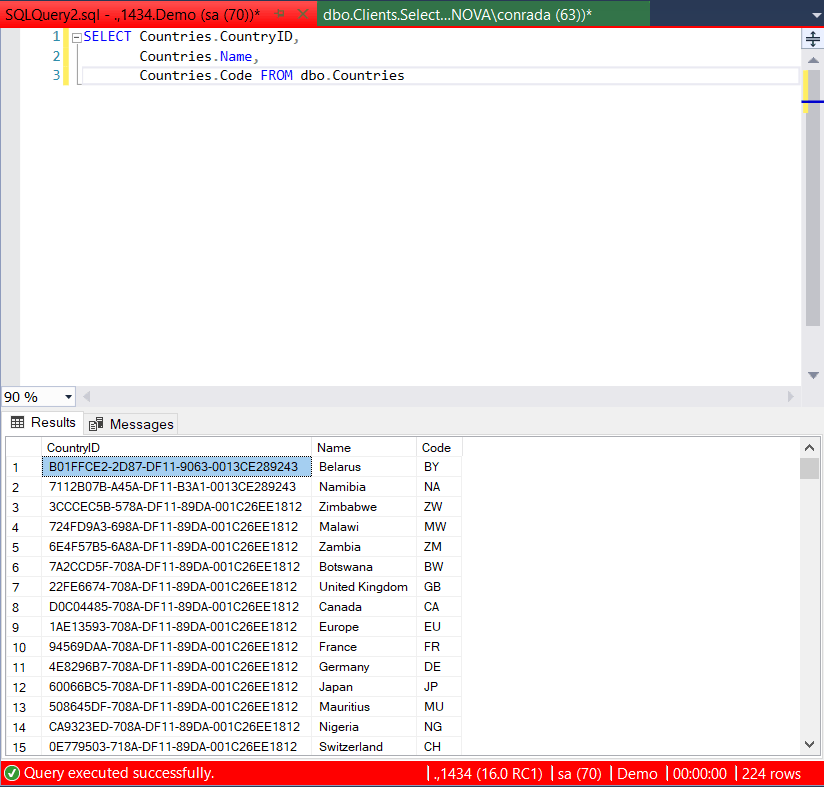
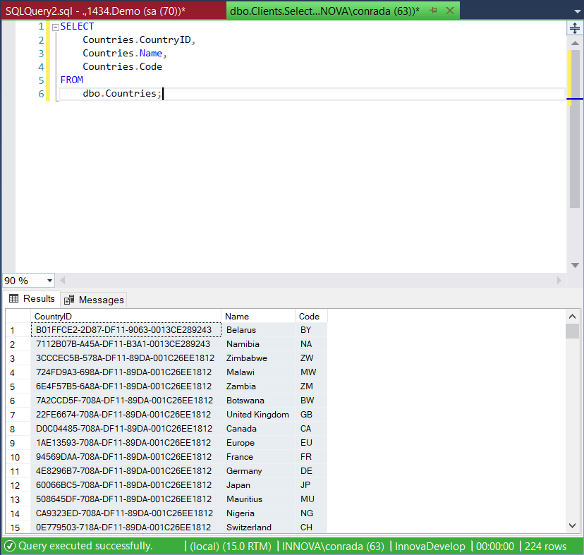

We've all done it - ran a query on the server we thought was the test but was in fact the production 

SQL Server Management Studio has a very simple solution for this problem - you can configure it to display different servers in different colours, and even give them environment names.

This is achieved using a utility from [RedGate Software](https://www.red-gate.com/) named [SQL Compare](https://www.red-gate.com/products/sql-development/sql-compare/)

With this tool installed you get an additional menu on the server node:

If you designate one server as `Production` and the other as `Development` it is easier to tell **where** exactly you are running your queries.

The tabs now will look like this:

`Production`:

  
`Development`:

It is that much more difficult (but not impossible!) to shoot yourself in the foot.

Happy hacking!